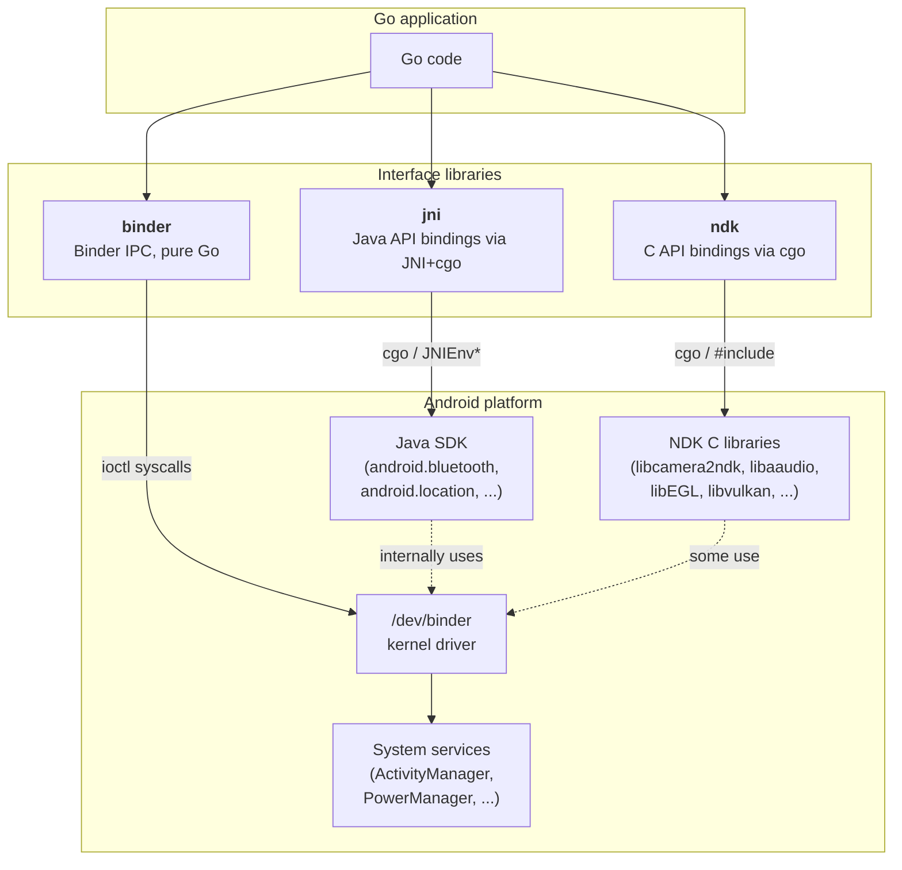
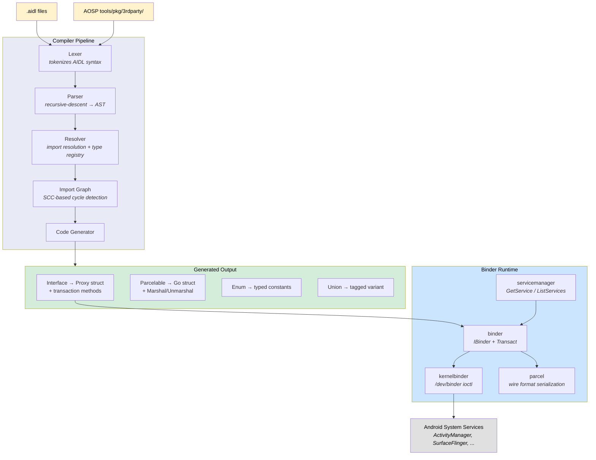
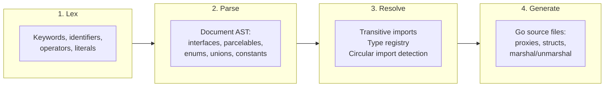
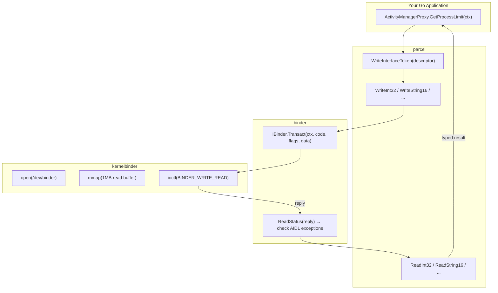

# binder

[](https://pkg.go.dev/github.com/xaionaro-go/binder)
[](https://goreportcard.com/report/github.com/xaionaro-go/binder)
[](https://github.com/xaionaro-go/binder/actions/workflows/ci.yml)
[](LICENSE)
[](go.mod)

Call Android system services from pure Go. Provides ~12000 type-safe Go methods across 600+ Android system services — ActivityManager, PowerManager, SurfaceFlinger, PackageManager, audio, camera and sensor HALs, and more — by speaking the Binder IPC wire protocol directly via `/dev/binder` ioctl syscalls. No Java, no NDK, no cgo required.

Includes a complete AIDL compiler that parses Android Interface Definition Language files and generates the Go proxies, a version-aware runtime that adapts transaction codes across Android API levels, and a CLI tool (`bindercli`) for interactive service discovery and invocation.

## What can it do?

- **Query system services** — battery level, GPS location, thermal status, running processes, installed packages
- **Control hardware** — connect to WiFi, toggle flashlight, manage Bluetooth, configure audio
- **Interact with any binder service** — ActivityManager, PowerManager, SurfaceFlinger, camera/sensor HALs, and 600+ more
- **No Java, no cgo** — pure Go, cross-compiles to a static binary, runs on Android or any Linux with `/dev/binder`
- **CLI tool included** — `bindercli` for interactive service discovery, method invocation, and debugging

## Quick start

**Go library** — `go get github.com/xaionaro-go/binder` and call any service:

```go
driver, _ := kernelbinder.Open(ctx, binder.WithMapSize(128*1024))
defer driver.Close(ctx)
transport, _ := versionaware.NewTransport(ctx, driver, 0)
sm := servicemanager.New(transport)

loc, _ := location.GetLastKnownLocation(ctx, sm, location.ProviderFused)
fmt.Printf("Lat: %.6f, Lon: %.6f\n", loc.LatitudeDegrees, loc.LongitudeDegrees)
```

## Related Projects

<details>
<summary>ndk, jni, binder (click to expand)</summary>

This project is part of a family of three Go libraries that cover the major Android interface surfaces. Each wraps a different layer of the Android platform:



| Library                                                            | Interface                    | Requires            | Best for                                                                                            |
| ------------------------------------------------------------------ | ---------------------------- | ------------------- | --------------------------------------------------------------------------------------------------- |
| **[ndk](https://github.com/xaionaro-go/ndk)**                      | Android NDK C APIs           | cgo + NDK toolchain | High-performance hardware access: camera, audio, sensors, OpenGL/Vulkan, media codecs               |
| **[jni](https://github.com/xaionaro-go/jni)**                      | Java Android SDK via JNI     | cgo + JNI + JVM/ART | Java-only APIs with no NDK equivalent: Bluetooth, WiFi, NFC, location, telephony, content providers |
| **[binder](https://github.com/xaionaro-go/binder)** (this project) | Binder IPC (system services) | pure Go (no cgo)    | Direct system service calls without Java: works on non-Android Linux with binder, minimal footprint |

### When to use which

- **Start with ndk** when the NDK provides a C API for what you need (camera, audio, sensors, EGL/Vulkan, media codecs). These are the lowest-latency, lowest-overhead bindings since they go straight from Go to the C library via cgo.

- **Use jni** when you need a Java Android SDK API that the NDK does not expose. Examples: Bluetooth discovery, WiFi P2P, NFC tag reading, location services, telephony, content providers, notifications. JNI is also the right choice when you need to interact with Java components (Activities, Services, BroadcastReceivers) or when you need the gRPC remote-access layer.

- **Use binder** when you want pure-Go access to Android system services without any cgo dependency. This is ideal for lightweight tools, CLI programs, or scenarios where you want to talk to the binder driver from a non-Android Linux system. AIDL covers the same system services that Java SDK wraps (ActivityManager, PowerManager, etc.) but at the wire-protocol level.

- **Combine them** when your application needs multiple layers. For example, a streaming app might use **ndk** for camera capture and audio encoding, **jni** for Bluetooth controller discovery, and **binder** for querying battery status from a companion daemon.

### How they relate to each other

All three libraries talk to the same Android system services, but through different paths:

- The **NDK C APIs** are provided by Google as stable C interfaces to Android platform features. Some (camera, sensors, audio) internally use binder IPC to talk to system services; others (EGL, Vulkan, OpenGL) talk directly to kernel drivers. The `ndk` library wraps these C APIs via cgo.
- The **Java SDK** uses binder IPC internally for system service access (BluetoothManager, LocationManager, etc.), routing calls through the Android Runtime (ART/Dalvik). The `jni` library calls into these Java APIs via the JNI C interface and cgo.
- The **AIDL binder protocol** is the underlying IPC mechanism that system-facing NDK and Java SDK APIs use. The `binder` library implements this protocol directly in pure Go, bypassing both C and Java layers entirely.

</details>

## Usage Examples

### Get GPS Coordinates

```go
import (
    "github.com/xaionaro-go/binder/android/location"
    "github.com/xaionaro-go/binder/binder"
    "github.com/xaionaro-go/binder/binder/versionaware"
    "github.com/xaionaro-go/binder/kernelbinder"
    "github.com/xaionaro-go/binder/servicemanager"
)

    ctx := context.Background()

    driver, err := kernelbinder.Open(ctx, binder.WithMapSize(128*1024))
    if err != nil {
        log.Fatal(err)
    }
    defer driver.Close(ctx)

    transport, err := versionaware.NewTransport(ctx, driver, 0)
    if err != nil {
        log.Fatal(err)
    }
    sm := servicemanager.New(transport)

    loc, err := location.GetLastKnownLocation(ctx, sm, location.ProviderFused)
    if err != nil {
        log.Fatal(err)
    }
    if loc == nil {
        log.Fatal("no cached location available")
    }

    fmt.Printf("Lat: %.6f, Lon: %.6f\n", loc.LatitudeDegrees, loc.LongitudeDegrees)
    fmt.Printf("Altitude: %.1f m\n", loc.AltitudeMeters)
```

### List Binder Services

```go
    sm := servicemanager.New(transport)

    services, err := sm.ListServices(ctx)
    if err != nil {
        log.Fatal(err)
    }

    for _, name := range services {
        svc, err := sm.CheckService(ctx, name)
        if err == nil && svc != nil && svc.IsAlive(ctx) {
            fmt.Printf("%-60s alive\n", name)
        }
    }
```

### Call a System Service (PowerManager)

```go
import "github.com/xaionaro-go/binder/android/os"

    pm, err := os.GetPowerManager(ctx, sm)
    if err != nil {
        log.Fatal(err)
    }

    interactive, _ := pm.IsInteractive(ctx)
    fmt.Printf("Screen on: %v\n", interactive)

    powerSave, _ := pm.IsPowerSaveMode(ctx)
    fmt.Printf("Power save: %v\n", powerSave)
```

More examples: [`examples/`](examples/)

| Example                                                    | Queries                                             |
| ---------------------------------------------------------- | --------------------------------------------------- |
| [`list_services`](examples/list_services/)                 | Enumerate all binder services, ping each            |
| [`activity_manager`](examples/activity_manager/)           | Process limits, monkey test flag, permission checks |
| [`battery_health`](examples/battery_health/)               | Capacity, charge status, current draw               |
| [`device_info`](examples/device_info/)                     | Device properties, build info                       |
| [`display_info`](examples/display_info/)                   | Display IDs, brightness, night mode                 |
| [`audio_status`](examples/audio_status/)                   | Audio device info, volume state                     |
| [`power_status`](examples/power_status/)                   | Power supply state, charging info                   |
| [`storage_info`](examples/storage_info/)                   | Storage device stats, mount points                  |
| [`package_query`](examples/package_query/)                 | Package list, installation info                     |
| [`softap_manage`](examples/softap_manage/)                 | WiFi hotspot enable/disable, config                 |
| [`softap_wifi_hal`](examples/softap_wifi_hal/)             | WiFi chip info, AP interface state                  |
| [`softap_tether_offload`](examples/softap_tether_offload/) | Tethering offload config, stats                     |

## bindercli Quick Start

`bindercli` lets you call any Android system service from the command line — no Go code needed.

**Install and deploy:**

```bash
GOOS=linux GOARCH=arm64 go build -o build/bindercli ./cmd/bindercli/
adb push build/bindercli /data/local/tmp/
```

**Try it:**

```bash
# List all binder services
adb shell /data/local/tmp/bindercli service list

# Check battery level
adb shell /data/local/tmp/bindercli android.hardware.health.IHealth get-health-info

# Query ActivityManager
adb shell /data/local/tmp/bindercli android.app.IActivityManager get-process-limit

# Get GPS hardware info
adb shell /data/local/tmp/bindercli android.location.ILocationManager get-gnss-hardware-model-name
```

See the full [bindercli reference](#bindercli) for all subcommands and more examples.

## Packages

|                                                                                                                                                           | Package              | Description                                                                            | Import Path                                        |
| --------------------------------------------------------------------------------------------------------------------------------------------------------- | -------------------- | -------------------------------------------------------------------------------------- | -------------------------------------------------- |
| **AIDL Pipeline** ([`tools/pkg/`](tools/pkg/))                                                                                                            |                      |                                                                                        |                                                    |
| [](https://pkg.go.dev/github.com/xaionaro-go/binder/tools/pkg/parser)                    | `tools/pkg/parser`   | Lexer and recursive-descent parser producing an AST from `.aidl` files                 | `github.com/xaionaro-go/binder/tools/pkg/parser`   |
| [](https://pkg.go.dev/github.com/xaionaro-go/binder/tools/pkg/resolver)          | `tools/pkg/resolver` | Import resolution across search paths with type registry and circular-import detection | `github.com/xaionaro-go/binder/tools/pkg/resolver` |
| [](https://pkg.go.dev/github.com/xaionaro-go/binder/tools/pkg/codegen)              | `tools/pkg/codegen`  | Go code generator for proxies, parcelables, enums, unions, and constants               | `github.com/xaionaro-go/binder/tools/pkg/codegen`  |
| [](https://pkg.go.dev/github.com/xaionaro-go/binder/tools/pkg/validate)          | `tools/pkg/validate` | Semantic validation: type resolution, parameter directions, oneway constraints         | `github.com/xaionaro-go/binder/tools/pkg/validate` |
| **Runtime**                                                                                                                                               |                      |                                                                                        |                                                    |
| [](https://pkg.go.dev/github.com/xaionaro-go/binder/binder)                               | `binder`             | Binder IPC abstractions: `IBinder` interface, `Transact()`, status/exception handling  | `github.com/xaionaro-go/binder/binder`             |
| [](https://pkg.go.dev/github.com/xaionaro-go/binder/parcel)                            | `parcel`             | Binder wire format: 4-byte aligned, little-endian serialization                        | `github.com/xaionaro-go/binder/parcel`             |
| [](https://pkg.go.dev/github.com/xaionaro-go/binder/kernelbinder)          | `kernelbinder`       | Linux `/dev/binder` driver: open, mmap, ioctl, protocol negotiation                    | `github.com/xaionaro-go/binder/kernelbinder`       |
| [](https://pkg.go.dev/github.com/xaionaro-go/binder/servicemanager) | `servicemanager`     | Client for `android.os.IServiceManager`: `GetService()`, `ListServices()`, etc.        | `github.com/xaionaro-go/binder/servicemanager`     |
| [](https://pkg.go.dev/github.com/xaionaro-go/binder/errors)                          | `errors`             | AIDL exception types: `ExceptionCode`, `StatusError`                                   | `github.com/xaionaro-go/binder/errors`             |
| **Testing**                                                                                                                                               |                      |                                                                                        |                                                    |
| [](https://pkg.go.dev/github.com/xaionaro-go/binder/tools/pkg/testutil)           | `tools/pkg/testutil` | Mock binder and reflection-based smoke testing for generated proxies                   | `github.com/xaionaro-go/binder/tools/pkg/testutil` |

### Generated AOSP Packages

<!-- BEGIN GENERATED PACKAGES -->

601 packages, 5494 generated Go files.

<details>
<summary><strong>android/accessibilityservice</strong> (1 packages)</summary>

| Package | Files | Import Path |
|---|---|---|
| [`android/accessibilityservice`](https://pkg.go.dev/github.com/xaionaro-go/binder/android/accessibilityservice) | 7 | `github.com/xaionaro-go/binder/android/accessibilityservice` |

</details>

<details>
<summary><strong>android/accounts</strong> (1 packages)</summary>

| Package | Files | Import Path |
|---|---|---|
| [`android/accounts`](https://pkg.go.dev/github.com/xaionaro-go/binder/android/accounts) | 9 | `github.com/xaionaro-go/binder/android/accounts` |

</details>

<details>
<summary><strong>android/adpf</strong> (1 packages)</summary>

| Package | Files | Import Path |
|---|---|---|
| [`android/adpf`](https://pkg.go.dev/github.com/xaionaro-go/binder/android/adpf) | 1 | `github.com/xaionaro-go/binder/android/adpf` |

</details>

<details>
<summary><strong>android/app</strong> (27 packages)</summary>

| Package | Files | Import Path |
|---|---|---|
| [`android/app`](https://pkg.go.dev/github.com/xaionaro-go/binder/android/app) | 130 | `github.com/xaionaro-go/binder/android/app` |
| [`android/app/admin`](https://pkg.go.dev/github.com/xaionaro-go/binder/android/app/admin) | 48 | `github.com/xaionaro-go/binder/android/app/admin` |
| [`android/app/ambientcontext`](https://pkg.go.dev/github.com/xaionaro-go/binder/android/app/ambientcontext) | 5 | `github.com/xaionaro-go/binder/android/app/ambientcontext` |
| [`android/app/appfunctions`](https://pkg.go.dev/github.com/xaionaro-go/binder/android/app/appfunctions) | 10 | `github.com/xaionaro-go/binder/android/app/appfunctions` |
| [`android/app/assist`](https://pkg.go.dev/github.com/xaionaro-go/binder/android/app/assist) | 4 | `github.com/xaionaro-go/binder/android/app/assist` |
| [`android/app/backup`](https://pkg.go.dev/github.com/xaionaro-go/binder/android/app/backup) | 12 | `github.com/xaionaro-go/binder/android/app/backup` |
| [`android/app/blob`](https://pkg.go.dev/github.com/xaionaro-go/binder/android/app/blob) | 6 | `github.com/xaionaro-go/binder/android/app/blob` |
| [`android/app/contentsuggestions`](https://pkg.go.dev/github.com/xaionaro-go/binder/android/app/contentsuggestions) | 8 | `github.com/xaionaro-go/binder/android/app/contentsuggestions` |
| [`android/app/contextualsearch`](https://pkg.go.dev/github.com/xaionaro-go/binder/android/app/contextualsearch) | 4 | `github.com/xaionaro-go/binder/android/app/contextualsearch` |
| [`android/app/job`](https://pkg.go.dev/github.com/xaionaro-go/binder/android/app/job) | 9 | `github.com/xaionaro-go/binder/android/app/job` |
| [`android/app/ondeviceintelligence`](https://pkg.go.dev/github.com/xaionaro-go/binder/android/app/ondeviceintelligence) | 15 | `github.com/xaionaro-go/binder/android/app/ondeviceintelligence` |
| [`android/app/people`](https://pkg.go.dev/github.com/xaionaro-go/binder/android/app/people) | 5 | `github.com/xaionaro-go/binder/android/app/people` |
| [`android/app/pinner`](https://pkg.go.dev/github.com/xaionaro-go/binder/android/app/pinner) | 2 | `github.com/xaionaro-go/binder/android/app/pinner` |
| [`android/app/prediction`](https://pkg.go.dev/github.com/xaionaro-go/binder/android/app/prediction) | 7 | `github.com/xaionaro-go/binder/android/app/prediction` |
| [`android/app/search`](https://pkg.go.dev/github.com/xaionaro-go/binder/android/app/search) | 8 | `github.com/xaionaro-go/binder/android/app/search` |
| [`android/app/servertransaction`](https://pkg.go.dev/github.com/xaionaro-go/binder/android/app/servertransaction) | 22 | `github.com/xaionaro-go/binder/android/app/servertransaction` |
| [`android/app/slice`](https://pkg.go.dev/github.com/xaionaro-go/binder/android/app/slice) | 5 | `github.com/xaionaro-go/binder/android/app/slice` |
| [`android/app/smartspace`](https://pkg.go.dev/github.com/xaionaro-go/binder/android/app/smartspace) | 7 | `github.com/xaionaro-go/binder/android/app/smartspace` |
| [`android/app/supervision`](https://pkg.go.dev/github.com/xaionaro-go/binder/android/app/supervision) | 2 | `github.com/xaionaro-go/binder/android/app/supervision` |
| [`android/app/time`](https://pkg.go.dev/github.com/xaionaro-go/binder/android/app/time) | 15 | `github.com/xaionaro-go/binder/android/app/time` |
| [`android/app/timedetector`](https://pkg.go.dev/github.com/xaionaro-go/binder/android/app/timedetector) | 3 | `github.com/xaionaro-go/binder/android/app/timedetector` |
| [`android/app/timezonedetector`](https://pkg.go.dev/github.com/xaionaro-go/binder/android/app/timezonedetector) | 3 | `github.com/xaionaro-go/binder/android/app/timezonedetector` |
| [`android/app/trust`](https://pkg.go.dev/github.com/xaionaro-go/binder/android/app/trust) | 3 | `github.com/xaionaro-go/binder/android/app/trust` |
| [`android/app/usage`](https://pkg.go.dev/github.com/xaionaro-go/binder/android/app/usage) | 19 | `github.com/xaionaro-go/binder/android/app/usage` |
| [`android/app/wallpaper`](https://pkg.go.dev/github.com/xaionaro-go/binder/android/app/wallpaper) | 2 | `github.com/xaionaro-go/binder/android/app/wallpaper` |
| [`android/app/wallpapereffectsgeneration`](https://pkg.go.dev/github.com/xaionaro-go/binder/android/app/wallpapereffectsgeneration) | 7 | `github.com/xaionaro-go/binder/android/app/wallpapereffectsgeneration` |
| [`android/app/wearable`](https://pkg.go.dev/github.com/xaionaro-go/binder/android/app/wearable) | 4 | `github.com/xaionaro-go/binder/android/app/wearable` |

</details>

<details>
<summary><strong>android/apphibernation</strong> (1 packages)</summary>

| Package | Files | Import Path |
|---|---|---|
| [`android/apphibernation`](https://pkg.go.dev/github.com/xaionaro-go/binder/android/apphibernation) | 1 | `github.com/xaionaro-go/binder/android/apphibernation` |

</details>

<details>
<summary><strong>android/appwidget</strong> (1 packages)</summary>

| Package | Files | Import Path |
|---|---|---|
| [`android/appwidget`](https://pkg.go.dev/github.com/xaionaro-go/binder/android/appwidget) | 2 | `github.com/xaionaro-go/binder/android/appwidget` |

</details>

<details>
<summary><strong>android/binderdebug</strong> (1 packages)</summary>

| Package | Files | Import Path |
|---|---|---|
| [`android/binderdebug/test`](https://pkg.go.dev/github.com/xaionaro-go/binder/android/binderdebug/test) | 1 | `github.com/xaionaro-go/binder/android/binderdebug/test` |

</details>

<details>
<summary><strong>android/companion</strong> (7 packages)</summary>

| Package | Files | Import Path |
|---|---|---|
| [`android/companion`](https://pkg.go.dev/github.com/xaionaro-go/binder/android/companion) | 18 | `github.com/xaionaro-go/binder/android/companion` |
| [`android/companion/datatransfer`](https://pkg.go.dev/github.com/xaionaro-go/binder/android/companion/datatransfer) | 2 | `github.com/xaionaro-go/binder/android/companion/datatransfer` |
| [`android/companion/virtual`](https://pkg.go.dev/github.com/xaionaro-go/binder/android/companion/virtual) | 10 | `github.com/xaionaro-go/binder/android/companion/virtual` |
| [`android/companion/virtual/audio`](https://pkg.go.dev/github.com/xaionaro-go/binder/android/companion/virtual/audio) | 2 | `github.com/xaionaro-go/binder/android/companion/virtual/audio` |
| [`android/companion/virtual/camera`](https://pkg.go.dev/github.com/xaionaro-go/binder/android/companion/virtual/camera) | 3 | `github.com/xaionaro-go/binder/android/companion/virtual/camera` |
| [`android/companion/virtual/sensor`](https://pkg.go.dev/github.com/xaionaro-go/binder/android/companion/virtual/sensor) | 4 | `github.com/xaionaro-go/binder/android/companion/virtual/sensor` |
| [`android/companion/virtualnative`](https://pkg.go.dev/github.com/xaionaro-go/binder/android/companion/virtualnative) | 1 | `github.com/xaionaro-go/binder/android/companion/virtualnative` |

</details>

<details>
<summary><strong>android/content</strong> (10 packages)</summary>

| Package | Files | Import Path |
|---|---|---|
| [`android/content`](https://pkg.go.dev/github.com/xaionaro-go/binder/android/content) | 40 | `github.com/xaionaro-go/binder/android/content` |
| [`android/content/integrity`](https://pkg.go.dev/github.com/xaionaro-go/binder/android/content/integrity) | 4 | `github.com/xaionaro-go/binder/android/content/integrity` |
| [`android/content/om`](https://pkg.go.dev/github.com/xaionaro-go/binder/android/content/om) | 3 | `github.com/xaionaro-go/binder/android/content/om` |
| [`android/content/pm`](https://pkg.go.dev/github.com/xaionaro-go/binder/android/content/pm) | 101 | `github.com/xaionaro-go/binder/android/content/pm` |
| [`android/content/pm/dependencyinstaller`](https://pkg.go.dev/github.com/xaionaro-go/binder/android/content/pm/dependencyinstaller) | 3 | `github.com/xaionaro-go/binder/android/content/pm/dependencyinstaller` |
| [`android/content/pm/dex`](https://pkg.go.dev/github.com/xaionaro-go/binder/android/content/pm/dex) | 2 | `github.com/xaionaro-go/binder/android/content/pm/dex` |
| [`android/content/pm/permission`](https://pkg.go.dev/github.com/xaionaro-go/binder/android/content/pm/permission) | 3 | `github.com/xaionaro-go/binder/android/content/pm/permission` |
| [`android/content/pm/verify/domain`](https://pkg.go.dev/github.com/xaionaro-go/binder/android/content/pm/verify/domain) | 6 | `github.com/xaionaro-go/binder/android/content/pm/verify/domain` |
| [`android/content/res`](https://pkg.go.dev/github.com/xaionaro-go/binder/android/content/res) | 6 | `github.com/xaionaro-go/binder/android/content/res` |
| [`android/content/rollback`](https://pkg.go.dev/github.com/xaionaro-go/binder/android/content/rollback) | 3 | `github.com/xaionaro-go/binder/android/content/rollback` |

</details>

<details>
<summary><strong>android/credentials</strong> (1 packages)</summary>

| Package | Files | Import Path |
|---|---|---|
| [`android/credentials`](https://pkg.go.dev/github.com/xaionaro-go/binder/android/credentials) | 24 | `github.com/xaionaro-go/binder/android/credentials` |

</details>

<details>
<summary><strong>android/database</strong> (1 packages)</summary>

| Package | Files | Import Path |
|---|---|---|
| [`android/database`](https://pkg.go.dev/github.com/xaionaro-go/binder/android/database) | 3 | `github.com/xaionaro-go/binder/android/database` |

</details>

<details>
<summary><strong>android/debug</strong> (1 packages)</summary>

| Package | Files | Import Path |
|---|---|---|
| [`android/debug`](https://pkg.go.dev/github.com/xaionaro-go/binder/android/debug) | 7 | `github.com/xaionaro-go/binder/android/debug` |

</details>

<details>
<summary><strong>android/flags</strong> (1 packages)</summary>

| Package | Files | Import Path |
|---|---|---|
| [`android/flags`](https://pkg.go.dev/github.com/xaionaro-go/binder/android/flags) | 3 | `github.com/xaionaro-go/binder/android/flags` |

</details>

<details>
<summary><strong>android/graphics</strong> (5 packages)</summary>

| Package | Files | Import Path |
|---|---|---|
| [`android/graphics`](https://pkg.go.dev/github.com/xaionaro-go/binder/android/graphics) | 10 | `github.com/xaionaro-go/binder/android/graphics` |
| [`android/graphics/bufferstreams`](https://pkg.go.dev/github.com/xaionaro-go/binder/android/graphics/bufferstreams) | 6 | `github.com/xaionaro-go/binder/android/graphics/bufferstreams` |
| [`android/graphics/bufferstreams/BufferCacheUpdate`](https://pkg.go.dev/github.com/xaionaro-go/binder/android/graphics/bufferstreams/BufferCacheUpdate) | 2 | `github.com/xaionaro-go/binder/android/graphics/bufferstreams/BufferCacheUpdate` |
| [`android/graphics/drawable`](https://pkg.go.dev/github.com/xaionaro-go/binder/android/graphics/drawable) | 1 | `github.com/xaionaro-go/binder/android/graphics/drawable` |
| [`android/graphics/fonts`](https://pkg.go.dev/github.com/xaionaro-go/binder/android/graphics/fonts) | 1 | `github.com/xaionaro-go/binder/android/graphics/fonts` |

</details>

<details>
<summary><strong>android/gui</strong> (8 packages)</summary>

| Package | Files | Import Path |
|---|---|---|
| [`android/gui`](https://pkg.go.dev/github.com/xaionaro-go/binder/android/gui) | 59 | `github.com/xaionaro-go/binder/android/gui` |
| [`android/gui/DeviceProductInfo`](https://pkg.go.dev/github.com/xaionaro-go/binder/android/gui/DeviceProductInfo) | 4 | `github.com/xaionaro-go/binder/android/gui/DeviceProductInfo` |
| [`android/gui/DisplayModeSpecs`](https://pkg.go.dev/github.com/xaionaro-go/binder/android/gui/DisplayModeSpecs) | 2 | `github.com/xaionaro-go/binder/android/gui/DisplayModeSpecs` |
| [`android/gui/DisplayModeSpecs/RefreshRateRanges`](https://pkg.go.dev/github.com/xaionaro-go/binder/android/gui/DisplayModeSpecs/RefreshRateRanges) | 1 | `github.com/xaionaro-go/binder/android/gui/DisplayModeSpecs/RefreshRateRanges` |
| [`android/gui/DisplayPrimaries`](https://pkg.go.dev/github.com/xaionaro-go/binder/android/gui/DisplayPrimaries) | 1 | `github.com/xaionaro-go/binder/android/gui/DisplayPrimaries` |
| [`android/gui/ISurfaceComposer`](https://pkg.go.dev/github.com/xaionaro-go/binder/android/gui/ISurfaceComposer) | 2 | `github.com/xaionaro-go/binder/android/gui/ISurfaceComposer` |
| [`android/gui/LutProperties`](https://pkg.go.dev/github.com/xaionaro-go/binder/android/gui/LutProperties) | 2 | `github.com/xaionaro-go/binder/android/gui/LutProperties` |
| [`android/gui/OverlayProperties`](https://pkg.go.dev/github.com/xaionaro-go/binder/android/gui/OverlayProperties) | 1 | `github.com/xaionaro-go/binder/android/gui/OverlayProperties` |

</details>

<details>
<summary><strong>android/hardware</strong> (280 packages)</summary>

| Package | Files | Import Path |
|---|---|---|
| [`android/hardware`](https://pkg.go.dev/github.com/xaionaro-go/binder/android/hardware) | 11 | `github.com/xaionaro-go/binder/android/hardware` |
| [`android/hardware/audio/common`](https://pkg.go.dev/github.com/xaionaro-go/binder/android/hardware/audio/common) | 5 | `github.com/xaionaro-go/binder/android/hardware/audio/common` |
| [`android/hardware/audio/core`](https://pkg.go.dev/github.com/xaionaro-go/binder/android/hardware/audio/core) | 18 | `github.com/xaionaro-go/binder/android/hardware/audio/core` |
| [`android/hardware/audio/core/IBluetooth`](https://pkg.go.dev/github.com/xaionaro-go/binder/android/hardware/audio/core/IBluetooth) | 2 | `github.com/xaionaro-go/binder/android/hardware/audio/core/IBluetooth` |
| [`android/hardware/audio/core/IBluetooth/ScoConfig`](https://pkg.go.dev/github.com/xaionaro-go/binder/android/hardware/audio/core/IBluetooth/ScoConfig) | 1 | `github.com/xaionaro-go/binder/android/hardware/audio/core/IBluetooth/ScoConfig` |
| [`android/hardware/audio/core/IModule`](https://pkg.go.dev/github.com/xaionaro-go/binder/android/hardware/audio/core/IModule) | 6 | `github.com/xaionaro-go/binder/android/hardware/audio/core/IModule` |
| [`android/hardware/audio/core/IStreamIn`](https://pkg.go.dev/github.com/xaionaro-go/binder/android/hardware/audio/core/IStreamIn) | 1 | `github.com/xaionaro-go/binder/android/hardware/audio/core/IStreamIn` |
| [`android/hardware/audio/core/ITelephony`](https://pkg.go.dev/github.com/xaionaro-go/binder/android/hardware/audio/core/ITelephony) | 1 | `github.com/xaionaro-go/binder/android/hardware/audio/core/ITelephony` |
| [`android/hardware/audio/core/ITelephony/TelecomConfig`](https://pkg.go.dev/github.com/xaionaro-go/binder/android/hardware/audio/core/ITelephony/TelecomConfig) | 1 | `github.com/xaionaro-go/binder/android/hardware/audio/core/ITelephony/TelecomConfig` |
| [`android/hardware/audio/core/StreamDescriptor`](https://pkg.go.dev/github.com/xaionaro-go/binder/android/hardware/audio/core/StreamDescriptor) | 6 | `github.com/xaionaro-go/binder/android/hardware/audio/core/StreamDescriptor` |
| [`android/hardware/audio/core/SurroundSoundConfig`](https://pkg.go.dev/github.com/xaionaro-go/binder/android/hardware/audio/core/SurroundSoundConfig) | 1 | `github.com/xaionaro-go/binder/android/hardware/audio/core/SurroundSoundConfig` |
| [`android/hardware/audio/core/sounddose`](https://pkg.go.dev/github.com/xaionaro-go/binder/android/hardware/audio/core/sounddose) | 1 | `github.com/xaionaro-go/binder/android/hardware/audio/core/sounddose` |
| [`android/hardware/audio/core/sounddose/ISoundDose`](https://pkg.go.dev/github.com/xaionaro-go/binder/android/hardware/audio/core/sounddose/ISoundDose) | 1 | `github.com/xaionaro-go/binder/android/hardware/audio/core/sounddose/ISoundDose` |
| [`android/hardware/audio/core/sounddose/ISoundDose/IHalSoundDoseCallback`](https://pkg.go.dev/github.com/xaionaro-go/binder/android/hardware/audio/core/sounddose/ISoundDose/IHalSoundDoseCallback) | 1 | `github.com/xaionaro-go/binder/android/hardware/audio/core/sounddose/ISoundDose/IHalSoundDoseCallback` |
| [`android/hardware/audio/effect`](https://pkg.go.dev/github.com/xaionaro-go/binder/android/hardware/audio/effect) | 29 | `github.com/xaionaro-go/binder/android/hardware/audio/effect` |
| [`android/hardware/audio/effect/AcousticEchoCanceler`](https://pkg.go.dev/github.com/xaionaro-go/binder/android/hardware/audio/effect/AcousticEchoCanceler) | 1 | `github.com/xaionaro-go/binder/android/hardware/audio/effect/AcousticEchoCanceler` |
| [`android/hardware/audio/effect/AutomaticGainControlV1`](https://pkg.go.dev/github.com/xaionaro-go/binder/android/hardware/audio/effect/AutomaticGainControlV1) | 1 | `github.com/xaionaro-go/binder/android/hardware/audio/effect/AutomaticGainControlV1` |
| [`android/hardware/audio/effect/AutomaticGainControlV2`](https://pkg.go.dev/github.com/xaionaro-go/binder/android/hardware/audio/effect/AutomaticGainControlV2) | 2 | `github.com/xaionaro-go/binder/android/hardware/audio/effect/AutomaticGainControlV2` |
| [`android/hardware/audio/effect/BassBoost`](https://pkg.go.dev/github.com/xaionaro-go/binder/android/hardware/audio/effect/BassBoost) | 1 | `github.com/xaionaro-go/binder/android/hardware/audio/effect/BassBoost` |
| [`android/hardware/audio/effect/Descriptor`](https://pkg.go.dev/github.com/xaionaro-go/binder/android/hardware/audio/effect/Descriptor) | 2 | `github.com/xaionaro-go/binder/android/hardware/audio/effect/Descriptor` |
| [`android/hardware/audio/effect/Downmix`](https://pkg.go.dev/github.com/xaionaro-go/binder/android/hardware/audio/effect/Downmix) | 2 | `github.com/xaionaro-go/binder/android/hardware/audio/effect/Downmix` |
| [`android/hardware/audio/effect/DynamicsProcessing`](https://pkg.go.dev/github.com/xaionaro-go/binder/android/hardware/audio/effect/DynamicsProcessing) | 9 | `github.com/xaionaro-go/binder/android/hardware/audio/effect/DynamicsProcessing` |
| [`android/hardware/audio/effect/EnvironmentalReverb`](https://pkg.go.dev/github.com/xaionaro-go/binder/android/hardware/audio/effect/EnvironmentalReverb) | 1 | `github.com/xaionaro-go/binder/android/hardware/audio/effect/EnvironmentalReverb` |
| [`android/hardware/audio/effect/Equalizer`](https://pkg.go.dev/github.com/xaionaro-go/binder/android/hardware/audio/effect/Equalizer) | 4 | `github.com/xaionaro-go/binder/android/hardware/audio/effect/Equalizer` |
| [`android/hardware/audio/effect/Eraser`](https://pkg.go.dev/github.com/xaionaro-go/binder/android/hardware/audio/effect/Eraser) | 1 | `github.com/xaionaro-go/binder/android/hardware/audio/effect/Eraser` |
| [`android/hardware/audio/effect/Flags`](https://pkg.go.dev/github.com/xaionaro-go/binder/android/hardware/audio/effect/Flags) | 4 | `github.com/xaionaro-go/binder/android/hardware/audio/effect/Flags` |
| [`android/hardware/audio/effect/HapticGenerator`](https://pkg.go.dev/github.com/xaionaro-go/binder/android/hardware/audio/effect/HapticGenerator) | 4 | `github.com/xaionaro-go/binder/android/hardware/audio/effect/HapticGenerator` |
| [`android/hardware/audio/effect/IEffect`](https://pkg.go.dev/github.com/xaionaro-go/binder/android/hardware/audio/effect/IEffect) | 2 | `github.com/xaionaro-go/binder/android/hardware/audio/effect/IEffect` |
| [`android/hardware/audio/effect/LoudnessEnhancer`](https://pkg.go.dev/github.com/xaionaro-go/binder/android/hardware/audio/effect/LoudnessEnhancer) | 1 | `github.com/xaionaro-go/binder/android/hardware/audio/effect/LoudnessEnhancer` |
| [`android/hardware/audio/effect/NoiseSuppression`](https://pkg.go.dev/github.com/xaionaro-go/binder/android/hardware/audio/effect/NoiseSuppression) | 3 | `github.com/xaionaro-go/binder/android/hardware/audio/effect/NoiseSuppression` |
| [`android/hardware/audio/effect/Parameter`](https://pkg.go.dev/github.com/xaionaro-go/binder/android/hardware/audio/effect/Parameter) | 4 | `github.com/xaionaro-go/binder/android/hardware/audio/effect/Parameter` |
| [`android/hardware/audio/effect/PresetReverb`](https://pkg.go.dev/github.com/xaionaro-go/binder/android/hardware/audio/effect/PresetReverb) | 2 | `github.com/xaionaro-go/binder/android/hardware/audio/effect/PresetReverb` |
| [`android/hardware/audio/effect/Processing`](https://pkg.go.dev/github.com/xaionaro-go/binder/android/hardware/audio/effect/Processing) | 1 | `github.com/xaionaro-go/binder/android/hardware/audio/effect/Processing` |
| [`android/hardware/audio/effect/Range`](https://pkg.go.dev/github.com/xaionaro-go/binder/android/hardware/audio/effect/Range) | 17 | `github.com/xaionaro-go/binder/android/hardware/audio/effect/Range` |
| [`android/hardware/audio/effect/Spatializer`](https://pkg.go.dev/github.com/xaionaro-go/binder/android/hardware/audio/effect/Spatializer) | 1 | `github.com/xaionaro-go/binder/android/hardware/audio/effect/Spatializer` |
| [`android/hardware/audio/effect/Virtualizer`](https://pkg.go.dev/github.com/xaionaro-go/binder/android/hardware/audio/effect/Virtualizer) | 3 | `github.com/xaionaro-go/binder/android/hardware/audio/effect/Virtualizer` |
| [`android/hardware/audio/effect/Visualizer`](https://pkg.go.dev/github.com/xaionaro-go/binder/android/hardware/audio/effect/Visualizer) | 4 | `github.com/xaionaro-go/binder/android/hardware/audio/effect/Visualizer` |
| [`android/hardware/audio/effect/Volume`](https://pkg.go.dev/github.com/xaionaro-go/binder/android/hardware/audio/effect/Volume) | 1 | `github.com/xaionaro-go/binder/android/hardware/audio/effect/Volume` |
| [`android/hardware/audio/sounddose`](https://pkg.go.dev/github.com/xaionaro-go/binder/android/hardware/audio/sounddose) | 1 | `github.com/xaionaro-go/binder/android/hardware/audio/sounddose` |
| [`android/hardware/authsecret`](https://pkg.go.dev/github.com/xaionaro-go/binder/android/hardware/authsecret) | 1 | `github.com/xaionaro-go/binder/android/hardware/authsecret` |
| [`android/hardware/automotive/audiocontrol`](https://pkg.go.dev/github.com/xaionaro-go/binder/android/hardware/automotive/audiocontrol) | 25 | `github.com/xaionaro-go/binder/android/hardware/automotive/audiocontrol` |
| [`android/hardware/automotive/audiocontrol/FadeConfiguration`](https://pkg.go.dev/github.com/xaionaro-go/binder/android/hardware/automotive/audiocontrol/FadeConfiguration) | 1 | `github.com/xaionaro-go/binder/android/hardware/automotive/audiocontrol/FadeConfiguration` |
| [`android/hardware/automotive/can`](https://pkg.go.dev/github.com/xaionaro-go/binder/android/hardware/automotive/can) | 8 | `github.com/xaionaro-go/binder/android/hardware/automotive/can` |
| [`android/hardware/automotive/can/BusConfig`](https://pkg.go.dev/github.com/xaionaro-go/binder/android/hardware/automotive/can/BusConfig) | 1 | `github.com/xaionaro-go/binder/android/hardware/automotive/can/BusConfig` |
| [`android/hardware/automotive/can/NativeInterface`](https://pkg.go.dev/github.com/xaionaro-go/binder/android/hardware/automotive/can/NativeInterface) | 1 | `github.com/xaionaro-go/binder/android/hardware/automotive/can/NativeInterface` |
| [`android/hardware/automotive/can/SlcanInterface`](https://pkg.go.dev/github.com/xaionaro-go/binder/android/hardware/automotive/can/SlcanInterface) | 1 | `github.com/xaionaro-go/binder/android/hardware/automotive/can/SlcanInterface` |
| [`android/hardware/automotive/evs`](https://pkg.go.dev/github.com/xaionaro-go/binder/android/hardware/automotive/evs) | 35 | `github.com/xaionaro-go/binder/android/hardware/automotive/evs` |
| [`android/hardware/automotive/ivn`](https://pkg.go.dev/github.com/xaionaro-go/binder/android/hardware/automotive/ivn) | 6 | `github.com/xaionaro-go/binder/android/hardware/automotive/ivn` |
| [`android/hardware/automotive/occupant_awareness`](https://pkg.go.dev/github.com/xaionaro-go/binder/android/hardware/automotive/occupant_awareness) | 11 | `github.com/xaionaro-go/binder/android/hardware/automotive/occupant_awareness` |
| [`android/hardware/automotive/remoteaccess`](https://pkg.go.dev/github.com/xaionaro-go/binder/android/hardware/automotive/remoteaccess) | 5 | `github.com/xaionaro-go/binder/android/hardware/automotive/remoteaccess` |
| [`android/hardware/automotive/vehicle`](https://pkg.go.dev/github.com/xaionaro-go/binder/android/hardware/automotive/vehicle) | 147 | `github.com/xaionaro-go/binder/android/hardware/automotive/vehicle` |
| [`android/hardware/biometrics`](https://pkg.go.dev/github.com/xaionaro-go/binder/android/hardware/biometrics) | 24 | `github.com/xaionaro-go/binder/android/hardware/biometrics` |
| [`android/hardware/biometrics/IBiometricContextListener`](https://pkg.go.dev/github.com/xaionaro-go/binder/android/hardware/biometrics/IBiometricContextListener) | 1 | `github.com/xaionaro-go/binder/android/hardware/biometrics/IBiometricContextListener` |
| [`android/hardware/biometrics/common`](https://pkg.go.dev/github.com/xaionaro-go/binder/android/hardware/biometrics/common) | 11 | `github.com/xaionaro-go/binder/android/hardware/biometrics/common` |
| [`android/hardware/biometrics/common/AuthenticateReason`](https://pkg.go.dev/github.com/xaionaro-go/binder/android/hardware/biometrics/common/AuthenticateReason) | 3 | `github.com/xaionaro-go/binder/android/hardware/biometrics/common/AuthenticateReason` |
| [`android/hardware/biometrics/common/OperationState`](https://pkg.go.dev/github.com/xaionaro-go/binder/android/hardware/biometrics/common/OperationState) | 2 | `github.com/xaionaro-go/binder/android/hardware/biometrics/common/OperationState` |
| [`android/hardware/biometrics/events`](https://pkg.go.dev/github.com/xaionaro-go/binder/android/hardware/biometrics/events) | 7 | `github.com/xaionaro-go/binder/android/hardware/biometrics/events` |
| [`android/hardware/biometrics/face`](https://pkg.go.dev/github.com/xaionaro-go/binder/android/hardware/biometrics/face) | 16 | `github.com/xaionaro-go/binder/android/hardware/biometrics/face` |
| [`android/hardware/biometrics/face/virtualhal`](https://pkg.go.dev/github.com/xaionaro-go/binder/android/hardware/biometrics/face/virtualhal) | 4 | `github.com/xaionaro-go/binder/android/hardware/biometrics/face/virtualhal` |
| [`android/hardware/biometrics/fingerprint`](https://pkg.go.dev/github.com/xaionaro-go/binder/android/hardware/biometrics/fingerprint) | 11 | `github.com/xaionaro-go/binder/android/hardware/biometrics/fingerprint` |
| [`android/hardware/biometrics/fingerprint/virtualhal`](https://pkg.go.dev/github.com/xaionaro-go/binder/android/hardware/biometrics/fingerprint/virtualhal) | 4 | `github.com/xaionaro-go/binder/android/hardware/biometrics/fingerprint/virtualhal` |
| [`android/hardware/bluetooth`](https://pkg.go.dev/github.com/xaionaro-go/binder/android/hardware/bluetooth) | 3 | `github.com/xaionaro-go/binder/android/hardware/bluetooth` |
| [`android/hardware/bluetooth/audio`](https://pkg.go.dev/github.com/xaionaro-go/binder/android/hardware/bluetooth/audio) | 65 | `github.com/xaionaro-go/binder/android/hardware/bluetooth/audio` |
| [`android/hardware/bluetooth/audio/BroadcastCapability`](https://pkg.go.dev/github.com/xaionaro-go/binder/android/hardware/bluetooth/audio/BroadcastCapability) | 2 | `github.com/xaionaro-go/binder/android/hardware/bluetooth/audio/BroadcastCapability` |
| [`android/hardware/bluetooth/audio/CodecCapabilities`](https://pkg.go.dev/github.com/xaionaro-go/binder/android/hardware/bluetooth/audio/CodecCapabilities) | 2 | `github.com/xaionaro-go/binder/android/hardware/bluetooth/audio/CodecCapabilities` |
| [`android/hardware/bluetooth/audio/CodecConfiguration`](https://pkg.go.dev/github.com/xaionaro-go/binder/android/hardware/bluetooth/audio/CodecConfiguration) | 2 | `github.com/xaionaro-go/binder/android/hardware/bluetooth/audio/CodecConfiguration` |
| [`android/hardware/bluetooth/audio/CodecId`](https://pkg.go.dev/github.com/xaionaro-go/binder/android/hardware/bluetooth/audio/CodecId) | 3 | `github.com/xaionaro-go/binder/android/hardware/bluetooth/audio/CodecId` |
| [`android/hardware/bluetooth/audio/CodecInfo`](https://pkg.go.dev/github.com/xaionaro-go/binder/android/hardware/bluetooth/audio/CodecInfo) | 4 | `github.com/xaionaro-go/binder/android/hardware/bluetooth/audio/CodecInfo` |
| [`android/hardware/bluetooth/audio/CodecSpecificCapabilitiesLtv`](https://pkg.go.dev/github.com/xaionaro-go/binder/android/hardware/bluetooth/audio/CodecSpecificCapabilitiesLtv) | 5 | `github.com/xaionaro-go/binder/android/hardware/bluetooth/audio/CodecSpecificCapabilitiesLtv` |
| [`android/hardware/bluetooth/audio/CodecSpecificConfigurationLtv`](https://pkg.go.dev/github.com/xaionaro-go/binder/android/hardware/bluetooth/audio/CodecSpecificConfigurationLtv) | 5 | `github.com/xaionaro-go/binder/android/hardware/bluetooth/audio/CodecSpecificConfigurationLtv` |
| [`android/hardware/bluetooth/audio/IBluetoothAudioProvider`](https://pkg.go.dev/github.com/xaionaro-go/binder/android/hardware/bluetooth/audio/IBluetoothAudioProvider) | 18 | `github.com/xaionaro-go/binder/android/hardware/bluetooth/audio/IBluetoothAudioProvider` |
| [`android/hardware/bluetooth/audio/IBluetoothAudioProvider/LeAudioAseConfigurationSetting`](https://pkg.go.dev/github.com/xaionaro-go/binder/android/hardware/bluetooth/audio/IBluetoothAudioProvider/LeAudioAseConfigurationSetting) | 1 | `github.com/xaionaro-go/binder/android/hardware/bluetooth/audio/IBluetoothAudioProvider/LeAudioAseConfigurationSetting` |
| [`android/hardware/bluetooth/audio/IBluetoothAudioProvider/LeAudioAseQosConfigurationRequirement`](https://pkg.go.dev/github.com/xaionaro-go/binder/android/hardware/bluetooth/audio/IBluetoothAudioProvider/LeAudioAseQosConfigurationRequirement) | 1 | `github.com/xaionaro-go/binder/android/hardware/bluetooth/audio/IBluetoothAudioProvider/LeAudioAseQosConfigurationRequirement` |
| [`android/hardware/bluetooth/audio/IBluetoothAudioProvider/LeAudioConfigurationRequirement`](https://pkg.go.dev/github.com/xaionaro-go/binder/android/hardware/bluetooth/audio/IBluetoothAudioProvider/LeAudioConfigurationRequirement) | 1 | `github.com/xaionaro-go/binder/android/hardware/bluetooth/audio/IBluetoothAudioProvider/LeAudioConfigurationRequirement` |
| [`android/hardware/bluetooth/audio/IBluetoothAudioProvider/LeAudioDataPathConfiguration`](https://pkg.go.dev/github.com/xaionaro-go/binder/android/hardware/bluetooth/audio/IBluetoothAudioProvider/LeAudioDataPathConfiguration) | 2 | `github.com/xaionaro-go/binder/android/hardware/bluetooth/audio/IBluetoothAudioProvider/LeAudioDataPathConfiguration` |
| [`android/hardware/bluetooth/audio/IBluetoothAudioProviderFactory`](https://pkg.go.dev/github.com/xaionaro-go/binder/android/hardware/bluetooth/audio/IBluetoothAudioProviderFactory) | 1 | `github.com/xaionaro-go/binder/android/hardware/bluetooth/audio/IBluetoothAudioProviderFactory` |
| [`android/hardware/bluetooth/audio/LeAudioAseConfiguration`](https://pkg.go.dev/github.com/xaionaro-go/binder/android/hardware/bluetooth/audio/LeAudioAseConfiguration) | 1 | `github.com/xaionaro-go/binder/android/hardware/bluetooth/audio/LeAudioAseConfiguration` |
| [`android/hardware/bluetooth/audio/LeAudioBroadcastConfiguration`](https://pkg.go.dev/github.com/xaionaro-go/binder/android/hardware/bluetooth/audio/LeAudioBroadcastConfiguration) | 1 | `github.com/xaionaro-go/binder/android/hardware/bluetooth/audio/LeAudioBroadcastConfiguration` |
| [`android/hardware/bluetooth/audio/LeAudioCodecConfiguration`](https://pkg.go.dev/github.com/xaionaro-go/binder/android/hardware/bluetooth/audio/LeAudioCodecConfiguration) | 1 | `github.com/xaionaro-go/binder/android/hardware/bluetooth/audio/LeAudioCodecConfiguration` |
| [`android/hardware/bluetooth/audio/LeAudioConfiguration`](https://pkg.go.dev/github.com/xaionaro-go/binder/android/hardware/bluetooth/audio/LeAudioConfiguration) | 1 | `github.com/xaionaro-go/binder/android/hardware/bluetooth/audio/LeAudioConfiguration` |
| [`android/hardware/bluetooth/audio/LeAudioConfiguration/StreamMap`](https://pkg.go.dev/github.com/xaionaro-go/binder/android/hardware/bluetooth/audio/LeAudioConfiguration/StreamMap) | 1 | `github.com/xaionaro-go/binder/android/hardware/bluetooth/audio/LeAudioConfiguration/StreamMap` |
| [`android/hardware/bluetooth/audio/LeAudioConfiguration/StreamMap/BluetoothDeviceAddress`](https://pkg.go.dev/github.com/xaionaro-go/binder/android/hardware/bluetooth/audio/LeAudioConfiguration/StreamMap/BluetoothDeviceAddress) | 1 | `github.com/xaionaro-go/binder/android/hardware/bluetooth/audio/LeAudioConfiguration/StreamMap/BluetoothDeviceAddress` |
| [`android/hardware/bluetooth/audio/MetadataLtv`](https://pkg.go.dev/github.com/xaionaro-go/binder/android/hardware/bluetooth/audio/MetadataLtv) | 3 | `github.com/xaionaro-go/binder/android/hardware/bluetooth/audio/MetadataLtv` |
| [`android/hardware/bluetooth/audio/PresentationPosition`](https://pkg.go.dev/github.com/xaionaro-go/binder/android/hardware/bluetooth/audio/PresentationPosition) | 1 | `github.com/xaionaro-go/binder/android/hardware/bluetooth/audio/PresentationPosition` |
| [`android/hardware/bluetooth/audio/UnicastCapability`](https://pkg.go.dev/github.com/xaionaro-go/binder/android/hardware/bluetooth/audio/UnicastCapability) | 2 | `github.com/xaionaro-go/binder/android/hardware/bluetooth/audio/UnicastCapability` |
| [`android/hardware/bluetooth/finder`](https://pkg.go.dev/github.com/xaionaro-go/binder/android/hardware/bluetooth/finder) | 2 | `github.com/xaionaro-go/binder/android/hardware/bluetooth/finder` |
| [`android/hardware/bluetooth/lmp_event`](https://pkg.go.dev/github.com/xaionaro-go/binder/android/hardware/bluetooth/lmp_event) | 6 | `github.com/xaionaro-go/binder/android/hardware/bluetooth/lmp_event` |
| [`android/hardware/bluetooth/ranging`](https://pkg.go.dev/github.com/xaionaro-go/binder/android/hardware/bluetooth/ranging) | 41 | `github.com/xaionaro-go/binder/android/hardware/bluetooth/ranging` |
| [`android/hardware/bluetooth/socket`](https://pkg.go.dev/github.com/xaionaro-go/binder/android/hardware/bluetooth/socket) | 10 | `github.com/xaionaro-go/binder/android/hardware/bluetooth/socket` |
| [`android/hardware/boot`](https://pkg.go.dev/github.com/xaionaro-go/binder/android/hardware/boot) | 2 | `github.com/xaionaro-go/binder/android/hardware/boot` |
| [`android/hardware/broadcastradio`](https://pkg.go.dev/github.com/xaionaro-go/binder/android/hardware/broadcastradio) | 33 | `github.com/xaionaro-go/binder/android/hardware/broadcastradio` |
| [`android/hardware/camera/common`](https://pkg.go.dev/github.com/xaionaro-go/binder/android/hardware/camera/common) | 8 | `github.com/xaionaro-go/binder/android/hardware/camera/common` |
| [`android/hardware/camera/device`](https://pkg.go.dev/github.com/xaionaro-go/binder/android/hardware/camera/device) | 35 | `github.com/xaionaro-go/binder/android/hardware/camera/device` |
| [`android/hardware/camera/metadata`](https://pkg.go.dev/github.com/xaionaro-go/binder/android/hardware/camera/metadata) | 105 | `github.com/xaionaro-go/binder/android/hardware/camera/metadata` |
| [`android/hardware/camera/provider`](https://pkg.go.dev/github.com/xaionaro-go/binder/android/hardware/camera/provider) | 4 | `github.com/xaionaro-go/binder/android/hardware/camera/provider` |
| [`android/hardware/camera2`](https://pkg.go.dev/github.com/xaionaro-go/binder/android/hardware/camera2) | 1 | `github.com/xaionaro-go/binder/android/hardware/camera2` |
| [`android/hardware/camera2/extension`](https://pkg.go.dev/github.com/xaionaro-go/binder/android/hardware/camera2/extension) | 30 | `github.com/xaionaro-go/binder/android/hardware/camera2/extension` |
| [`android/hardware/cas`](https://pkg.go.dev/github.com/xaionaro-go/binder/android/hardware/cas) | 13 | `github.com/xaionaro-go/binder/android/hardware/cas` |
| [`android/hardware/common`](https://pkg.go.dev/github.com/xaionaro-go/binder/android/hardware/common) | 3 | `github.com/xaionaro-go/binder/android/hardware/common` |
| [`android/hardware/common/fmq`](https://pkg.go.dev/github.com/xaionaro-go/binder/android/hardware/common/fmq) | 4 | `github.com/xaionaro-go/binder/android/hardware/common/fmq` |
| [`android/hardware/confirmationui`](https://pkg.go.dev/github.com/xaionaro-go/binder/android/hardware/confirmationui) | 4 | `github.com/xaionaro-go/binder/android/hardware/confirmationui` |
| [`android/hardware/contexthub`](https://pkg.go.dev/github.com/xaionaro-go/binder/android/hardware/contexthub) | 28 | `github.com/xaionaro-go/binder/android/hardware/contexthub` |
| [`android/hardware/contexthub/EndpointInfo`](https://pkg.go.dev/github.com/xaionaro-go/binder/android/hardware/contexthub/EndpointInfo) | 1 | `github.com/xaionaro-go/binder/android/hardware/contexthub/EndpointInfo` |
| [`android/hardware/contexthub/HostEndpointInfo`](https://pkg.go.dev/github.com/xaionaro-go/binder/android/hardware/contexthub/HostEndpointInfo) | 1 | `github.com/xaionaro-go/binder/android/hardware/contexthub/HostEndpointInfo` |
| [`android/hardware/contexthub/HubInfo`](https://pkg.go.dev/github.com/xaionaro-go/binder/android/hardware/contexthub/HubInfo) | 1 | `github.com/xaionaro-go/binder/android/hardware/contexthub/HubInfo` |
| [`android/hardware/contexthub/Service`](https://pkg.go.dev/github.com/xaionaro-go/binder/android/hardware/contexthub/Service) | 1 | `github.com/xaionaro-go/binder/android/hardware/contexthub/Service` |
| [`android/hardware/devicestate`](https://pkg.go.dev/github.com/xaionaro-go/binder/android/hardware/devicestate) | 3 | `github.com/xaionaro-go/binder/android/hardware/devicestate` |
| [`android/hardware/display`](https://pkg.go.dev/github.com/xaionaro-go/binder/android/hardware/display) | 20 | `github.com/xaionaro-go/binder/android/hardware/display` |
| [`android/hardware/drm`](https://pkg.go.dev/github.com/xaionaro-go/binder/android/hardware/drm) | 38 | `github.com/xaionaro-go/binder/android/hardware/drm` |
| [`android/hardware/dumpstate`](https://pkg.go.dev/github.com/xaionaro-go/binder/android/hardware/dumpstate) | 1 | `github.com/xaionaro-go/binder/android/hardware/dumpstate` |
| [`android/hardware/dumpstate/IDumpstateDevice`](https://pkg.go.dev/github.com/xaionaro-go/binder/android/hardware/dumpstate/IDumpstateDevice) | 1 | `github.com/xaionaro-go/binder/android/hardware/dumpstate/IDumpstateDevice` |
| [`android/hardware/face`](https://pkg.go.dev/github.com/xaionaro-go/binder/android/hardware/face) | 13 | `github.com/xaionaro-go/binder/android/hardware/face` |
| [`android/hardware/fastboot`](https://pkg.go.dev/github.com/xaionaro-go/binder/android/hardware/fastboot) | 2 | `github.com/xaionaro-go/binder/android/hardware/fastboot` |
| [`android/hardware/fingerprint`](https://pkg.go.dev/github.com/xaionaro-go/binder/android/hardware/fingerprint) | 13 | `github.com/xaionaro-go/binder/android/hardware/fingerprint` |
| [`android/hardware/gatekeeper`](https://pkg.go.dev/github.com/xaionaro-go/binder/android/hardware/gatekeeper) | 3 | `github.com/xaionaro-go/binder/android/hardware/gatekeeper` |
| [`android/hardware/gnss`](https://pkg.go.dev/github.com/xaionaro-go/binder/android/hardware/gnss) | 38 | `github.com/xaionaro-go/binder/android/hardware/gnss` |
| [`android/hardware/gnss/GnssData`](https://pkg.go.dev/github.com/xaionaro-go/binder/android/hardware/gnss/GnssData) | 1 | `github.com/xaionaro-go/binder/android/hardware/gnss/GnssData` |
| [`android/hardware/gnss/IAGnss`](https://pkg.go.dev/github.com/xaionaro-go/binder/android/hardware/gnss/IAGnss) | 1 | `github.com/xaionaro-go/binder/android/hardware/gnss/IAGnss` |
| [`android/hardware/gnss/IAGnssCallback`](https://pkg.go.dev/github.com/xaionaro-go/binder/android/hardware/gnss/IAGnssCallback) | 2 | `github.com/xaionaro-go/binder/android/hardware/gnss/IAGnssCallback` |
| [`android/hardware/gnss/IAGnssRil`](https://pkg.go.dev/github.com/xaionaro-go/binder/android/hardware/gnss/IAGnssRil) | 5 | `github.com/xaionaro-go/binder/android/hardware/gnss/IAGnssRil` |
| [`android/hardware/gnss/IGnss`](https://pkg.go.dev/github.com/xaionaro-go/binder/android/hardware/gnss/IGnss) | 4 | `github.com/xaionaro-go/binder/android/hardware/gnss/IGnss` |
| [`android/hardware/gnss/IGnssAntennaInfoCallback`](https://pkg.go.dev/github.com/xaionaro-go/binder/android/hardware/gnss/IGnssAntennaInfoCallback) | 3 | `github.com/xaionaro-go/binder/android/hardware/gnss/IGnssAntennaInfoCallback` |
| [`android/hardware/gnss/IGnssBatching`](https://pkg.go.dev/github.com/xaionaro-go/binder/android/hardware/gnss/IGnssBatching) | 1 | `github.com/xaionaro-go/binder/android/hardware/gnss/IGnssBatching` |
| [`android/hardware/gnss/IGnssCallback`](https://pkg.go.dev/github.com/xaionaro-go/binder/android/hardware/gnss/IGnssCallback) | 4 | `github.com/xaionaro-go/binder/android/hardware/gnss/IGnssCallback` |
| [`android/hardware/gnss/IGnssDebug`](https://pkg.go.dev/github.com/xaionaro-go/binder/android/hardware/gnss/IGnssDebug) | 6 | `github.com/xaionaro-go/binder/android/hardware/gnss/IGnssDebug` |
| [`android/hardware/gnss/IGnssMeasurementInterface`](https://pkg.go.dev/github.com/xaionaro-go/binder/android/hardware/gnss/IGnssMeasurementInterface) | 1 | `github.com/xaionaro-go/binder/android/hardware/gnss/IGnssMeasurementInterface` |
| [`android/hardware/gnss/IGnssNavigationMessageCallback`](https://pkg.go.dev/github.com/xaionaro-go/binder/android/hardware/gnss/IGnssNavigationMessageCallback) | 1 | `github.com/xaionaro-go/binder/android/hardware/gnss/IGnssNavigationMessageCallback` |
| [`android/hardware/gnss/IGnssNavigationMessageCallback/GnssNavigationMessage`](https://pkg.go.dev/github.com/xaionaro-go/binder/android/hardware/gnss/IGnssNavigationMessageCallback/GnssNavigationMessage) | 1 | `github.com/xaionaro-go/binder/android/hardware/gnss/IGnssNavigationMessageCallback/GnssNavigationMessage` |
| [`android/hardware/gnss/SatellitePvt`](https://pkg.go.dev/github.com/xaionaro-go/binder/android/hardware/gnss/SatellitePvt) | 1 | `github.com/xaionaro-go/binder/android/hardware/gnss/SatellitePvt` |
| [`android/hardware/gnss/gnss_assistance`](https://pkg.go.dev/github.com/xaionaro-go/binder/android/hardware/gnss/gnss_assistance) | 20 | `github.com/xaionaro-go/binder/android/hardware/gnss/gnss_assistance` |
| [`android/hardware/gnss/gnss_assistance/BeidouSatelliteEphemeris`](https://pkg.go.dev/github.com/xaionaro-go/binder/android/hardware/gnss/gnss_assistance/BeidouSatelliteEphemeris) | 3 | `github.com/xaionaro-go/binder/android/hardware/gnss/gnss_assistance/BeidouSatelliteEphemeris` |
| [`android/hardware/gnss/gnss_assistance/GalileoSatelliteEphemeris`](https://pkg.go.dev/github.com/xaionaro-go/binder/android/hardware/gnss/gnss_assistance/GalileoSatelliteEphemeris) | 2 | `github.com/xaionaro-go/binder/android/hardware/gnss/gnss_assistance/GalileoSatelliteEphemeris` |
| [`android/hardware/gnss/gnss_assistance/GalileoSatelliteEphemeris/GalileoSatelliteClockModel`](https://pkg.go.dev/github.com/xaionaro-go/binder/android/hardware/gnss/gnss_assistance/GalileoSatelliteEphemeris/GalileoSatelliteClockModel) | 1 | `github.com/xaionaro-go/binder/android/hardware/gnss/gnss_assistance/GalileoSatelliteEphemeris/GalileoSatelliteClockModel` |
| [`android/hardware/gnss/gnss_assistance/GlonassAlmanac`](https://pkg.go.dev/github.com/xaionaro-go/binder/android/hardware/gnss/gnss_assistance/GlonassAlmanac) | 1 | `github.com/xaionaro-go/binder/android/hardware/gnss/gnss_assistance/GlonassAlmanac` |
| [`android/hardware/gnss/gnss_assistance/GlonassSatelliteEphemeris`](https://pkg.go.dev/github.com/xaionaro-go/binder/android/hardware/gnss/gnss_assistance/GlonassSatelliteEphemeris) | 2 | `github.com/xaionaro-go/binder/android/hardware/gnss/gnss_assistance/GlonassSatelliteEphemeris` |
| [`android/hardware/gnss/gnss_assistance/GnssAlmanac`](https://pkg.go.dev/github.com/xaionaro-go/binder/android/hardware/gnss/gnss_assistance/GnssAlmanac) | 1 | `github.com/xaionaro-go/binder/android/hardware/gnss/gnss_assistance/GnssAlmanac` |
| [`android/hardware/gnss/gnss_assistance/GnssAssistance`](https://pkg.go.dev/github.com/xaionaro-go/binder/android/hardware/gnss/gnss_assistance/GnssAssistance) | 6 | `github.com/xaionaro-go/binder/android/hardware/gnss/gnss_assistance/GnssAssistance` |
| [`android/hardware/gnss/gnss_assistance/GnssCorrectionComponent`](https://pkg.go.dev/github.com/xaionaro-go/binder/android/hardware/gnss/gnss_assistance/GnssCorrectionComponent) | 2 | `github.com/xaionaro-go/binder/android/hardware/gnss/gnss_assistance/GnssCorrectionComponent` |
| [`android/hardware/gnss/gnss_assistance/GpsSatelliteEphemeris`](https://pkg.go.dev/github.com/xaionaro-go/binder/android/hardware/gnss/gnss_assistance/GpsSatelliteEphemeris) | 3 | `github.com/xaionaro-go/binder/android/hardware/gnss/gnss_assistance/GpsSatelliteEphemeris` |
| [`android/hardware/gnss/gnss_assistance/KeplerianOrbitModel`](https://pkg.go.dev/github.com/xaionaro-go/binder/android/hardware/gnss/gnss_assistance/KeplerianOrbitModel) | 1 | `github.com/xaionaro-go/binder/android/hardware/gnss/gnss_assistance/KeplerianOrbitModel` |
| [`android/hardware/gnss/measurement_corrections`](https://pkg.go.dev/github.com/xaionaro-go/binder/android/hardware/gnss/measurement_corrections) | 5 | `github.com/xaionaro-go/binder/android/hardware/gnss/measurement_corrections` |
| [`android/hardware/gnss/measurement_corrections/SingleSatCorrection`](https://pkg.go.dev/github.com/xaionaro-go/binder/android/hardware/gnss/measurement_corrections/SingleSatCorrection) | 1 | `github.com/xaionaro-go/binder/android/hardware/gnss/measurement_corrections/SingleSatCorrection` |
| [`android/hardware/gnss/visibility_control`](https://pkg.go.dev/github.com/xaionaro-go/binder/android/hardware/gnss/visibility_control) | 2 | `github.com/xaionaro-go/binder/android/hardware/gnss/visibility_control` |
| [`android/hardware/gnss/visibility_control/IGnssVisibilityControlCallback`](https://pkg.go.dev/github.com/xaionaro-go/binder/android/hardware/gnss/visibility_control/IGnssVisibilityControlCallback) | 4 | `github.com/xaionaro-go/binder/android/hardware/gnss/visibility_control/IGnssVisibilityControlCallback` |
| [`android/hardware/graphics/allocator`](https://pkg.go.dev/github.com/xaionaro-go/binder/android/hardware/graphics/allocator) | 4 | `github.com/xaionaro-go/binder/android/hardware/graphics/allocator` |
| [`android/hardware/graphics/common`](https://pkg.go.dev/github.com/xaionaro-go/binder/android/hardware/graphics/common) | 28 | `github.com/xaionaro-go/binder/android/hardware/graphics/common` |
| [`android/hardware/graphics/composer3`](https://pkg.go.dev/github.com/xaionaro-go/binder/android/hardware/graphics/composer3) | 59 | `github.com/xaionaro-go/binder/android/hardware/graphics/composer3` |
| [`android/hardware/graphics/composer3/DisplayConfiguration`](https://pkg.go.dev/github.com/xaionaro-go/binder/android/hardware/graphics/composer3/DisplayConfiguration) | 1 | `github.com/xaionaro-go/binder/android/hardware/graphics/composer3/DisplayConfiguration` |
| [`android/hardware/graphics/composer3/DisplayLuts`](https://pkg.go.dev/github.com/xaionaro-go/binder/android/hardware/graphics/composer3/DisplayLuts) | 1 | `github.com/xaionaro-go/binder/android/hardware/graphics/composer3/DisplayLuts` |
| [`android/hardware/graphics/composer3/DisplayRequest`](https://pkg.go.dev/github.com/xaionaro-go/binder/android/hardware/graphics/composer3/DisplayRequest) | 1 | `github.com/xaionaro-go/binder/android/hardware/graphics/composer3/DisplayRequest` |
| [`android/hardware/graphics/composer3/LutProperties`](https://pkg.go.dev/github.com/xaionaro-go/binder/android/hardware/graphics/composer3/LutProperties) | 2 | `github.com/xaionaro-go/binder/android/hardware/graphics/composer3/LutProperties` |
| [`android/hardware/graphics/composer3/OverlayProperties`](https://pkg.go.dev/github.com/xaionaro-go/binder/android/hardware/graphics/composer3/OverlayProperties) | 1 | `github.com/xaionaro-go/binder/android/hardware/graphics/composer3/OverlayProperties` |
| [`android/hardware/graphics/composer3/PresentFence`](https://pkg.go.dev/github.com/xaionaro-go/binder/android/hardware/graphics/composer3/PresentFence) | 1 | `github.com/xaionaro-go/binder/android/hardware/graphics/composer3/PresentFence` |
| [`android/hardware/graphics/composer3/PresentOrValidate`](https://pkg.go.dev/github.com/xaionaro-go/binder/android/hardware/graphics/composer3/PresentOrValidate) | 1 | `github.com/xaionaro-go/binder/android/hardware/graphics/composer3/PresentOrValidate` |
| [`android/hardware/graphics/composer3/ReleaseFences`](https://pkg.go.dev/github.com/xaionaro-go/binder/android/hardware/graphics/composer3/ReleaseFences) | 1 | `github.com/xaionaro-go/binder/android/hardware/graphics/composer3/ReleaseFences` |
| [`android/hardware/graphics/composer3/VrrConfig`](https://pkg.go.dev/github.com/xaionaro-go/binder/android/hardware/graphics/composer3/VrrConfig) | 2 | `github.com/xaionaro-go/binder/android/hardware/graphics/composer3/VrrConfig` |
| [`android/hardware/hdmi`](https://pkg.go.dev/github.com/xaionaro-go/binder/android/hardware/hdmi) | 16 | `github.com/xaionaro-go/binder/android/hardware/hdmi` |
| [`android/hardware/health`](https://pkg.go.dev/github.com/xaionaro-go/binder/android/hardware/health) | 13 | `github.com/xaionaro-go/binder/android/hardware/health` |
| [`android/hardware/health/storage`](https://pkg.go.dev/github.com/xaionaro-go/binder/android/hardware/health/storage) | 3 | `github.com/xaionaro-go/binder/android/hardware/health/storage` |
| [`android/hardware/identity`](https://pkg.go.dev/github.com/xaionaro-go/binder/android/hardware/identity) | 10 | `github.com/xaionaro-go/binder/android/hardware/identity` |
| [`android/hardware/input`](https://pkg.go.dev/github.com/xaionaro-go/binder/android/hardware/input) | 37 | `github.com/xaionaro-go/binder/android/hardware/input` |
| [`android/hardware/input/AidlInputGestureData`](https://pkg.go.dev/github.com/xaionaro-go/binder/android/hardware/input/AidlInputGestureData) | 3 | `github.com/xaionaro-go/binder/android/hardware/input/AidlInputGestureData` |
| [`android/hardware/input/common`](https://pkg.go.dev/github.com/xaionaro-go/binder/android/hardware/input/common) | 15 | `github.com/xaionaro-go/binder/android/hardware/input/common` |
| [`android/hardware/input/processor`](https://pkg.go.dev/github.com/xaionaro-go/binder/android/hardware/input/processor) | 1 | `github.com/xaionaro-go/binder/android/hardware/input/processor` |
| [`android/hardware/ir`](https://pkg.go.dev/github.com/xaionaro-go/binder/android/hardware/ir) | 2 | `github.com/xaionaro-go/binder/android/hardware/ir` |
| [`android/hardware/iris`](https://pkg.go.dev/github.com/xaionaro-go/binder/android/hardware/iris) | 2 | `github.com/xaionaro-go/binder/android/hardware/iris` |
| [`android/hardware/keymaster`](https://pkg.go.dev/github.com/xaionaro-go/binder/android/hardware/keymaster) | 5 | `github.com/xaionaro-go/binder/android/hardware/keymaster` |
| [`android/hardware/light`](https://pkg.go.dev/github.com/xaionaro-go/binder/android/hardware/light) | 6 | `github.com/xaionaro-go/binder/android/hardware/light` |
| [`android/hardware/lights`](https://pkg.go.dev/github.com/xaionaro-go/binder/android/hardware/lights) | 3 | `github.com/xaionaro-go/binder/android/hardware/lights` |
| [`android/hardware/location`](https://pkg.go.dev/github.com/xaionaro-go/binder/android/hardware/location) | 31 | `github.com/xaionaro-go/binder/android/hardware/location` |
| [`android/hardware/macsec`](https://pkg.go.dev/github.com/xaionaro-go/binder/android/hardware/macsec) | 1 | `github.com/xaionaro-go/binder/android/hardware/macsec` |
| [`android/hardware/media/bufferpool2`](https://pkg.go.dev/github.com/xaionaro-go/binder/android/hardware/media/bufferpool2) | 9 | `github.com/xaionaro-go/binder/android/hardware/media/bufferpool2` |
| [`android/hardware/media/bufferpool2/IAccessor`](https://pkg.go.dev/github.com/xaionaro-go/binder/android/hardware/media/bufferpool2/IAccessor) | 1 | `github.com/xaionaro-go/binder/android/hardware/media/bufferpool2/IAccessor` |
| [`android/hardware/media/bufferpool2/IClientManager`](https://pkg.go.dev/github.com/xaionaro-go/binder/android/hardware/media/bufferpool2/IClientManager) | 1 | `github.com/xaionaro-go/binder/android/hardware/media/bufferpool2/IClientManager` |
| [`android/hardware/media/bufferpool2/IConnection`](https://pkg.go.dev/github.com/xaionaro-go/binder/android/hardware/media/bufferpool2/IConnection) | 2 | `github.com/xaionaro-go/binder/android/hardware/media/bufferpool2/IConnection` |
| [`android/hardware/media/c2`](https://pkg.go.dev/github.com/xaionaro-go/binder/android/hardware/media/c2) | 32 | `github.com/xaionaro-go/binder/android/hardware/media/c2` |
| [`android/hardware/media/c2/FieldDescriptor`](https://pkg.go.dev/github.com/xaionaro-go/binder/android/hardware/media/c2/FieldDescriptor) | 2 | `github.com/xaionaro-go/binder/android/hardware/media/c2/FieldDescriptor` |
| [`android/hardware/media/c2/FieldSupportedValuesQuery`](https://pkg.go.dev/github.com/xaionaro-go/binder/android/hardware/media/c2/FieldSupportedValuesQuery) | 1 | `github.com/xaionaro-go/binder/android/hardware/media/c2/FieldSupportedValuesQuery` |
| [`android/hardware/media/c2/IComponent`](https://pkg.go.dev/github.com/xaionaro-go/binder/android/hardware/media/c2/IComponent) | 4 | `github.com/xaionaro-go/binder/android/hardware/media/c2/IComponent` |
| [`android/hardware/media/c2/IComponentListener`](https://pkg.go.dev/github.com/xaionaro-go/binder/android/hardware/media/c2/IComponentListener) | 2 | `github.com/xaionaro-go/binder/android/hardware/media/c2/IComponentListener` |
| [`android/hardware/media/c2/IComponentStore`](https://pkg.go.dev/github.com/xaionaro-go/binder/android/hardware/media/c2/IComponentStore) | 1 | `github.com/xaionaro-go/binder/android/hardware/media/c2/IComponentStore` |
| [`android/hardware/media/c2/IComponentStore/ComponentTraits`](https://pkg.go.dev/github.com/xaionaro-go/binder/android/hardware/media/c2/IComponentStore/ComponentTraits) | 2 | `github.com/xaionaro-go/binder/android/hardware/media/c2/IComponentStore/ComponentTraits` |
| [`android/hardware/media/c2/IConfigurable`](https://pkg.go.dev/github.com/xaionaro-go/binder/android/hardware/media/c2/IConfigurable) | 3 | `github.com/xaionaro-go/binder/android/hardware/media/c2/IConfigurable` |
| [`android/hardware/media/c2/IGraphicBufferAllocator`](https://pkg.go.dev/github.com/xaionaro-go/binder/android/hardware/media/c2/IGraphicBufferAllocator) | 2 | `github.com/xaionaro-go/binder/android/hardware/media/c2/IGraphicBufferAllocator` |
| [`android/hardware/media/c2/IPooledGraphicBufferAllocator`](https://pkg.go.dev/github.com/xaionaro-go/binder/android/hardware/media/c2/IPooledGraphicBufferAllocator) | 2 | `github.com/xaionaro-go/binder/android/hardware/media/c2/IPooledGraphicBufferAllocator` |
| [`android/hardware/media/c2/SettingResult`](https://pkg.go.dev/github.com/xaionaro-go/binder/android/hardware/media/c2/SettingResult) | 1 | `github.com/xaionaro-go/binder/android/hardware/media/c2/SettingResult` |
| [`android/hardware/memtrack`](https://pkg.go.dev/github.com/xaionaro-go/binder/android/hardware/memtrack) | 4 | `github.com/xaionaro-go/binder/android/hardware/memtrack` |
| [`android/hardware/net/nlinterceptor`](https://pkg.go.dev/github.com/xaionaro-go/binder/android/hardware/net/nlinterceptor) | 2 | `github.com/xaionaro-go/binder/android/hardware/net/nlinterceptor` |
| [`android/hardware/neuralnetworks`](https://pkg.go.dev/github.com/xaionaro-go/binder/android/hardware/neuralnetworks) | 44 | `github.com/xaionaro-go/binder/android/hardware/neuralnetworks` |
| [`android/hardware/nfc`](https://pkg.go.dev/github.com/xaionaro-go/binder/android/hardware/nfc) | 8 | `github.com/xaionaro-go/binder/android/hardware/nfc` |
| [`android/hardware/oemlock`](https://pkg.go.dev/github.com/xaionaro-go/binder/android/hardware/oemlock) | 2 | `github.com/xaionaro-go/binder/android/hardware/oemlock` |
| [`android/hardware/power`](https://pkg.go.dev/github.com/xaionaro-go/binder/android/hardware/power) | 22 | `github.com/xaionaro-go/binder/android/hardware/power` |
| [`android/hardware/power/ChannelMessage`](https://pkg.go.dev/github.com/xaionaro-go/binder/android/hardware/power/ChannelMessage) | 1 | `github.com/xaionaro-go/binder/android/hardware/power/ChannelMessage` |
| [`android/hardware/power/ChannelMessage/ChannelMessageContents`](https://pkg.go.dev/github.com/xaionaro-go/binder/android/hardware/power/ChannelMessage/ChannelMessageContents) | 1 | `github.com/xaionaro-go/binder/android/hardware/power/ChannelMessage/ChannelMessageContents` |
| [`android/hardware/power/CpuHeadroomParams`](https://pkg.go.dev/github.com/xaionaro-go/binder/android/hardware/power/CpuHeadroomParams) | 1 | `github.com/xaionaro-go/binder/android/hardware/power/CpuHeadroomParams` |
| [`android/hardware/power/GpuHeadroomParams`](https://pkg.go.dev/github.com/xaionaro-go/binder/android/hardware/power/GpuHeadroomParams) | 1 | `github.com/xaionaro-go/binder/android/hardware/power/GpuHeadroomParams` |
| [`android/hardware/power/SupportInfo`](https://pkg.go.dev/github.com/xaionaro-go/binder/android/hardware/power/SupportInfo) | 2 | `github.com/xaionaro-go/binder/android/hardware/power/SupportInfo` |
| [`android/hardware/power/stats`](https://pkg.go.dev/github.com/xaionaro-go/binder/android/hardware/power/stats) | 11 | `github.com/xaionaro-go/binder/android/hardware/power/stats` |
| [`android/hardware/radio`](https://pkg.go.dev/github.com/xaionaro-go/binder/android/hardware/radio) | 26 | `github.com/xaionaro-go/binder/android/hardware/radio` |
| [`android/hardware/radio/config`](https://pkg.go.dev/github.com/xaionaro-go/binder/android/hardware/radio/config) | 10 | `github.com/xaionaro-go/binder/android/hardware/radio/config` |
| [`android/hardware/radio/data`](https://pkg.go.dev/github.com/xaionaro-go/binder/android/hardware/radio/data) | 31 | `github.com/xaionaro-go/binder/android/hardware/radio/data` |
| [`android/hardware/radio/ims`](https://pkg.go.dev/github.com/xaionaro-go/binder/android/hardware/radio/ims) | 14 | `github.com/xaionaro-go/binder/android/hardware/radio/ims` |
| [`android/hardware/radio/ims/ConnectionFailureInfo`](https://pkg.go.dev/github.com/xaionaro-go/binder/android/hardware/radio/ims/ConnectionFailureInfo) | 1 | `github.com/xaionaro-go/binder/android/hardware/radio/ims/ConnectionFailureInfo` |
| [`android/hardware/radio/ims/ImsCall`](https://pkg.go.dev/github.com/xaionaro-go/binder/android/hardware/radio/ims/ImsCall) | 3 | `github.com/xaionaro-go/binder/android/hardware/radio/ims/ImsCall` |
| [`android/hardware/radio/ims/SrvccCall`](https://pkg.go.dev/github.com/xaionaro-go/binder/android/hardware/radio/ims/SrvccCall) | 3 | `github.com/xaionaro-go/binder/android/hardware/radio/ims/SrvccCall` |
| [`android/hardware/radio/ims/media`](https://pkg.go.dev/github.com/xaionaro-go/binder/android/hardware/radio/ims/media) | 28 | `github.com/xaionaro-go/binder/android/hardware/radio/ims/media` |
| [`android/hardware/radio/messaging`](https://pkg.go.dev/github.com/xaionaro-go/binder/android/hardware/radio/messaging) | 15 | `github.com/xaionaro-go/binder/android/hardware/radio/messaging` |
| [`android/hardware/radio/modem`](https://pkg.go.dev/github.com/xaionaro-go/binder/android/hardware/radio/modem) | 15 | `github.com/xaionaro-go/binder/android/hardware/radio/modem` |
| [`android/hardware/radio/modem/ImeiInfo`](https://pkg.go.dev/github.com/xaionaro-go/binder/android/hardware/radio/modem/ImeiInfo) | 1 | `github.com/xaionaro-go/binder/android/hardware/radio/modem/ImeiInfo` |
| [`android/hardware/radio/network`](https://pkg.go.dev/github.com/xaionaro-go/binder/android/hardware/radio/network) | 71 | `github.com/xaionaro-go/binder/android/hardware/radio/network` |
| [`android/hardware/radio/network/EutranRegistrationInfo`](https://pkg.go.dev/github.com/xaionaro-go/binder/android/hardware/radio/network/EutranRegistrationInfo) | 1 | `github.com/xaionaro-go/binder/android/hardware/radio/network/EutranRegistrationInfo` |
| [`android/hardware/radio/sap`](https://pkg.go.dev/github.com/xaionaro-go/binder/android/hardware/radio/sap) | 8 | `github.com/xaionaro-go/binder/android/hardware/radio/sap` |
| [`android/hardware/radio/sim`](https://pkg.go.dev/github.com/xaionaro-go/binder/android/hardware/radio/sim) | 24 | `github.com/xaionaro-go/binder/android/hardware/radio/sim` |
| [`android/hardware/radio/sim/CarrierRestrictions`](https://pkg.go.dev/github.com/xaionaro-go/binder/android/hardware/radio/sim/CarrierRestrictions) | 1 | `github.com/xaionaro-go/binder/android/hardware/radio/sim/CarrierRestrictions` |
| [`android/hardware/radio/voice`](https://pkg.go.dev/github.com/xaionaro-go/binder/android/hardware/radio/voice) | 30 | `github.com/xaionaro-go/binder/android/hardware/radio/voice` |
| [`android/hardware/rebootescrow`](https://pkg.go.dev/github.com/xaionaro-go/binder/android/hardware/rebootescrow) | 1 | `github.com/xaionaro-go/binder/android/hardware/rebootescrow` |
| [`android/hardware/secure_element`](https://pkg.go.dev/github.com/xaionaro-go/binder/android/hardware/secure_element) | 3 | `github.com/xaionaro-go/binder/android/hardware/secure_element` |
| [`android/hardware/security/authgraph`](https://pkg.go.dev/github.com/xaionaro-go/binder/android/hardware/security/authgraph) | 12 | `github.com/xaionaro-go/binder/android/hardware/security/authgraph` |
| [`android/hardware/security/keymint`](https://pkg.go.dev/github.com/xaionaro-go/binder/android/hardware/security/keymint) | 29 | `github.com/xaionaro-go/binder/android/hardware/security/keymint` |
| [`android/hardware/security/secretkeeper`](https://pkg.go.dev/github.com/xaionaro-go/binder/android/hardware/security/secretkeeper) | 3 | `github.com/xaionaro-go/binder/android/hardware/security/secretkeeper` |
| [`android/hardware/security/secureclock`](https://pkg.go.dev/github.com/xaionaro-go/binder/android/hardware/security/secureclock) | 3 | `github.com/xaionaro-go/binder/android/hardware/security/secureclock` |
| [`android/hardware/security/see/authmgr`](https://pkg.go.dev/github.com/xaionaro-go/binder/android/hardware/security/see/authmgr) | 7 | `github.com/xaionaro-go/binder/android/hardware/security/see/authmgr` |
| [`android/hardware/security/see/hdcp`](https://pkg.go.dev/github.com/xaionaro-go/binder/android/hardware/security/see/hdcp) | 1 | `github.com/xaionaro-go/binder/android/hardware/security/see/hdcp` |
| [`android/hardware/security/see/hdcp/IHdcpAuthControl`](https://pkg.go.dev/github.com/xaionaro-go/binder/android/hardware/security/see/hdcp/IHdcpAuthControl) | 2 | `github.com/xaionaro-go/binder/android/hardware/security/see/hdcp/IHdcpAuthControl` |
| [`android/hardware/security/see/hdcp/IHdcpAuthControl/PendingHdcpLevelResult`](https://pkg.go.dev/github.com/xaionaro-go/binder/android/hardware/security/see/hdcp/IHdcpAuthControl/PendingHdcpLevelResult) | 1 | `github.com/xaionaro-go/binder/android/hardware/security/see/hdcp/IHdcpAuthControl/PendingHdcpLevelResult` |
| [`android/hardware/security/see/hwcrypto`](https://pkg.go.dev/github.com/xaionaro-go/binder/android/hardware/security/see/hwcrypto) | 12 | `github.com/xaionaro-go/binder/android/hardware/security/see/hwcrypto` |
| [`android/hardware/security/see/hwcrypto/IHwCryptoKey`](https://pkg.go.dev/github.com/xaionaro-go/binder/android/hardware/security/see/hwcrypto/IHwCryptoKey) | 9 | `github.com/xaionaro-go/binder/android/hardware/security/see/hwcrypto/IHwCryptoKey` |
| [`android/hardware/security/see/hwcrypto/MemoryBufferParameter`](https://pkg.go.dev/github.com/xaionaro-go/binder/android/hardware/security/see/hwcrypto/MemoryBufferParameter) | 1 | `github.com/xaionaro-go/binder/android/hardware/security/see/hwcrypto/MemoryBufferParameter` |
| [`android/hardware/security/see/hwcrypto/types`](https://pkg.go.dev/github.com/xaionaro-go/binder/android/hardware/security/see/hwcrypto/types) | 23 | `github.com/xaionaro-go/binder/android/hardware/security/see/hwcrypto/types` |
| [`android/hardware/security/see/hwcrypto/types/AesGcmMode`](https://pkg.go.dev/github.com/xaionaro-go/binder/android/hardware/security/see/hwcrypto/types/AesGcmMode) | 1 | `github.com/xaionaro-go/binder/android/hardware/security/see/hwcrypto/types/AesGcmMode` |
| [`android/hardware/security/see/storage`](https://pkg.go.dev/github.com/xaionaro-go/binder/android/hardware/security/see/storage) | 10 | `github.com/xaionaro-go/binder/android/hardware/security/see/storage` |
| [`android/hardware/security/sharedsecret`](https://pkg.go.dev/github.com/xaionaro-go/binder/android/hardware/security/sharedsecret) | 2 | `github.com/xaionaro-go/binder/android/hardware/security/sharedsecret` |
| [`android/hardware/sensors`](https://pkg.go.dev/github.com/xaionaro-go/binder/android/hardware/sensors) | 8 | `github.com/xaionaro-go/binder/android/hardware/sensors` |
| [`android/hardware/sensors/AdditionalInfo`](https://pkg.go.dev/github.com/xaionaro-go/binder/android/hardware/sensors/AdditionalInfo) | 2 | `github.com/xaionaro-go/binder/android/hardware/sensors/AdditionalInfo` |
| [`android/hardware/sensors/AdditionalInfo/AdditionalInfoPayload`](https://pkg.go.dev/github.com/xaionaro-go/binder/android/hardware/sensors/AdditionalInfo/AdditionalInfoPayload) | 2 | `github.com/xaionaro-go/binder/android/hardware/sensors/AdditionalInfo/AdditionalInfoPayload` |
| [`android/hardware/sensors/DynamicSensorInfo`](https://pkg.go.dev/github.com/xaionaro-go/binder/android/hardware/sensors/DynamicSensorInfo) | 1 | `github.com/xaionaro-go/binder/android/hardware/sensors/DynamicSensorInfo` |
| [`android/hardware/sensors/Event`](https://pkg.go.dev/github.com/xaionaro-go/binder/android/hardware/sensors/Event) | 1 | `github.com/xaionaro-go/binder/android/hardware/sensors/Event` |
| [`android/hardware/sensors/Event/EventPayload`](https://pkg.go.dev/github.com/xaionaro-go/binder/android/hardware/sensors/Event/EventPayload) | 11 | `github.com/xaionaro-go/binder/android/hardware/sensors/Event/EventPayload` |
| [`android/hardware/sensors/Event/EventPayload/MetaData`](https://pkg.go.dev/github.com/xaionaro-go/binder/android/hardware/sensors/Event/EventPayload/MetaData) | 1 | `github.com/xaionaro-go/binder/android/hardware/sensors/Event/EventPayload/MetaData` |
| [`android/hardware/sensors/ISensors`](https://pkg.go.dev/github.com/xaionaro-go/binder/android/hardware/sensors/ISensors) | 3 | `github.com/xaionaro-go/binder/android/hardware/sensors/ISensors` |
| [`android/hardware/sensors/ISensors/SharedMemInfo`](https://pkg.go.dev/github.com/xaionaro-go/binder/android/hardware/sensors/ISensors/SharedMemInfo) | 2 | `github.com/xaionaro-go/binder/android/hardware/sensors/ISensors/SharedMemInfo` |
| [`android/hardware/soundtrigger`](https://pkg.go.dev/github.com/xaionaro-go/binder/android/hardware/soundtrigger) | 14 | `github.com/xaionaro-go/binder/android/hardware/soundtrigger` |
| [`android/hardware/soundtrigger3`](https://pkg.go.dev/github.com/xaionaro-go/binder/android/hardware/soundtrigger3) | 3 | `github.com/xaionaro-go/binder/android/hardware/soundtrigger3` |
| [`android/hardware/tests/extension/vibrator`](https://pkg.go.dev/github.com/xaionaro-go/binder/android/hardware/tests/extension/vibrator) | 3 | `github.com/xaionaro-go/binder/android/hardware/tests/extension/vibrator` |
| [`android/hardware/tetheroffload`](https://pkg.go.dev/github.com/xaionaro-go/binder/android/hardware/tetheroffload) | 7 | `github.com/xaionaro-go/binder/android/hardware/tetheroffload` |
| [`android/hardware/thermal`](https://pkg.go.dev/github.com/xaionaro-go/binder/android/hardware/thermal) | 9 | `github.com/xaionaro-go/binder/android/hardware/thermal` |
| [`android/hardware/threadnetwork`](https://pkg.go.dev/github.com/xaionaro-go/binder/android/hardware/threadnetwork) | 2 | `github.com/xaionaro-go/binder/android/hardware/threadnetwork` |
| [`android/hardware/tv/hdmi/cec`](https://pkg.go.dev/github.com/xaionaro-go/binder/android/hardware/tv/hdmi/cec) | 9 | `github.com/xaionaro-go/binder/android/hardware/tv/hdmi/cec` |
| [`android/hardware/tv/hdmi/connection`](https://pkg.go.dev/github.com/xaionaro-go/binder/android/hardware/tv/hdmi/connection) | 6 | `github.com/xaionaro-go/binder/android/hardware/tv/hdmi/connection` |
| [`android/hardware/tv/hdmi/earc`](https://pkg.go.dev/github.com/xaionaro-go/binder/android/hardware/tv/hdmi/earc) | 4 | `github.com/xaionaro-go/binder/android/hardware/tv/hdmi/earc` |
| [`android/hardware/tv/input`](https://pkg.go.dev/github.com/xaionaro-go/binder/android/hardware/tv/input) | 11 | `github.com/xaionaro-go/binder/android/hardware/tv/input` |
| [`android/hardware/tv/mediaquality`](https://pkg.go.dev/github.com/xaionaro-go/binder/android/hardware/tv/mediaquality) | 34 | `github.com/xaionaro-go/binder/android/hardware/tv/mediaquality` |
| [`android/hardware/tv/mediaquality/DolbyAudioProcessing`](https://pkg.go.dev/github.com/xaionaro-go/binder/android/hardware/tv/mediaquality/DolbyAudioProcessing) | 1 | `github.com/xaionaro-go/binder/android/hardware/tv/mediaquality/DolbyAudioProcessing` |
| [`android/hardware/tv/tuner`](https://pkg.go.dev/github.com/xaionaro-go/binder/android/hardware/tv/tuner) | 193 | `github.com/xaionaro-go/binder/android/hardware/tv/tuner` |
| [`android/hardware/usb`](https://pkg.go.dev/github.com/xaionaro-go/binder/android/hardware/usb) | 32 | `github.com/xaionaro-go/binder/android/hardware/usb` |
| [`android/hardware/usb/AltModeData`](https://pkg.go.dev/github.com/xaionaro-go/binder/android/hardware/usb/AltModeData) | 1 | `github.com/xaionaro-go/binder/android/hardware/usb/AltModeData` |
| [`android/hardware/usb/gadget`](https://pkg.go.dev/github.com/xaionaro-go/binder/android/hardware/usb/gadget) | 5 | `github.com/xaionaro-go/binder/android/hardware/usb/gadget` |
| [`android/hardware/uwb`](https://pkg.go.dev/github.com/xaionaro-go/binder/android/hardware/uwb) | 5 | `github.com/xaionaro-go/binder/android/hardware/uwb` |
| [`android/hardware/uwb/fira_android`](https://pkg.go.dev/github.com/xaionaro-go/binder/android/hardware/uwb/fira_android) | 12 | `github.com/xaionaro-go/binder/android/hardware/uwb/fira_android` |
| [`android/hardware/vibrator`](https://pkg.go.dev/github.com/xaionaro-go/binder/android/hardware/vibrator) | 17 | `github.com/xaionaro-go/binder/android/hardware/vibrator` |
| [`android/hardware/virtualization/capabilities`](https://pkg.go.dev/github.com/xaionaro-go/binder/android/hardware/virtualization/capabilities) | 1 | `github.com/xaionaro-go/binder/android/hardware/virtualization/capabilities` |
| [`android/hardware/weaver`](https://pkg.go.dev/github.com/xaionaro-go/binder/android/hardware/weaver) | 4 | `github.com/xaionaro-go/binder/android/hardware/weaver` |
| [`android/hardware/wifi`](https://pkg.go.dev/github.com/xaionaro-go/binder/android/hardware/wifi) | 140 | `github.com/xaionaro-go/binder/android/hardware/wifi` |
| [`android/hardware/wifi/IWifiChip`](https://pkg.go.dev/github.com/xaionaro-go/binder/android/hardware/wifi/IWifiChip) | 17 | `github.com/xaionaro-go/binder/android/hardware/wifi/IWifiChip` |
| [`android/hardware/wifi/IWifiChipEventCallback`](https://pkg.go.dev/github.com/xaionaro-go/binder/android/hardware/wifi/IWifiChipEventCallback) | 2 | `github.com/xaionaro-go/binder/android/hardware/wifi/IWifiChipEventCallback` |
| [`android/hardware/wifi/IWifiStaIface`](https://pkg.go.dev/github.com/xaionaro-go/binder/android/hardware/wifi/IWifiStaIface) | 1 | `github.com/xaionaro-go/binder/android/hardware/wifi/IWifiStaIface` |
| [`android/hardware/wifi/IWifiStaIfaceEventCallback`](https://pkg.go.dev/github.com/xaionaro-go/binder/android/hardware/wifi/IWifiStaIfaceEventCallback) | 2 | `github.com/xaionaro-go/binder/android/hardware/wifi/IWifiStaIfaceEventCallback` |
| [`android/hardware/wifi/StaLinkLayerLinkStats`](https://pkg.go.dev/github.com/xaionaro-go/binder/android/hardware/wifi/StaLinkLayerLinkStats) | 1 | `github.com/xaionaro-go/binder/android/hardware/wifi/StaLinkLayerLinkStats` |
| [`android/hardware/wifi/TwtSession`](https://pkg.go.dev/github.com/xaionaro-go/binder/android/hardware/wifi/TwtSession) | 1 | `github.com/xaionaro-go/binder/android/hardware/wifi/TwtSession` |
| [`android/hardware/wifi/common`](https://pkg.go.dev/github.com/xaionaro-go/binder/android/hardware/wifi/common) | 2 | `github.com/xaionaro-go/binder/android/hardware/wifi/common` |
| [`android/hardware/wifi/hostapd`](https://pkg.go.dev/github.com/xaionaro-go/binder/android/hardware/wifi/hostapd) | 17 | `github.com/xaionaro-go/binder/android/hardware/wifi/hostapd` |
| [`android/hardware/wifi/supplicant`](https://pkg.go.dev/github.com/xaionaro-go/binder/android/hardware/wifi/supplicant) | 134 | `github.com/xaionaro-go/binder/android/hardware/wifi/supplicant` |
| [`android/hardware/wifi/supplicant/ISupplicantStaIfaceCallback`](https://pkg.go.dev/github.com/xaionaro-go/binder/android/hardware/wifi/supplicant/ISupplicantStaIfaceCallback) | 1 | `github.com/xaionaro-go/binder/android/hardware/wifi/supplicant/ISupplicantStaIfaceCallback` |
| [`android/hardware/wifi/supplicant/MscsParams`](https://pkg.go.dev/github.com/xaionaro-go/binder/android/hardware/wifi/supplicant/MscsParams) | 1 | `github.com/xaionaro-go/binder/android/hardware/wifi/supplicant/MscsParams` |
| [`android/hardware/wifi/supplicant/MsduDeliveryInfo`](https://pkg.go.dev/github.com/xaionaro-go/binder/android/hardware/wifi/supplicant/MsduDeliveryInfo) | 1 | `github.com/xaionaro-go/binder/android/hardware/wifi/supplicant/MsduDeliveryInfo` |
| [`android/hardware/wifi/supplicant/P2pDirInfo`](https://pkg.go.dev/github.com/xaionaro-go/binder/android/hardware/wifi/supplicant/P2pDirInfo) | 1 | `github.com/xaionaro-go/binder/android/hardware/wifi/supplicant/P2pDirInfo` |
| [`android/hardware/wifi/supplicant/QosCharacteristics`](https://pkg.go.dev/github.com/xaionaro-go/binder/android/hardware/wifi/supplicant/QosCharacteristics) | 1 | `github.com/xaionaro-go/binder/android/hardware/wifi/supplicant/QosCharacteristics` |
| [`android/hardware/wifi/supplicant/QosPolicyScsData`](https://pkg.go.dev/github.com/xaionaro-go/binder/android/hardware/wifi/supplicant/QosPolicyScsData) | 1 | `github.com/xaionaro-go/binder/android/hardware/wifi/supplicant/QosPolicyScsData` |
| [`android/hardware/wifi/supplicant/UsdPublishConfig`](https://pkg.go.dev/github.com/xaionaro-go/binder/android/hardware/wifi/supplicant/UsdPublishConfig) | 1 | `github.com/xaionaro-go/binder/android/hardware/wifi/supplicant/UsdPublishConfig` |
| [`android/hardware/wifi/supplicant/UsdSubscribeConfig`](https://pkg.go.dev/github.com/xaionaro-go/binder/android/hardware/wifi/supplicant/UsdSubscribeConfig) | 1 | `github.com/xaionaro-go/binder/android/hardware/wifi/supplicant/UsdSubscribeConfig` |

</details>

<details>
<summary><strong>android/location</strong> (2 packages)</summary>

| Package | Files | Import Path |
|---|---|---|
| [`android/location`](https://pkg.go.dev/github.com/xaionaro-go/binder/android/location) | 73 | `github.com/xaionaro-go/binder/android/location` |
| [`android/location/provider`](https://pkg.go.dev/github.com/xaionaro-go/binder/android/location/provider) | 12 | `github.com/xaionaro-go/binder/android/location/provider` |

</details>

<details>
<summary><strong>android/media</strong> (46 packages)</summary>

| Package | Files | Import Path |
|---|---|---|
| [`android/media`](https://pkg.go.dev/github.com/xaionaro-go/binder/android/media) | 77 | `github.com/xaionaro-go/binder/android/media` |
| [`android/media/LoudnessCodecInfo`](https://pkg.go.dev/github.com/xaionaro-go/binder/android/media/LoudnessCodecInfo) | 1 | `github.com/xaionaro-go/binder/android/media/LoudnessCodecInfo` |
| [`android/media/audio/common`](https://pkg.go.dev/github.com/xaionaro-go/binder/android/media/audio/common) | 69 | `github.com/xaionaro-go/binder/android/media/audio/common` |
| [`android/media/audio/common/AudioHalCapCriterionV2`](https://pkg.go.dev/github.com/xaionaro-go/binder/android/media/audio/common/AudioHalCapCriterionV2) | 5 | `github.com/xaionaro-go/binder/android/media/audio/common/AudioHalCapCriterionV2` |
| [`android/media/audio/common/AudioHalCapParameter`](https://pkg.go.dev/github.com/xaionaro-go/binder/android/media/audio/common/AudioHalCapParameter) | 4 | `github.com/xaionaro-go/binder/android/media/audio/common/AudioHalCapParameter` |
| [`android/media/audio/common/AudioHalCapRule`](https://pkg.go.dev/github.com/xaionaro-go/binder/android/media/audio/common/AudioHalCapRule) | 3 | `github.com/xaionaro-go/binder/android/media/audio/common/AudioHalCapRule` |
| [`android/media/audio/common/AudioHalEngineConfig`](https://pkg.go.dev/github.com/xaionaro-go/binder/android/media/audio/common/AudioHalEngineConfig) | 1 | `github.com/xaionaro-go/binder/android/media/audio/common/AudioHalEngineConfig` |
| [`android/media/audio/common/AudioHalProductStrategy`](https://pkg.go.dev/github.com/xaionaro-go/binder/android/media/audio/common/AudioHalProductStrategy) | 1 | `github.com/xaionaro-go/binder/android/media/audio/common/AudioHalProductStrategy` |
| [`android/media/audio/common/AudioHalVolumeCurve`](https://pkg.go.dev/github.com/xaionaro-go/binder/android/media/audio/common/AudioHalVolumeCurve) | 2 | `github.com/xaionaro-go/binder/android/media/audio/common/AudioHalVolumeCurve` |
| [`android/media/audio/common/AudioPlaybackRate`](https://pkg.go.dev/github.com/xaionaro-go/binder/android/media/audio/common/AudioPlaybackRate) | 2 | `github.com/xaionaro-go/binder/android/media/audio/common/AudioPlaybackRate` |
| [`android/media/audio/common/AudioPolicyForceUse`](https://pkg.go.dev/github.com/xaionaro-go/binder/android/media/audio/common/AudioPolicyForceUse) | 4 | `github.com/xaionaro-go/binder/android/media/audio/common/AudioPolicyForceUse` |
| [`android/media/audio/common/HeadTracking`](https://pkg.go.dev/github.com/xaionaro-go/binder/android/media/audio/common/HeadTracking) | 3 | `github.com/xaionaro-go/binder/android/media/audio/common/HeadTracking` |
| [`android/media/audio/common/MicrophoneDynamicInfo`](https://pkg.go.dev/github.com/xaionaro-go/binder/android/media/audio/common/MicrophoneDynamicInfo) | 1 | `github.com/xaionaro-go/binder/android/media/audio/common/MicrophoneDynamicInfo` |
| [`android/media/audio/common/MicrophoneInfo`](https://pkg.go.dev/github.com/xaionaro-go/binder/android/media/audio/common/MicrophoneInfo) | 5 | `github.com/xaionaro-go/binder/android/media/audio/common/MicrophoneInfo` |
| [`android/media/audio/common/Spatialization`](https://pkg.go.dev/github.com/xaionaro-go/binder/android/media/audio/common/Spatialization) | 2 | `github.com/xaionaro-go/binder/android/media/audio/common/Spatialization` |
| [`android/media/audio/eraser`](https://pkg.go.dev/github.com/xaionaro-go/binder/android/media/audio/eraser) | 12 | `github.com/xaionaro-go/binder/android/media/audio/eraser` |
| [`android/media/audiopolicy`](https://pkg.go.dev/github.com/xaionaro-go/binder/android/media/audiopolicy) | 6 | `github.com/xaionaro-go/binder/android/media/audiopolicy` |
| [`android/media/browse`](https://pkg.go.dev/github.com/xaionaro-go/binder/android/media/browse) | 1 | `github.com/xaionaro-go/binder/android/media/browse` |
| [`android/media/metrics`](https://pkg.go.dev/github.com/xaionaro-go/binder/android/media/metrics) | 9 | `github.com/xaionaro-go/binder/android/media/metrics` |
| [`android/media/midi`](https://pkg.go.dev/github.com/xaionaro-go/binder/android/media/midi) | 8 | `github.com/xaionaro-go/binder/android/media/midi` |
| [`android/media/musicrecognition`](https://pkg.go.dev/github.com/xaionaro-go/binder/android/media/musicrecognition) | 7 | `github.com/xaionaro-go/binder/android/media/musicrecognition` |
| [`android/media/permission`](https://pkg.go.dev/github.com/xaionaro-go/binder/android/media/permission) | 1 | `github.com/xaionaro-go/binder/android/media/permission` |
| [`android/media/projection`](https://pkg.go.dev/github.com/xaionaro-go/binder/android/media/projection) | 8 | `github.com/xaionaro-go/binder/android/media/projection` |
| [`android/media/quality`](https://pkg.go.dev/github.com/xaionaro-go/binder/android/media/quality) | 14 | `github.com/xaionaro-go/binder/android/media/quality` |
| [`android/media/session`](https://pkg.go.dev/github.com/xaionaro-go/binder/android/media/session) | 15 | `github.com/xaionaro-go/binder/android/media/session` |
| [`android/media/soundtrigger`](https://pkg.go.dev/github.com/xaionaro-go/binder/android/media/soundtrigger) | 18 | `github.com/xaionaro-go/binder/android/media/soundtrigger` |
| [`android/media/soundtrigger_middleware`](https://pkg.go.dev/github.com/xaionaro-go/binder/android/media/soundtrigger_middleware) | 11 | `github.com/xaionaro-go/binder/android/media/soundtrigger_middleware` |
| [`android/media/tv`](https://pkg.go.dev/github.com/xaionaro-go/binder/android/media/tv) | 45 | `github.com/xaionaro-go/binder/android/media/tv` |
| [`android/media/tv/ad`](https://pkg.go.dev/github.com/xaionaro-go/binder/android/media/tv/ad) | 9 | `github.com/xaionaro-go/binder/android/media/tv/ad` |
| [`android/media/tv/extension/analog`](https://pkg.go.dev/github.com/xaionaro-go/binder/android/media/tv/extension/analog) | 1 | `github.com/xaionaro-go/binder/android/media/tv/extension/analog` |
| [`android/media/tv/extension/cam`](https://pkg.go.dev/github.com/xaionaro-go/binder/android/media/tv/extension/cam) | 19 | `github.com/xaionaro-go/binder/android/media/tv/extension/cam` |
| [`android/media/tv/extension/clienttoken`](https://pkg.go.dev/github.com/xaionaro-go/binder/android/media/tv/extension/clienttoken) | 1 | `github.com/xaionaro-go/binder/android/media/tv/extension/clienttoken` |
| [`android/media/tv/extension/event`](https://pkg.go.dev/github.com/xaionaro-go/binder/android/media/tv/extension/event) | 5 | `github.com/xaionaro-go/binder/android/media/tv/extension/event` |
| [`android/media/tv/extension/oad`](https://pkg.go.dev/github.com/xaionaro-go/binder/android/media/tv/extension/oad) | 1 | `github.com/xaionaro-go/binder/android/media/tv/extension/oad` |
| [`android/media/tv/extension/pvr`](https://pkg.go.dev/github.com/xaionaro-go/binder/android/media/tv/extension/pvr) | 3 | `github.com/xaionaro-go/binder/android/media/tv/extension/pvr` |
| [`android/media/tv/extension/rating`](https://pkg.go.dev/github.com/xaionaro-go/binder/android/media/tv/extension/rating) | 8 | `github.com/xaionaro-go/binder/android/media/tv/extension/rating` |
| [`android/media/tv/extension/scan`](https://pkg.go.dev/github.com/xaionaro-go/binder/android/media/tv/extension/scan) | 19 | `github.com/xaionaro-go/binder/android/media/tv/extension/scan` |
| [`android/media/tv/extension/scanbsu`](https://pkg.go.dev/github.com/xaionaro-go/binder/android/media/tv/extension/scanbsu) | 2 | `github.com/xaionaro-go/binder/android/media/tv/extension/scanbsu` |
| [`android/media/tv/extension/screenmode`](https://pkg.go.dev/github.com/xaionaro-go/binder/android/media/tv/extension/screenmode) | 1 | `github.com/xaionaro-go/binder/android/media/tv/extension/screenmode` |
| [`android/media/tv/extension/servicedb`](https://pkg.go.dev/github.com/xaionaro-go/binder/android/media/tv/extension/servicedb) | 11 | `github.com/xaionaro-go/binder/android/media/tv/extension/servicedb` |
| [`android/media/tv/extension/signal`](https://pkg.go.dev/github.com/xaionaro-go/binder/android/media/tv/extension/signal) | 9 | `github.com/xaionaro-go/binder/android/media/tv/extension/signal` |
| [`android/media/tv/extension/teletext`](https://pkg.go.dev/github.com/xaionaro-go/binder/android/media/tv/extension/teletext) | 3 | `github.com/xaionaro-go/binder/android/media/tv/extension/teletext` |
| [`android/media/tv/extension/time`](https://pkg.go.dev/github.com/xaionaro-go/binder/android/media/tv/extension/time) | 1 | `github.com/xaionaro-go/binder/android/media/tv/extension/time` |
| [`android/media/tv/extension/tune`](https://pkg.go.dev/github.com/xaionaro-go/binder/android/media/tv/extension/tune) | 4 | `github.com/xaionaro-go/binder/android/media/tv/extension/tune` |
| [`android/media/tv/interactive`](https://pkg.go.dev/github.com/xaionaro-go/binder/android/media/tv/interactive) | 10 | `github.com/xaionaro-go/binder/android/media/tv/interactive` |
| [`android/media/tv/tunerresourcemanager`](https://pkg.go.dev/github.com/xaionaro-go/binder/android/media/tv/tunerresourcemanager) | 12 | `github.com/xaionaro-go/binder/android/media/tv/tunerresourcemanager` |

</details>

<details>
<summary><strong>android/net</strong> (4 packages)</summary>

| Package | Files | Import Path |
|---|---|---|
| [`android/net`](https://pkg.go.dev/github.com/xaionaro-go/binder/android/net) | 33 | `github.com/xaionaro-go/binder/android/net` |
| [`android/net/vcn`](https://pkg.go.dev/github.com/xaionaro-go/binder/android/net/vcn) | 6 | `github.com/xaionaro-go/binder/android/net/vcn` |
| [`android/net/wifi/sharedconnectivity/app`](https://pkg.go.dev/github.com/xaionaro-go/binder/android/net/wifi/sharedconnectivity/app) | 6 | `github.com/xaionaro-go/binder/android/net/wifi/sharedconnectivity/app` |
| [`android/net/wifi/sharedconnectivity/service`](https://pkg.go.dev/github.com/xaionaro-go/binder/android/net/wifi/sharedconnectivity/service) | 2 | `github.com/xaionaro-go/binder/android/net/wifi/sharedconnectivity/service` |

</details>

<details>
<summary><strong>android/nfc</strong> (1 packages)</summary>

| Package | Files | Import Path |
|---|---|---|
| [`android/nfc/cardemulation`](https://pkg.go.dev/github.com/xaionaro-go/binder/android/nfc/cardemulation) | 3 | `github.com/xaionaro-go/binder/android/nfc/cardemulation` |

</details>

<details>
<summary><strong>android/os</strong> (14 packages)</summary>

| Package | Files | Import Path |
|---|---|---|
| [`android/os`](https://pkg.go.dev/github.com/xaionaro-go/binder/android/os) | 126 | `github.com/xaionaro-go/binder/android/os` |
| [`android/os/ExternalVibrationScale`](https://pkg.go.dev/github.com/xaionaro-go/binder/android/os/ExternalVibrationScale) | 1 | `github.com/xaionaro-go/binder/android/os/ExternalVibrationScale` |
| [`android/os/IInstalld`](https://pkg.go.dev/github.com/xaionaro-go/binder/android/os/IInstalld) | 1 | `github.com/xaionaro-go/binder/android/os/IInstalld` |
| [`android/os/IPowerManager`](https://pkg.go.dev/github.com/xaionaro-go/binder/android/os/IPowerManager) | 2 | `github.com/xaionaro-go/binder/android/os/IPowerManager` |
| [`android/os/StatsBootstrapAtomValue`](https://pkg.go.dev/github.com/xaionaro-go/binder/android/os/StatsBootstrapAtomValue) | 2 | `github.com/xaionaro-go/binder/android/os/StatsBootstrapAtomValue` |
| [`android/os/StatsBootstrapAtomValue/Annotation`](https://pkg.go.dev/github.com/xaionaro-go/binder/android/os/StatsBootstrapAtomValue/Annotation) | 2 | `github.com/xaionaro-go/binder/android/os/StatsBootstrapAtomValue/Annotation` |
| [`android/os/connectivity`](https://pkg.go.dev/github.com/xaionaro-go/binder/android/os/connectivity) | 4 | `github.com/xaionaro-go/binder/android/os/connectivity` |
| [`android/os/health`](https://pkg.go.dev/github.com/xaionaro-go/binder/android/os/health) | 2 | `github.com/xaionaro-go/binder/android/os/health` |
| [`android/os/image`](https://pkg.go.dev/github.com/xaionaro-go/binder/android/os/image) | 2 | `github.com/xaionaro-go/binder/android/os/image` |
| [`android/os/incremental`](https://pkg.go.dev/github.com/xaionaro-go/binder/android/os/incremental) | 9 | `github.com/xaionaro-go/binder/android/os/incremental` |
| [`android/os/instrumentation`](https://pkg.go.dev/github.com/xaionaro-go/binder/android/os/instrumentation) | 5 | `github.com/xaionaro-go/binder/android/os/instrumentation` |
| [`android/os/logcat`](https://pkg.go.dev/github.com/xaionaro-go/binder/android/os/logcat) | 1 | `github.com/xaionaro-go/binder/android/os/logcat` |
| [`android/os/storage`](https://pkg.go.dev/github.com/xaionaro-go/binder/android/os/storage) | 10 | `github.com/xaionaro-go/binder/android/os/storage` |
| [`android/os/vibrator`](https://pkg.go.dev/github.com/xaionaro-go/binder/android/os/vibrator) | 9 | `github.com/xaionaro-go/binder/android/os/vibrator` |

</details>

<details>
<summary><strong>android/permission</strong> (1 packages)</summary>

| Package | Files | Import Path |
|---|---|---|
| [`android/permission`](https://pkg.go.dev/github.com/xaionaro-go/binder/android/permission) | 9 | `github.com/xaionaro-go/binder/android/permission` |

</details>

<details>
<summary><strong>android/print</strong> (1 packages)</summary>

| Package | Files | Import Path |
|---|---|---|
| [`android/print`](https://pkg.go.dev/github.com/xaionaro-go/binder/android/print) | 20 | `github.com/xaionaro-go/binder/android/print` |

</details>

<details>
<summary><strong>android/printservice</strong> (2 packages)</summary>

| Package | Files | Import Path |
|---|---|---|
| [`android/printservice`](https://pkg.go.dev/github.com/xaionaro-go/binder/android/printservice) | 3 | `github.com/xaionaro-go/binder/android/printservice` |
| [`android/printservice/recommendation`](https://pkg.go.dev/github.com/xaionaro-go/binder/android/printservice/recommendation) | 4 | `github.com/xaionaro-go/binder/android/printservice/recommendation` |

</details>

<details>
<summary><strong>android/se</strong> (1 packages)</summary>

| Package | Files | Import Path |
|---|---|---|
| [`android/se/omapi`](https://pkg.go.dev/github.com/xaionaro-go/binder/android/se/omapi) | 5 | `github.com/xaionaro-go/binder/android/se/omapi` |

</details>

<details>
<summary><strong>android/security</strong> (12 packages)</summary>

| Package | Files | Import Path |
|---|---|---|
| [`android/security`](https://pkg.go.dev/github.com/xaionaro-go/binder/android/security) | 7 | `github.com/xaionaro-go/binder/android/security` |
| [`android/security/advancedprotection`](https://pkg.go.dev/github.com/xaionaro-go/binder/android/security/advancedprotection) | 4 | `github.com/xaionaro-go/binder/android/security/advancedprotection` |
| [`android/security/attestationverification`](https://pkg.go.dev/github.com/xaionaro-go/binder/android/security/attestationverification) | 6 | `github.com/xaionaro-go/binder/android/security/attestationverification` |
| [`android/security/authenticationpolicy`](https://pkg.go.dev/github.com/xaionaro-go/binder/android/security/authenticationpolicy) | 4 | `github.com/xaionaro-go/binder/android/security/authenticationpolicy` |
| [`android/security/intrusiondetection`](https://pkg.go.dev/github.com/xaionaro-go/binder/android/security/intrusiondetection) | 6 | `github.com/xaionaro-go/binder/android/security/intrusiondetection` |
| [`android/security/intrusiondetection/IIntrusionDetectionServiceCommandCallback`](https://pkg.go.dev/github.com/xaionaro-go/binder/android/security/intrusiondetection/IIntrusionDetectionServiceCommandCallback) | 1 | `github.com/xaionaro-go/binder/android/security/intrusiondetection/IIntrusionDetectionServiceCommandCallback` |
| [`android/security/intrusiondetection/IIntrusionDetectionServiceStateCallback`](https://pkg.go.dev/github.com/xaionaro-go/binder/android/security/intrusiondetection/IIntrusionDetectionServiceStateCallback) | 1 | `github.com/xaionaro-go/binder/android/security/intrusiondetection/IIntrusionDetectionServiceStateCallback` |
| [`android/security/keymaster`](https://pkg.go.dev/github.com/xaionaro-go/binder/android/security/keymaster) | 7 | `github.com/xaionaro-go/binder/android/security/keymaster` |
| [`android/security/keystore`](https://pkg.go.dev/github.com/xaionaro-go/binder/android/security/keystore) | 6 | `github.com/xaionaro-go/binder/android/security/keystore` |
| [`android/security/keystore/recovery`](https://pkg.go.dev/github.com/xaionaro-go/binder/android/security/keystore/recovery) | 5 | `github.com/xaionaro-go/binder/android/security/keystore/recovery` |
| [`android/security/rkp`](https://pkg.go.dev/github.com/xaionaro-go/binder/android/security/rkp) | 6 | `github.com/xaionaro-go/binder/android/security/rkp` |
| [`android/security/rkp/IGetKeyCallback`](https://pkg.go.dev/github.com/xaionaro-go/binder/android/security/rkp/IGetKeyCallback) | 1 | `github.com/xaionaro-go/binder/android/security/rkp/IGetKeyCallback` |

</details>

<details>
<summary><strong>android/service</strong> (44 packages)</summary>

| Package | Files | Import Path |
|---|---|---|
| [`android/service/ambientcontext`](https://pkg.go.dev/github.com/xaionaro-go/binder/android/service/ambientcontext) | 3 | `github.com/xaionaro-go/binder/android/service/ambientcontext` |
| [`android/service/appprediction`](https://pkg.go.dev/github.com/xaionaro-go/binder/android/service/appprediction) | 1 | `github.com/xaionaro-go/binder/android/service/appprediction` |
| [`android/service/assist/classification`](https://pkg.go.dev/github.com/xaionaro-go/binder/android/service/assist/classification) | 5 | `github.com/xaionaro-go/binder/android/service/assist/classification` |
| [`android/service/attention`](https://pkg.go.dev/github.com/xaionaro-go/binder/android/service/attention) | 3 | `github.com/xaionaro-go/binder/android/service/attention` |
| [`android/service/autofill`](https://pkg.go.dev/github.com/xaionaro-go/binder/android/service/autofill) | 36 | `github.com/xaionaro-go/binder/android/service/autofill` |
| [`android/service/autofill/augmented`](https://pkg.go.dev/github.com/xaionaro-go/binder/android/service/autofill/augmented) | 2 | `github.com/xaionaro-go/binder/android/service/autofill/augmented` |
| [`android/service/carrier`](https://pkg.go.dev/github.com/xaionaro-go/binder/android/service/carrier) | 7 | `github.com/xaionaro-go/binder/android/service/carrier` |
| [`android/service/chooser`](https://pkg.go.dev/github.com/xaionaro-go/binder/android/service/chooser) | 5 | `github.com/xaionaro-go/binder/android/service/chooser` |
| [`android/service/contentcapture`](https://pkg.go.dev/github.com/xaionaro-go/binder/android/service/contentcapture) | 9 | `github.com/xaionaro-go/binder/android/service/contentcapture` |
| [`android/service/contentsuggestions`](https://pkg.go.dev/github.com/xaionaro-go/binder/android/service/contentsuggestions) | 1 | `github.com/xaionaro-go/binder/android/service/contentsuggestions` |
| [`android/service/controls`](https://pkg.go.dev/github.com/xaionaro-go/binder/android/service/controls) | 5 | `github.com/xaionaro-go/binder/android/service/controls` |
| [`android/service/controls/actions`](https://pkg.go.dev/github.com/xaionaro-go/binder/android/service/controls/actions) | 1 | `github.com/xaionaro-go/binder/android/service/controls/actions` |
| [`android/service/controls/templates`](https://pkg.go.dev/github.com/xaionaro-go/binder/android/service/controls/templates) | 2 | `github.com/xaionaro-go/binder/android/service/controls/templates` |
| [`android/service/credentials`](https://pkg.go.dev/github.com/xaionaro-go/binder/android/service/credentials) | 17 | `github.com/xaionaro-go/binder/android/service/credentials` |
| [`android/service/displayhash`](https://pkg.go.dev/github.com/xaionaro-go/binder/android/service/displayhash) | 2 | `github.com/xaionaro-go/binder/android/service/displayhash` |
| [`android/service/dreams`](https://pkg.go.dev/github.com/xaionaro-go/binder/android/service/dreams) | 6 | `github.com/xaionaro-go/binder/android/service/dreams` |
| [`android/service/euicc`](https://pkg.go.dev/github.com/xaionaro-go/binder/android/service/euicc) | 21 | `github.com/xaionaro-go/binder/android/service/euicc` |
| [`android/service/games`](https://pkg.go.dev/github.com/xaionaro-go/binder/android/service/games) | 11 | `github.com/xaionaro-go/binder/android/service/games` |
| [`android/service/media`](https://pkg.go.dev/github.com/xaionaro-go/binder/android/service/media) | 2 | `github.com/xaionaro-go/binder/android/service/media` |
| [`android/service/notification`](https://pkg.go.dev/github.com/xaionaro-go/binder/android/service/notification) | 17 | `github.com/xaionaro-go/binder/android/service/notification` |
| [`android/service/oemlock`](https://pkg.go.dev/github.com/xaionaro-go/binder/android/service/oemlock) | 2 | `github.com/xaionaro-go/binder/android/service/oemlock` |
| [`android/service/ondeviceintelligence`](https://pkg.go.dev/github.com/xaionaro-go/binder/android/service/ondeviceintelligence) | 5 | `github.com/xaionaro-go/binder/android/service/ondeviceintelligence` |
| [`android/service/persistentdata`](https://pkg.go.dev/github.com/xaionaro-go/binder/android/service/persistentdata) | 2 | `github.com/xaionaro-go/binder/android/service/persistentdata` |
| [`android/service/quickaccesswallet`](https://pkg.go.dev/github.com/xaionaro-go/binder/android/service/quickaccesswallet) | 9 | `github.com/xaionaro-go/binder/android/service/quickaccesswallet` |
| [`android/service/quicksettings`](https://pkg.go.dev/github.com/xaionaro-go/binder/android/service/quicksettings) | 3 | `github.com/xaionaro-go/binder/android/service/quicksettings` |
| [`android/service/remotelockscreenvalidation`](https://pkg.go.dev/github.com/xaionaro-go/binder/android/service/remotelockscreenvalidation) | 2 | `github.com/xaionaro-go/binder/android/service/remotelockscreenvalidation` |
| [`android/service/resolver`](https://pkg.go.dev/github.com/xaionaro-go/binder/android/service/resolver) | 3 | `github.com/xaionaro-go/binder/android/service/resolver` |
| [`android/service/resumeonreboot`](https://pkg.go.dev/github.com/xaionaro-go/binder/android/service/resumeonreboot) | 1 | `github.com/xaionaro-go/binder/android/service/resumeonreboot` |
| [`android/service/rotationresolver`](https://pkg.go.dev/github.com/xaionaro-go/binder/android/service/rotationresolver) | 3 | `github.com/xaionaro-go/binder/android/service/rotationresolver` |
| [`android/service/search`](https://pkg.go.dev/github.com/xaionaro-go/binder/android/service/search) | 1 | `github.com/xaionaro-go/binder/android/service/search` |
| [`android/service/settings/preferences`](https://pkg.go.dev/github.com/xaionaro-go/binder/android/service/settings/preferences) | 12 | `github.com/xaionaro-go/binder/android/service/settings/preferences` |
| [`android/service/settings/suggestions`](https://pkg.go.dev/github.com/xaionaro-go/binder/android/service/settings/suggestions) | 2 | `github.com/xaionaro-go/binder/android/service/settings/suggestions` |
| [`android/service/smartspace`](https://pkg.go.dev/github.com/xaionaro-go/binder/android/service/smartspace) | 1 | `github.com/xaionaro-go/binder/android/service/smartspace` |
| [`android/service/storage`](https://pkg.go.dev/github.com/xaionaro-go/binder/android/service/storage) | 1 | `github.com/xaionaro-go/binder/android/service/storage` |
| [`android/service/textclassifier`](https://pkg.go.dev/github.com/xaionaro-go/binder/android/service/textclassifier) | 2 | `github.com/xaionaro-go/binder/android/service/textclassifier` |
| [`android/service/timezone`](https://pkg.go.dev/github.com/xaionaro-go/binder/android/service/timezone) | 5 | `github.com/xaionaro-go/binder/android/service/timezone` |
| [`android/service/translation`](https://pkg.go.dev/github.com/xaionaro-go/binder/android/service/translation) | 2 | `github.com/xaionaro-go/binder/android/service/translation` |
| [`android/service/trust`](https://pkg.go.dev/github.com/xaionaro-go/binder/android/service/trust) | 3 | `github.com/xaionaro-go/binder/android/service/trust` |
| [`android/service/voice`](https://pkg.go.dev/github.com/xaionaro-go/binder/android/service/voice) | 18 | `github.com/xaionaro-go/binder/android/service/voice` |
| [`android/service/vr`](https://pkg.go.dev/github.com/xaionaro-go/binder/android/service/vr) | 5 | `github.com/xaionaro-go/binder/android/service/vr` |
| [`android/service/wallpaper`](https://pkg.go.dev/github.com/xaionaro-go/binder/android/service/wallpaper) | 3 | `github.com/xaionaro-go/binder/android/service/wallpaper` |
| [`android/service/wallpapereffectsgeneration`](https://pkg.go.dev/github.com/xaionaro-go/binder/android/service/wallpapereffectsgeneration) | 1 | `github.com/xaionaro-go/binder/android/service/wallpapereffectsgeneration` |
| [`android/service/watchdog`](https://pkg.go.dev/github.com/xaionaro-go/binder/android/service/watchdog) | 2 | `github.com/xaionaro-go/binder/android/service/watchdog` |
| [`android/service/wearable`](https://pkg.go.dev/github.com/xaionaro-go/binder/android/service/wearable) | 1 | `github.com/xaionaro-go/binder/android/service/wearable` |

</details>

<details>
<summary><strong>android/speech</strong> (2 packages)</summary>

| Package | Files | Import Path |
|---|---|---|
| [`android/speech`](https://pkg.go.dev/github.com/xaionaro-go/binder/android/speech) | 10 | `github.com/xaionaro-go/binder/android/speech` |
| [`android/speech/tts`](https://pkg.go.dev/github.com/xaionaro-go/binder/android/speech/tts) | 6 | `github.com/xaionaro-go/binder/android/speech/tts` |

</details>

<details>
<summary><strong>android/system</strong> (6 packages)</summary>

| Package | Files | Import Path |
|---|---|---|
| [`android/system/keystore2`](https://pkg.go.dev/github.com/xaionaro-go/binder/android/system/keystore2) | 15 | `github.com/xaionaro-go/binder/android/system/keystore2` |
| [`android/system/net/netd`](https://pkg.go.dev/github.com/xaionaro-go/binder/android/system/net/netd) | 1 | `github.com/xaionaro-go/binder/android/system/net/netd` |
| [`android/system/net/netd/INetd`](https://pkg.go.dev/github.com/xaionaro-go/binder/android/system/net/netd/INetd) | 1 | `github.com/xaionaro-go/binder/android/system/net/netd/INetd` |
| [`android/system/suspend`](https://pkg.go.dev/github.com/xaionaro-go/binder/android/system/suspend) | 6 | `github.com/xaionaro-go/binder/android/system/suspend` |
| [`android/system/suspend/internal_`](https://pkg.go.dev/github.com/xaionaro-go/binder/android/system/suspend/internal_) | 4 | `github.com/xaionaro-go/binder/android/system/suspend/internal_` |
| [`android/system/vold`](https://pkg.go.dev/github.com/xaionaro-go/binder/android/system/vold) | 3 | `github.com/xaionaro-go/binder/android/system/vold` |

</details>

<details>
<summary><strong>android/telecom</strong> (2 packages)</summary>

| Package | Files | Import Path |
|---|---|---|
| [`android/telecom`](https://pkg.go.dev/github.com/xaionaro-go/binder/android/telecom) | 29 | `github.com/xaionaro-go/binder/android/telecom` |
| [`android/telecom/Logging`](https://pkg.go.dev/github.com/xaionaro-go/binder/android/telecom/Logging) | 1 | `github.com/xaionaro-go/binder/android/telecom/Logging` |

</details>

<details>
<summary><strong>android/telephony</strong> (14 packages)</summary>

| Package | Files | Import Path |
|---|---|---|
| [`android/telephony`](https://pkg.go.dev/github.com/xaionaro-go/binder/android/telephony) | 90 | `github.com/xaionaro-go/binder/android/telephony` |
| [`android/telephony/cdma`](https://pkg.go.dev/github.com/xaionaro-go/binder/android/telephony/cdma) | 2 | `github.com/xaionaro-go/binder/android/telephony/cdma` |
| [`android/telephony/data`](https://pkg.go.dev/github.com/xaionaro-go/binder/android/telephony/data) | 20 | `github.com/xaionaro-go/binder/android/telephony/data` |
| [`android/telephony/emergency`](https://pkg.go.dev/github.com/xaionaro-go/binder/android/telephony/emergency) | 1 | `github.com/xaionaro-go/binder/android/telephony/emergency` |
| [`android/telephony/euicc`](https://pkg.go.dev/github.com/xaionaro-go/binder/android/telephony/euicc) | 4 | `github.com/xaionaro-go/binder/android/telephony/euicc` |
| [`android/telephony/gba`](https://pkg.go.dev/github.com/xaionaro-go/binder/android/telephony/gba) | 3 | `github.com/xaionaro-go/binder/android/telephony/gba` |
| [`android/telephony/ims`](https://pkg.go.dev/github.com/xaionaro-go/binder/android/telephony/ims) | 29 | `github.com/xaionaro-go/binder/android/telephony/ims` |
| [`android/telephony/ims/aidl`](https://pkg.go.dev/github.com/xaionaro-go/binder/android/telephony/ims/aidl) | 29 | `github.com/xaionaro-go/binder/android/telephony/ims/aidl` |
| [`android/telephony/ims/feature`](https://pkg.go.dev/github.com/xaionaro-go/binder/android/telephony/ims/feature) | 2 | `github.com/xaionaro-go/binder/android/telephony/ims/feature` |
| [`android/telephony/ims/stub`](https://pkg.go.dev/github.com/xaionaro-go/binder/android/telephony/ims/stub) | 1 | `github.com/xaionaro-go/binder/android/telephony/ims/stub` |
| [`android/telephony/mbms`](https://pkg.go.dev/github.com/xaionaro-go/binder/android/telephony/mbms) | 13 | `github.com/xaionaro-go/binder/android/telephony/mbms` |
| [`android/telephony/mbms/vendor`](https://pkg.go.dev/github.com/xaionaro-go/binder/android/telephony/mbms/vendor) | 3 | `github.com/xaionaro-go/binder/android/telephony/mbms/vendor` |
| [`android/telephony/satellite`](https://pkg.go.dev/github.com/xaionaro-go/binder/android/telephony/satellite) | 26 | `github.com/xaionaro-go/binder/android/telephony/satellite` |
| [`android/telephony/satellite/stub`](https://pkg.go.dev/github.com/xaionaro-go/binder/android/telephony/satellite/stub) | 21 | `github.com/xaionaro-go/binder/android/telephony/satellite/stub` |

</details>

<details>
<summary><strong>android/tests</strong> (2 packages)</summary>

| Package | Files | Import Path |
|---|---|---|
| [`android/tests/binder`](https://pkg.go.dev/github.com/xaionaro-go/binder/android/tests/binder) | 1 | `github.com/xaionaro-go/binder/android/tests/binder` |
| [`android/tests/enforcepermission`](https://pkg.go.dev/github.com/xaionaro-go/binder/android/tests/enforcepermission) | 2 | `github.com/xaionaro-go/binder/android/tests/enforcepermission` |

</details>

<details>
<summary><strong>android/text</strong> (2 packages)</summary>

| Package | Files | Import Path |
|---|---|---|
| [`android/text`](https://pkg.go.dev/github.com/xaionaro-go/binder/android/text) | 3 | `github.com/xaionaro-go/binder/android/text` |
| [`android/text/style`](https://pkg.go.dev/github.com/xaionaro-go/binder/android/text/style) | 1 | `github.com/xaionaro-go/binder/android/text/style` |

</details>

<details>
<summary><strong>android/tracing</strong> (1 packages)</summary>

| Package | Files | Import Path |
|---|---|---|
| [`android/tracing`](https://pkg.go.dev/github.com/xaionaro-go/binder/android/tracing) | 2 | `github.com/xaionaro-go/binder/android/tracing` |

</details>

<details>
<summary><strong>android/util</strong> (1 packages)</summary>

| Package | Files | Import Path |
|---|---|---|
| [`android/util`](https://pkg.go.dev/github.com/xaionaro-go/binder/android/util) | 5 | `github.com/xaionaro-go/binder/android/util` |

</details>

<details>
<summary><strong>android/view</strong> (10 packages)</summary>

| Package | Files | Import Path |
|---|---|---|
| [`android/view`](https://pkg.go.dev/github.com/xaionaro-go/binder/android/view) | 83 | `github.com/xaionaro-go/binder/android/view` |
| [`android/view/accessibility`](https://pkg.go.dev/github.com/xaionaro-go/binder/android/view/accessibility) | 16 | `github.com/xaionaro-go/binder/android/view/accessibility` |
| [`android/view/accessibility/IAccessibilityManager`](https://pkg.go.dev/github.com/xaionaro-go/binder/android/view/accessibility/IAccessibilityManager) | 1 | `github.com/xaionaro-go/binder/android/view/accessibility/IAccessibilityManager` |
| [`android/view/autofill`](https://pkg.go.dev/github.com/xaionaro-go/binder/android/view/autofill) | 8 | `github.com/xaionaro-go/binder/android/view/autofill` |
| [`android/view/contentcapture`](https://pkg.go.dev/github.com/xaionaro-go/binder/android/view/contentcapture) | 12 | `github.com/xaionaro-go/binder/android/view/contentcapture` |
| [`android/view/displayhash`](https://pkg.go.dev/github.com/xaionaro-go/binder/android/view/displayhash) | 2 | `github.com/xaionaro-go/binder/android/view/displayhash` |
| [`android/view/inputmethod`](https://pkg.go.dev/github.com/xaionaro-go/binder/android/view/inputmethod) | 32 | `github.com/xaionaro-go/binder/android/view/inputmethod` |
| [`android/view/textclassifier`](https://pkg.go.dev/github.com/xaionaro-go/binder/android/view/textclassifier) | 18 | `github.com/xaionaro-go/binder/android/view/textclassifier` |
| [`android/view/textservice`](https://pkg.go.dev/github.com/xaionaro-go/binder/android/view/textservice) | 5 | `github.com/xaionaro-go/binder/android/view/textservice` |
| [`android/view/translation`](https://pkg.go.dev/github.com/xaionaro-go/binder/android/view/translation) | 14 | `github.com/xaionaro-go/binder/android/view/translation` |

</details>

<details>
<summary><strong>android/webkit</strong> (1 packages)</summary>

| Package | Files | Import Path |
|---|---|---|
| [`android/webkit`](https://pkg.go.dev/github.com/xaionaro-go/binder/android/webkit) | 3 | `github.com/xaionaro-go/binder/android/webkit` |

</details>

<details>
<summary><strong>android/widget</strong> (2 packages)</summary>

| Package | Files | Import Path |
|---|---|---|
| [`android/widget`](https://pkg.go.dev/github.com/xaionaro-go/binder/android/widget) | 3 | `github.com/xaionaro-go/binder/android/widget` |
| [`android/widget/inline`](https://pkg.go.dev/github.com/xaionaro-go/binder/android/widget/inline) | 1 | `github.com/xaionaro-go/binder/android/widget/inline` |

</details>

<details>
<summary><strong>android/window</strong> (1 packages)</summary>

| Package | Files | Import Path |
|---|---|---|
| [`android/window`](https://pkg.go.dev/github.com/xaionaro-go/binder/android/window) | 68 | `github.com/xaionaro-go/binder/android/window` |

</details>

<details>
<summary><strong>com/android</strong> (76 packages)</summary>

| Package | Files | Import Path |
|---|---|---|
| [`com/android/codegentest`](https://pkg.go.dev/github.com/xaionaro-go/binder/com/android/codegentest) | 3 | `github.com/xaionaro-go/binder/com/android/codegentest` |
| [`com/android/frameworks/coretests/aidl`](https://pkg.go.dev/github.com/xaionaro-go/binder/com/android/frameworks/coretests/aidl) | 12 | `github.com/xaionaro-go/binder/com/android/frameworks/coretests/aidl` |
| [`com/android/frameworks/perftests/am/util`](https://pkg.go.dev/github.com/xaionaro-go/binder/com/android/frameworks/perftests/am/util) | 2 | `github.com/xaionaro-go/binder/com/android/frameworks/perftests/am/util` |
| [`com/android/ims`](https://pkg.go.dev/github.com/xaionaro-go/binder/com/android/ims) | 3 | `github.com/xaionaro-go/binder/com/android/ims` |
| [`com/android/ims/internal_`](https://pkg.go.dev/github.com/xaionaro-go/binder/com/android/ims/internal_) | 19 | `github.com/xaionaro-go/binder/com/android/ims/internal_` |
| [`com/android/ims/internal_/uce/common`](https://pkg.go.dev/github.com/xaionaro-go/binder/com/android/ims/internal_/uce/common) | 3 | `github.com/xaionaro-go/binder/com/android/ims/internal_/uce/common` |
| [`com/android/ims/internal_/uce/options`](https://pkg.go.dev/github.com/xaionaro-go/binder/com/android/ims/internal_/uce/options) | 6 | `github.com/xaionaro-go/binder/com/android/ims/internal_/uce/options` |
| [`com/android/ims/internal_/uce/presence`](https://pkg.go.dev/github.com/xaionaro-go/binder/com/android/ims/internal_/uce/presence) | 13 | `github.com/xaionaro-go/binder/com/android/ims/internal_/uce/presence` |
| [`com/android/ims/internal_/uce/uceservice`](https://pkg.go.dev/github.com/xaionaro-go/binder/com/android/ims/internal_/uce/uceservice) | 2 | `github.com/xaionaro-go/binder/com/android/ims/internal_/uce/uceservice` |
| [`com/android/internal_/app`](https://pkg.go.dev/github.com/xaionaro-go/binder/com/android/internal_/app) | 24 | `github.com/xaionaro-go/binder/com/android/internal_/app` |
| [`com/android/internal_/app/procstats`](https://pkg.go.dev/github.com/xaionaro-go/binder/com/android/internal_/app/procstats) | 2 | `github.com/xaionaro-go/binder/com/android/internal_/app/procstats` |
| [`com/android/internal_/appwidget`](https://pkg.go.dev/github.com/xaionaro-go/binder/com/android/internal_/appwidget) | 2 | `github.com/xaionaro-go/binder/com/android/internal_/appwidget` |
| [`com/android/internal_/backup`](https://pkg.go.dev/github.com/xaionaro-go/binder/com/android/internal_/backup) | 3 | `github.com/xaionaro-go/binder/com/android/internal_/backup` |
| [`com/android/internal_/compat`](https://pkg.go.dev/github.com/xaionaro-go/binder/com/android/internal_/compat) | 10 | `github.com/xaionaro-go/binder/com/android/internal_/compat` |
| [`com/android/internal_/content`](https://pkg.go.dev/github.com/xaionaro-go/binder/com/android/internal_/content) | 1 | `github.com/xaionaro-go/binder/com/android/internal_/content` |
| [`com/android/internal_/graphics/fonts`](https://pkg.go.dev/github.com/xaionaro-go/binder/com/android/internal_/graphics/fonts) | 1 | `github.com/xaionaro-go/binder/com/android/internal_/graphics/fonts` |
| [`com/android/internal_/infra`](https://pkg.go.dev/github.com/xaionaro-go/binder/com/android/internal_/infra) | 2 | `github.com/xaionaro-go/binder/com/android/internal_/infra` |
| [`com/android/internal_/inputmethod`](https://pkg.go.dev/github.com/xaionaro-go/binder/com/android/internal_/inputmethod) | 20 | `github.com/xaionaro-go/binder/com/android/internal_/inputmethod` |
| [`com/android/internal_/inputmethod/IInputMethod`](https://pkg.go.dev/github.com/xaionaro-go/binder/com/android/internal_/inputmethod/IInputMethod) | 2 | `github.com/xaionaro-go/binder/com/android/internal_/inputmethod/IInputMethod` |
| [`com/android/internal_/logging`](https://pkg.go.dev/github.com/xaionaro-go/binder/com/android/internal_/logging) | 1 | `github.com/xaionaro-go/binder/com/android/internal_/logging` |
| [`com/android/internal_/net`](https://pkg.go.dev/github.com/xaionaro-go/binder/com/android/internal_/net) | 4 | `github.com/xaionaro-go/binder/com/android/internal_/net` |
| [`com/android/internal_/os`](https://pkg.go.dev/github.com/xaionaro-go/binder/com/android/internal_/os) | 6 | `github.com/xaionaro-go/binder/com/android/internal_/os` |
| [`com/android/internal_/os/IBinaryTransparencyService`](https://pkg.go.dev/github.com/xaionaro-go/binder/com/android/internal_/os/IBinaryTransparencyService) | 2 | `github.com/xaionaro-go/binder/com/android/internal_/os/IBinaryTransparencyService` |
| [`com/android/internal_/policy`](https://pkg.go.dev/github.com/xaionaro-go/binder/com/android/internal_/policy) | 8 | `github.com/xaionaro-go/binder/com/android/internal_/policy` |
| [`com/android/internal_/protolog`](https://pkg.go.dev/github.com/xaionaro-go/binder/com/android/internal_/protolog) | 2 | `github.com/xaionaro-go/binder/com/android/internal_/protolog` |
| [`com/android/internal_/protolog/IProtoLogConfigurationService`](https://pkg.go.dev/github.com/xaionaro-go/binder/com/android/internal_/protolog/IProtoLogConfigurationService) | 1 | `github.com/xaionaro-go/binder/com/android/internal_/protolog/IProtoLogConfigurationService` |
| [`com/android/internal_/statusbar`](https://pkg.go.dev/github.com/xaionaro-go/binder/com/android/internal_/statusbar) | 11 | `github.com/xaionaro-go/binder/com/android/internal_/statusbar` |
| [`com/android/internal_/telecom`](https://pkg.go.dev/github.com/xaionaro-go/binder/com/android/internal_/telecom) | 23 | `github.com/xaionaro-go/binder/com/android/internal_/telecom` |
| [`com/android/internal_/telephony`](https://pkg.go.dev/github.com/xaionaro-go/binder/com/android/internal_/telephony) | 35 | `github.com/xaionaro-go/binder/com/android/internal_/telephony` |
| [`com/android/internal_/telephony/euicc`](https://pkg.go.dev/github.com/xaionaro-go/binder/com/android/internal_/telephony/euicc) | 24 | `github.com/xaionaro-go/binder/com/android/internal_/telephony/euicc` |
| [`com/android/internal_/textservice`](https://pkg.go.dev/github.com/xaionaro-go/binder/com/android/internal_/textservice) | 6 | `github.com/xaionaro-go/binder/com/android/internal_/textservice` |
| [`com/android/internal_/util`](https://pkg.go.dev/github.com/xaionaro-go/binder/com/android/internal_/util) | 1 | `github.com/xaionaro-go/binder/com/android/internal_/util` |
| [`com/android/internal_/view`](https://pkg.go.dev/github.com/xaionaro-go/binder/com/android/internal_/view) | 3 | `github.com/xaionaro-go/binder/com/android/internal_/view` |
| [`com/android/internal_/view/inline`](https://pkg.go.dev/github.com/xaionaro-go/binder/com/android/internal_/view/inline) | 2 | `github.com/xaionaro-go/binder/com/android/internal_/view/inline` |
| [`com/android/internal_/widget`](https://pkg.go.dev/github.com/xaionaro-go/binder/com/android/internal_/widget) | 7 | `github.com/xaionaro-go/binder/com/android/internal_/widget` |
| [`com/android/net`](https://pkg.go.dev/github.com/xaionaro-go/binder/com/android/net) | 3 | `github.com/xaionaro-go/binder/com/android/net` |
| [`com/android/onemedia`](https://pkg.go.dev/github.com/xaionaro-go/binder/com/android/onemedia) | 2 | `github.com/xaionaro-go/binder/com/android/onemedia` |
| [`com/android/onemedia/playback`](https://pkg.go.dev/github.com/xaionaro-go/binder/com/android/onemedia/playback) | 1 | `github.com/xaionaro-go/binder/com/android/onemedia/playback` |
| [`com/android/printspooler/renderer`](https://pkg.go.dev/github.com/xaionaro-go/binder/com/android/printspooler/renderer) | 2 | `github.com/xaionaro-go/binder/com/android/printspooler/renderer` |
| [`com/android/server/inputflinger`](https://pkg.go.dev/github.com/xaionaro-go/binder/com/android/server/inputflinger) | 7 | `github.com/xaionaro-go/binder/com/android/server/inputflinger` |
| [`com/android/server/inputflinger/IInputFilter`](https://pkg.go.dev/github.com/xaionaro-go/binder/com/android/server/inputflinger/IInputFilter) | 1 | `github.com/xaionaro-go/binder/com/android/server/inputflinger/IInputFilter` |
| [`com/android/server/inputflinger/IInputFlingerRust`](https://pkg.go.dev/github.com/xaionaro-go/binder/com/android/server/inputflinger/IInputFlingerRust) | 1 | `github.com/xaionaro-go/binder/com/android/server/inputflinger/IInputFlingerRust` |
| [`com/android/server/inputflinger/IInputThread`](https://pkg.go.dev/github.com/xaionaro-go/binder/com/android/server/inputflinger/IInputThread) | 1 | `github.com/xaionaro-go/binder/com/android/server/inputflinger/IInputThread` |
| [`com/android/server/power/stats`](https://pkg.go.dev/github.com/xaionaro-go/binder/com/android/server/power/stats) | 1 | `github.com/xaionaro-go/binder/com/android/server/power/stats` |
| [`com/android/settingslib/bluetooth/devicesettings`](https://pkg.go.dev/github.com/xaionaro-go/binder/com/android/settingslib/bluetooth/devicesettings) | 10 | `github.com/xaionaro-go/binder/com/android/settingslib/bluetooth/devicesettings` |
| [`com/android/smspush/unitTests`](https://pkg.go.dev/github.com/xaionaro-go/binder/com/android/smspush/unitTests) | 1 | `github.com/xaionaro-go/binder/com/android/smspush/unitTests` |
| [`com/android/systemui/animation/shared`](https://pkg.go.dev/github.com/xaionaro-go/binder/com/android/systemui/animation/shared) | 1 | `github.com/xaionaro-go/binder/com/android/systemui/animation/shared` |
| [`com/android/systemui/assist`](https://pkg.go.dev/github.com/xaionaro-go/binder/com/android/systemui/assist) | 1 | `github.com/xaionaro-go/binder/com/android/systemui/assist` |
| [`com/android/systemui/communal/shared/model`](https://pkg.go.dev/github.com/xaionaro-go/binder/com/android/systemui/communal/shared/model) | 1 | `github.com/xaionaro-go/binder/com/android/systemui/communal/shared/model` |
| [`com/android/systemui/communal/widgets`](https://pkg.go.dev/github.com/xaionaro-go/binder/com/android/systemui/communal/widgets) | 1 | `github.com/xaionaro-go/binder/com/android/systemui/communal/widgets` |
| [`com/android/systemui/communal/widgets/IGlanceableHubWidgetManagerService`](https://pkg.go.dev/github.com/xaionaro-go/binder/com/android/systemui/communal/widgets/IGlanceableHubWidgetManagerService) | 3 | `github.com/xaionaro-go/binder/com/android/systemui/communal/widgets/IGlanceableHubWidgetManagerService` |
| [`com/android/systemui/communal/widgets/IGlanceableHubWidgetManagerService/IConfigureWidgetCallback`](https://pkg.go.dev/github.com/xaionaro-go/binder/com/android/systemui/communal/widgets/IGlanceableHubWidgetManagerService/IConfigureWidgetCallback) | 1 | `github.com/xaionaro-go/binder/com/android/systemui/communal/widgets/IGlanceableHubWidgetManagerService/IConfigureWidgetCallback` |
| [`com/android/systemui/dreams/homecontrols/shared`](https://pkg.go.dev/github.com/xaionaro-go/binder/com/android/systemui/dreams/homecontrols/shared) | 2 | `github.com/xaionaro-go/binder/com/android/systemui/dreams/homecontrols/shared` |
| [`com/android/systemui/notetask`](https://pkg.go.dev/github.com/xaionaro-go/binder/com/android/systemui/notetask) | 2 | `github.com/xaionaro-go/binder/com/android/systemui/notetask` |
| [`com/android/systemui/screenshot`](https://pkg.go.dev/github.com/xaionaro-go/binder/com/android/systemui/screenshot) | 1 | `github.com/xaionaro-go/binder/com/android/systemui/screenshot` |
| [`com/android/systemui/screenshot/appclips`](https://pkg.go.dev/github.com/xaionaro-go/binder/com/android/systemui/screenshot/appclips) | 2 | `github.com/xaionaro-go/binder/com/android/systemui/screenshot/appclips` |
| [`com/android/systemui/screenshot/proxy`](https://pkg.go.dev/github.com/xaionaro-go/binder/com/android/systemui/screenshot/proxy) | 2 | `github.com/xaionaro-go/binder/com/android/systemui/screenshot/proxy` |
| [`com/android/systemui/shared/recents`](https://pkg.go.dev/github.com/xaionaro-go/binder/com/android/systemui/shared/recents) | 2 | `github.com/xaionaro-go/binder/com/android/systemui/shared/recents` |
| [`com/android/systemui/shared/recents/model`](https://pkg.go.dev/github.com/xaionaro-go/binder/com/android/systemui/shared/recents/model) | 1 | `github.com/xaionaro-go/binder/com/android/systemui/shared/recents/model` |
| [`com/android/systemui/shared/system/smartspace`](https://pkg.go.dev/github.com/xaionaro-go/binder/com/android/systemui/shared/system/smartspace) | 3 | `github.com/xaionaro-go/binder/com/android/systemui/shared/system/smartspace` |
| [`com/android/systemui/unfold/progress`](https://pkg.go.dev/github.com/xaionaro-go/binder/com/android/systemui/unfold/progress) | 2 | `github.com/xaionaro-go/binder/com/android/systemui/unfold/progress` |
| [`com/android/systemui/wallet/controller`](https://pkg.go.dev/github.com/xaionaro-go/binder/com/android/systemui/wallet/controller) | 2 | `github.com/xaionaro-go/binder/com/android/systemui/wallet/controller` |
| [`com/android/test/binder`](https://pkg.go.dev/github.com/xaionaro-go/binder/com/android/test/binder) | 2 | `github.com/xaionaro-go/binder/com/android/test/binder` |
| [`com/android/test/viewembed`](https://pkg.go.dev/github.com/xaionaro-go/binder/com/android/test/viewembed) | 2 | `github.com/xaionaro-go/binder/com/android/test/viewembed` |
| [`com/android/wm/shell/back`](https://pkg.go.dev/github.com/xaionaro-go/binder/com/android/wm/shell/back) | 1 | `github.com/xaionaro-go/binder/com/android/wm/shell/back` |
| [`com/android/wm/shell/bubbles`](https://pkg.go.dev/github.com/xaionaro-go/binder/com/android/wm/shell/bubbles) | 2 | `github.com/xaionaro-go/binder/com/android/wm/shell/bubbles` |
| [`com/android/wm/shell/common/pip`](https://pkg.go.dev/github.com/xaionaro-go/binder/com/android/wm/shell/common/pip) | 2 | `github.com/xaionaro-go/binder/com/android/wm/shell/common/pip` |
| [`com/android/wm/shell/desktopmode`](https://pkg.go.dev/github.com/xaionaro-go/binder/com/android/wm/shell/desktopmode) | 2 | `github.com/xaionaro-go/binder/com/android/wm/shell/desktopmode` |
| [`com/android/wm/shell/draganddrop`](https://pkg.go.dev/github.com/xaionaro-go/binder/com/android/wm/shell/draganddrop) | 1 | `github.com/xaionaro-go/binder/com/android/wm/shell/draganddrop` |
| [`com/android/wm/shell/onehanded`](https://pkg.go.dev/github.com/xaionaro-go/binder/com/android/wm/shell/onehanded) | 1 | `github.com/xaionaro-go/binder/com/android/wm/shell/onehanded` |
| [`com/android/wm/shell/recents`](https://pkg.go.dev/github.com/xaionaro-go/binder/com/android/wm/shell/recents) | 4 | `github.com/xaionaro-go/binder/com/android/wm/shell/recents` |
| [`com/android/wm/shell/shared`](https://pkg.go.dev/github.com/xaionaro-go/binder/com/android/wm/shell/shared) | 4 | `github.com/xaionaro-go/binder/com/android/wm/shell/shared` |
| [`com/android/wm/shell/shared/bubbles`](https://pkg.go.dev/github.com/xaionaro-go/binder/com/android/wm/shell/shared/bubbles) | 1 | `github.com/xaionaro-go/binder/com/android/wm/shell/shared/bubbles` |
| [`com/android/wm/shell/shared/desktopmode`](https://pkg.go.dev/github.com/xaionaro-go/binder/com/android/wm/shell/shared/desktopmode) | 1 | `github.com/xaionaro-go/binder/com/android/wm/shell/shared/desktopmode` |
| [`com/android/wm/shell/splitscreen`](https://pkg.go.dev/github.com/xaionaro-go/binder/com/android/wm/shell/splitscreen) | 3 | `github.com/xaionaro-go/binder/com/android/wm/shell/splitscreen` |
| [`com/android/wm/shell/startingsurface`](https://pkg.go.dev/github.com/xaionaro-go/binder/com/android/wm/shell/startingsurface) | 2 | `github.com/xaionaro-go/binder/com/android/wm/shell/startingsurface` |

</details>

<details>
<summary><strong>com/google</strong> (1 packages)</summary>

| Package | Files | Import Path |
|---|---|---|
| [`com/google/android/lint/integration_tests`](https://pkg.go.dev/github.com/xaionaro-go/binder/com/google/android/lint/integration_tests) | 1 | `github.com/xaionaro-go/binder/com/google/android/lint/integration_tests` |

</details>

<details>
<summary><strong>fuzztest</strong> (1 packages)</summary>

| Package | Files | Import Path |
|---|---|---|
| [`fuzztest`](https://pkg.go.dev/github.com/xaionaro-go/binder/fuzztest) | 1 | `github.com/xaionaro-go/binder/fuzztest` |

</details>

<details>
<summary><strong>libgui_test_server</strong> (1 packages)</summary>

| Package | Files | Import Path |
|---|---|---|
| [`libgui_test_server`](https://pkg.go.dev/github.com/xaionaro-go/binder/libgui_test_server) | 1 | `github.com/xaionaro-go/binder/libgui_test_server` |

</details>

<details>
<summary><strong>parcelables</strong> (1 packages)</summary>

| Package | Files | Import Path |
|---|---|---|
| [`parcelables`](https://pkg.go.dev/github.com/xaionaro-go/binder/parcelables) | 3 | `github.com/xaionaro-go/binder/parcelables` |

</details>

<details>
<summary><strong>parcelables/GenericDataParcelable</strong> (1 packages)</summary>

| Package | Files | Import Path |
|---|---|---|
| [`parcelables/GenericDataParcelable`](https://pkg.go.dev/github.com/xaionaro-go/binder/parcelables/GenericDataParcelable) | 1 | `github.com/xaionaro-go/binder/parcelables/GenericDataParcelable` |

</details>

<details>
<summary><strong>src/com</strong> (1 packages)</summary>

| Package | Files | Import Path |
|---|---|---|
| [`src/com/android/commands/uinput`](https://pkg.go.dev/github.com/xaionaro-go/binder/src/com/android/commands/uinput) | 1 | `github.com/xaionaro-go/binder/src/com/android/commands/uinput` |

</details>

<!-- END GENERATED PACKAGES -->

### Commands and Tools

|                                                       | Description                                                                       |
| ----------------------------------------------------- | --------------------------------------------------------------------------------- |
| [`tools/cmd/aidlgen`](tools/cmd/aidlgen/)             | AIDL-to-Go compiler: reads search paths + AIDL files, generates Go code           |
| [`tools/cmd/aospgen`](tools/cmd/aospgen/)             | Bulk generator: discovers all AIDL files in AOSP submodules, generates everything |
| [`tools/cmd/gen_e2e_smoke`](tools/cmd/gen_e2e_smoke/) | Generates smoke tests exercising every proxy type in generated packages           |
| [`tools/cmd/genreadme`](tools/cmd/genreadme/)         | Regenerates the package table in this README from generated packages              |

## bindercli

`bindercli` is a unified command-line tool for interacting with Android Binder services and the AIDL compiler. It auto-generates subcommands for every AIDL interface in the project (1,500+ interfaces, 12,000+ methods), so you can call any Android system service method directly from the command line with typed flags.

Build and deploy:

```bash
GOOS=linux GOARCH=arm64 go build -o build/bindercli ./cmd/bindercli/
adb push build/bindercli /data/local/tmp/
```

Core subcommands:

| Command                                          | Description                                                |
| ------------------------------------------------ | ---------------------------------------------------------- |
| `bindercli service list`                         | List all registered binder services with alive/dead status |
| `bindercli service inspect <name>`               | Show a service's handle, descriptor, and alive status      |
| `bindercli service methods <name>`               | List all methods available on a service                    |
| `bindercli service transact <name> <code> [hex]` | Send a raw binder transaction                              |
| `bindercli aidl compile [-I path] <files>`       | Compile `.aidl` files to Go                                |
| `bindercli aidl parse <file>`                    | Dump parsed AIDL AST as JSON                               |
| `bindercli aidl check <files>`                   | Validate AIDL files without generating                     |
| `bindercli <descriptor> <method> [--flags]`      | Call any AIDL method with typed parameters                 |

Global flags: `--format json|text|auto`, `--binder-device`, `--map-size`.

### Examples

> **Note:** Generated proxy commands use transaction codes compiled from the AIDL snapshot in
> `tools/pkg/3rdparty/`. If the device runs a different Android version, some proxy methods may
> return parse errors due to transaction code mismatches. The `service` subcommands and
> ServiceManager-level lookups work across all versions.

<details>
<summary>List and inspect services</summary>

```bash
# List all registered binder services with alive/dead status
bindercli service list

# Inspect a specific service (show handle, descriptor, alive status)
bindercli service inspect SurfaceFlinger

# List methods available on a service (from generated registry)
bindercli service methods activity

# Send a raw binder transaction (service name, transaction code, optional hex data)
bindercli service transact SurfaceFlinger 64
```

</details>

<details>
<summary>Get GPS coordinates</summary>

```bash
# List all location providers
bindercli android.location.ILocationManager get-all-providers
# Example output: {"result":["passive","network","fused","gps_hardware","gps"]}

# Check if GPS provider is enabled
bindercli android.location.ILocationManager is-provider-enabled-for-user \
  --provider gps --userId 0

# Get GNSS hardware info
bindercli android.location.ILocationManager get-gnss-hardware-model-name
# Example output: {"result":"S.LSI,K041,SPOTNAV_4.15.4_9_250930_R1_291847"}

bindercli android.location.ILocationManager get-gnss-year-of-hardware
# Example output: {"result":2023}

# Get last known GPS location (returns Location parcelable with lat/lon/alt)
bindercli android.location.ILocationManager get-last-location \
  --provider gps \
  --packageName com.android.shell \
  --attributionTag ""
```

</details>

<details>
<summary>Connect to a WiFi AP with SSID "MyNetwork" and PSK "secret123"</summary>

```bash
# Step 1: Add a new network via the supplicant
bindercli android.hardware.wifi.supplicant.ISupplicantStaIface add-network

# Step 2: Set the SSID (pass as hex-encoded bytes; "MyNetwork" = 4d794e6574776f726b)
bindercli android.hardware.wifi.supplicant.ISupplicantStaNetwork set-ssid \
  --ssid 4d794e6574776f726b

# Step 3: Set the WPA passphrase
bindercli android.hardware.wifi.supplicant.ISupplicantStaNetwork set-psk-passphrase \
  --psk secret123

# Step 4: Set key management to WPA-PSK (bit 1 = 0x02)
bindercli android.hardware.wifi.supplicant.ISupplicantStaNetwork set-key-mgmt \
  --keyMgmtMask 2

# Step 5: Enable the network to trigger connection
bindercli android.hardware.wifi.supplicant.ISupplicantStaNetwork enable \
  --noConnect false

# Disconnect from current network
bindercli android.hardware.wifi.supplicant.ISupplicantStaIface disconnect

# List saved networks
bindercli android.hardware.wifi.supplicant.ISupplicantStaIface list-networks
```

</details>

<details>
<summary>Take a picture from the camera</summary>

```bash
# List available camera devices
bindercli android.hardware.camera.provider.ICameraProvider get-camera-id-list

# Get camera characteristics (resolution, capabilities, etc.)
bindercli android.hardware.camera.device.ICameraDevice get-camera-characteristics

# Toggle flashlight/torch mode
bindercli android.hardware.camera.provider.ICameraProvider set-torch-mode \
  --cameraDeviceName "0" --enabled true
```

Note: Full camera capture requires a callback-driven session flow (open -> configure streams -> capture request -> receive frames). The individual steps are available as commands, but the session orchestration needs a script or the Go API directly.

</details>

<details>
<summary>Record from microphone</summary>

```bash
# Get active microphones on an input stream
bindercli android.hardware.audio.core.IStreamIn get-active-microphones

# Set microphone field dimension (for directional recording)
bindercli android.hardware.audio.core.IStreamIn set-microphone-field-dimension \
  --zoom 1.0

# Set microphone direction
# 0=UNSPECIFIED, 1=FRONT, 2=BACK, 3=EXTERNAL
bindercli android.hardware.audio.core.IStreamIn set-microphone-direction \
  --direction 1
```

Note: Actual audio capture requires opening an input stream via `IModule.openInputStream()` with an audio configuration, then reading PCM data from the returned stream handle. Use the Go API for the full recording flow.

</details>

<details>
<summary>Query battery, power, and thermal status</summary>

```bash
# Get current thermal status (0=none, 1=light, 2=moderate, ...)
bindercli android.os.IThermalService get-current-thermal-status
# Example output: {"result":0}

# Check if device is in power save mode
bindercli android.os.IPowerManager is-power-save-mode
# Example output: {"result":false}

# Check if device is interactive (screen on)
bindercli android.os.IPowerManager is-interactive

# Reboot the device
bindercli android.os.IPowerManager reboot \
  --confirm false --reason "cli-reboot" --wait true
```

</details>

<details>
<summary>Query packages and app info</summary>

```bash
# Check if a package is installed
bindercli android.content.pm.IPackageManager is-package-available \
  --packageName com.android.settings --userId 0
# Example output: {"result":true}

# Check a permission
bindercli android.content.pm.IPackageManager check-permission \
  --permName android.permission.INTERNET \
  --pkgName com.android.settings --userId 0

# Get the installer of a package
bindercli android.content.pm.IPackageManager get-installer-package-name \
  --packageName com.android.chrome
```

</details>

<details>
<summary>Display info</summary>

```bash
# Get display IDs
bindercli android.hardware.display.IDisplayManager get-display-ids \
  --includeDisabled false
# Example output: {"result":[0]}
```

</details>

<details>
<summary>Clipboard operations</summary>

```bash
# Check if clipboard has text
bindercli android.content.IClipboard has-clipboard-text \
  --callingPackage com.android.shell \
  --attributionTag "" --userId 0 --deviceId 0
# Example output: {"result":false}
```

</details>

<details>
<summary>Bluetooth operations</summary>

```bash
# Initialize Bluetooth HCI
bindercli android.hardware.bluetooth.IBluetoothHci initialize \
  --callback <callback_service>

# Send raw HCI command (hex bytes)
bindercli android.hardware.bluetooth.IBluetoothHci send-hci-command \
  --command 01030c00

# Close Bluetooth HCI
bindercli android.hardware.bluetooth.IBluetoothHci close
```

</details>

<details>
<summary>ActivityManager queries</summary>

```bash
# Check if user is a monkey (automated test)
bindercli android.app.IActivityManager is-user-a-monkey

# Get process memory limit
bindercli android.app.IActivityManager get-process-limit

# Check a permission for a process
bindercli android.app.IActivityManager check-permission \
  --permission android.permission.INTERNET --pid 1 --uid 0

# Force stop a package
bindercli android.app.IActivityManager force-stop-package \
  --packageName com.example.app --userId 0

# Check if app freezer is supported
bindercli android.app.IActivityManager is-app-freezer-supported
```

</details>

<details>
<summary>Telephony</summary>

```bash
# Get active phone type (0=NONE, 1=GSM, 2=CDMA)
bindercli com.android.internal.telephony.ITelephony get-active-phone-type

# Get network country ISO
bindercli com.android.internal.telephony.ITelephony get-network-country-iso-for-phone \
  --phoneId 0
```

</details>

### Verified Devices

Commands are tested against the following devices. The runtime uses version-aware transaction code resolution (`binder/versionaware`) with tables for API 34, 35, and 36. "SM" = ServiceManager-level lookup, "Proxy" = generated proxy method with version-aware code resolution.

<details>
<summary>Verification matrix</summary>

| Command                                 | Type  | Pixel 8a (API 36) | Emulator (API 35) |
| --------------------------------------- | ----- | ----------------- | ----------------- |
| `service list`                          | SM    | PASS              | PASS              |
| `service inspect`                       | SM    | PASS              | PASS              |
| `location get-all-providers`            | Proxy | PASS              | PASS              |
| `location is-provider-enabled-for-user` | Proxy | PASS              | PASS              |
| `location get-gnss-hardware-model-name` | Proxy | PASS              | PASS              |
| `location get-gnss-year-of-hardware`    | Proxy | PASS              | PASS              |
| `thermal get-current-thermal-status`    | Proxy | PASS              | PASS              |
| `power is-power-save-mode`              | Proxy | PASS              | PASS              |
| `power is-interactive`                  | Proxy | PASS              | PASS              |
| `pm is-package-available`               | Proxy | PASS              | PASS              |
| `display get-display-ids`               | Proxy | PASS              | PASS              |
| `clipboard has-clipboard-text`          | Proxy | PASS              | PASS              |
| `am check-permission`                   | Proxy | PASS              | PASS              |
| `am is-user-a-monkey`                   | Proxy | FLAKY\*           | PASS              |
| `am get-process-limit`                  | Proxy | FLAKY\*           | PASS              |

\* Some IActivityManager methods return empty replies intermittently on the Pixel 8a, likely due to the device's firmware AIDL revision having additional methods beyond the `android-16.0.0_r1` snapshot. The transaction code offset may be off by 1-2 for some methods.

</details>

## Architecture

The project has two major parts: a **compiler** that turns `.aidl` files into Go source code, and a **runtime** that implements the Binder IPC protocol for communicating with Android services.



### Compiler Pipeline

The compiler transforms AIDL source files into Go code through four stages:



**Stage 1 — Lexer** (`tools/pkg/parser/lexer.go`): Tokenizes AIDL source into keywords (`interface`, `parcelable`, `oneway`, ...), identifiers, operators, and literals. Handles `>>` splitting for nested generics like `List<List<String>>`.

**Stage 2 — Parser** (`tools/pkg/parser/parser.go`): Recursive-descent parser builds a typed AST. Supports the full AIDL grammar: interfaces with methods and transaction codes, parcelables with typed fields and defaults, enums with explicit or implicit values, unions, nested types, generics (`List<T>`, `Map<K,V>`), annotations (`@nullable`, `@Backing`, `@utf8InCpp`), and constant expressions with arithmetic/bitwise operators.

**Stage 3 — Resolver** (`tools/pkg/resolver/resolver.go`): Given search paths (`-I` flags), resolves AIDL imports transitively. Converts qualified names like `android.os.IServiceManager` to file paths, parses each imported file, and registers all definitions in a shared `TypeRegistry`. Detects circular imports. Supports skip-unresolved mode for bulk AOSP processing where some imports reference unavailable files.

**Stage 4 — Code Generator** (`tools/pkg/codegen/`): Produces Go source for each AIDL definition:

| AIDL Type      | Generated Go Code                                                                                            |
| -------------- | ------------------------------------------------------------------------------------------------------------ |
| **Interface**  | Go interface + proxy struct with `Transact()`-based methods, descriptor constant, transaction code constants |
| **Parcelable** | Go struct with `MarshalParcel(*parcel.Parcel) error` and `UnmarshalParcel(*parcel.Parcel) error`             |
| **Enum**       | Type alias on backing type (`int32`, `int64`, `byte`) + typed `const` block                                  |
| **Union**      | Struct with tag field + typed variant accessors                                                              |

The code generator includes an **import graph** (`tools/pkg/codegen/import_graph.go`) that computes strongly-connected components (Tarjan's SCC algorithm) to detect and break import cycles between generated packages.

### Binder Runtime

The runtime implements the Android Binder IPC protocol in pure Go:



**`kernelbinder.Driver`**: Opens `/dev/binder`, verifies the protocol version via ioctl, memory-maps the kernel buffer, and implements `Transact()` as a write-read ioctl. Handles transaction replies, error codes, and death notifications.

**`parcel.Parcel`**: 4-byte aligned, little-endian byte buffer implementing the Binder wire format. Writes/reads all AIDL primitive types (int32, int64, float, double, bool, byte, String as UTF-16), arrays, binder handles (`flat_binder_object`), and file descriptors.

**`binder.ProxyBinder`**: Client-side handle wrapping a kernel binder reference. Provides `Transact()`, `IsAlive()` (ping), and death notification registration (`LinkToDeath`/`UnlinkToDeath`).

**`servicemanager`**: Client for Android's ServiceManager, the registry of all system services. Implements `GetService()`, `CheckService()`, `ListServices()`, and `AddService()` as typed binder transactions.

### Generated Code

For an AIDL interface like:

```java
// android/app/IActivityManager.aidl
package android.app;

interface IActivityManager {
    int getProcessLimit();
    int checkPermission(in String permission, int pid, int uid);
    boolean isUserAMonkey();
    // ... 200+ more methods
}
```

The compiler generates:

```go
package app

const DescriptorIActivityManager = "android.app.IActivityManager"

const (
    TransactionIActivityManagerGetProcessLimit = binder.FirstCallTransaction + 52
    TransactionIActivityManagerCheckPermission = binder.FirstCallTransaction + 8
    // ...
)

type IActivityManager interface {
    GetProcessLimit(ctx context.Context) (int32, error)
    CheckPermission(ctx context.Context, permission string, pid int32, uid int32) (int32, error)
    IsUserAMonkey(ctx context.Context) (bool, error)
    // ...
}

type ActivityManagerProxy struct {
    remote binder.IBinder
}

func NewActivityManagerProxy(remote binder.IBinder) *ActivityManagerProxy {
    return &ActivityManagerProxy{remote: remote}
}

func (p *ActivityManagerProxy) GetProcessLimit(ctx context.Context) (int32, error) {
    var _result int32
    _data := parcel.New()
    _data.WriteInterfaceToken(DescriptorIActivityManager)

    _reply, _err := p.remote.Transact(ctx, TransactionIActivityManagerGetProcessLimit, 0, _data)
    if _err != nil {
        return _result, _err
    }
    defer _reply.Recycle()

    if _err = binder.ReadStatus(_reply); _err != nil {
        return _result, _err
    }

    _result, _err = _reply.ReadInt32()
    if _err != nil {
        return _result, _err
    }
    return _result, nil
}
```

### Supported AIDL Constructs

| Construct         | Example                                         | Generated Go                               |
| ----------------- | ----------------------------------------------- | ------------------------------------------ |
| Interface methods | `String getName();`                             | Proxy method with marshal/unmarshal        |
| `oneway` methods  | `oneway void fire(in String msg);`              | Fire-and-forget (no reply parcel)          |
| Parcelable fields | `int id; String name;`                          | Struct + `MarshalParcel`/`UnmarshalParcel` |
| Enums             | `@Backing(type="int") enum Status { OK, FAIL }` | `type Status int32` + typed constants      |
| Unions            | `union Result { int value; String error; }`     | Struct with tag + variant accessors        |
| Generics          | `List<String>`, `Map<String, int>`              | `[]string`, `map[string]int32`             |
| Nullable types    | `@nullable String desc;`                        | `*string`                                  |
| Constants         | `const int VERSION = 1;`                        | Package-level `const`                      |
| Nested types      | Parcelable inside interface                     | Separate file, qualified name              |
| In/out/inout      | `void read(out byte[] buf);`                    | Bidirectional parcel marshaling            |
| Annotations       | `@nullable`, `@utf8InCpp`, `@Backing`           | Affects type mapping and codegen           |

## Code Generation

### From Individual AIDL Files

```bash
go run ./tools/cmd/aidlgen -I path/to/search/root -output . file1.aidl file2.aidl
```

### From AOSP (Bulk Generation)

With the AOSP submodules in `tools/pkg/3rdparty/`:

```bash
git submodule update --init --depth 1
go run ./tools/cmd/aospgen -3rdparty tools/pkg/3rdparty -output . -smoke-tests
```

This discovers all AIDL files across `frameworks-base`, `frameworks-native`, `hardware-interfaces`, and `system-hardware-interfaces`, infers search roots from package declarations, and generates Go proxies for all AOSP services. The current AOSP snapshot produces **5,490 Go files** across **666 packages**.

### Transaction Code Resolution

Each binder method has a numeric transaction code that can differ between Android versions. The generated proxies call `ResolveCode()` at runtime to get the correct code for the device, using a three-layer detection strategy:

1. **DEX bytecode extraction** (primary) — scans `/system/framework/*.jar`, parses DEX bytecode, and reads `TRANSACTION_*` constants from `$Stub` classes. This gives definitive codes for the exact firmware running on the device. This method is expected to work on all Android devices. If it fails on your platform, please [open an issue](https://github.com/xaionaro-go/binder/issues).

2. **Compiled version tables + ELF filtering** (fallback) — pre-compiled tables from multiple AOSP revision tags, narrowed by API level (from ELF `.note.android.ident`) and exported symbols in `libbinder.so`.

3. **Live transaction probing** (last resort) — sends a test transaction (`isUserAMonkey()` on ActivityManager) with each candidate code and picks the one that returns a valid response.

Methods 2 and 3 exist only for extra reliability in edge cases (e.g. no read access to `/system/framework/`). The `genversions` tool builds the version tables by checking out AOSP revision tags and recording method→code mappings.

## Testing and Verification

The project is verified at four levels:

### 1. Unit Tests

The compiler packages (`parser`, `codegen`, `resolver`, `binder`, `parcel`, `typesys`) and `tools/pkg/testutil` have unit tests that run without any Android device or special environment:

```bash
go test ./tools/pkg/... ./binder/ ./parcel/
```

These test:

- **Parser correctness**: Lexing/parsing of all AIDL constructs against [testdata](testdata/) fixtures (interfaces, parcelables, enums, unions, generics, constants, annotations)
- **Code generation**: Each generator (`GenerateInterface`, `GenerateParcelable`, `GenerateEnum`, `GenerateUnion`) is tested by parsing AIDL input, generating Go, and verifying the output is valid `gofmt`-compliant Go source that contains expected identifiers (descriptors, transaction codes, type names, method signatures)
- **Import cycle detection**: Verifies the SCC algorithm correctly identifies and breaks cross-package import cycles
- **Marshal/unmarshal naming**: Maps from AIDL types to parcel read/write expressions
- **Parcel serialization**: Round-trip encoding/decoding of all primitive types
- **Binder status**: Exception code marshaling

### 2. AOSP Codegen Test

Tests that code generation succeeds for the entire AOSP AIDL surface (requires `tools/pkg/3rdparty/` submodules):

```bash
go test -tags aosp_codegen -v -run TestCodegenAllAOSP ./tools/pkg/codegen/
```

Walks all ~12,000 AIDL files, parses each, generates Go code, and verifies the output parses as valid Go. Reports per-file success/failure statistics.

### 3. Generated Smoke Tests

Auto-generated tests that instantiate every proxy type with a mock binder and call every method with zero-value arguments:

```bash
go run ./tools/gen_e2e_smoke
go test -tags e2e ./tests/e2e/...  # requires /dev/binder OR mock mode
```

### 4. End-to-End Tests on Android

Full integration tests that open `/dev/binder` and transact with real Android system services:

```bash
# Run on Android device or emulator
go test -tags e2e -v ./tests/e2e/...
```

These verify:

- **ServiceManager**: `ListServices`, `GetService`, `CheckService`, service handle aliveness
- **Typed transactions**: Call `ActivityManager.GetProcessLimit()`, `SurfaceFlinger.GetPhysicalDisplayIds()`, etc. and validate returned types
- **Exception handling**: AIDL security exceptions, status codes
- **Parcelable round-trip**: Real service data deserialized through generated `UnmarshalParcel`
- **Concurrency**: Multiple goroutines with isolated binder drivers
- **Death notifications**: Registration/unregistration lifecycle
- **Oneway transactions**: Fire-and-forget calls
- **Error handling**: Invalid handles, dead processes

### CI

Unit tests run automatically on every push and pull request via [GitHub Actions](.github/workflows/ci.yml). E2E tests require an Android device and must be run manually.

A [weekly workflow](.github/workflows/check-aosp-updates.yml) checks for new AOSP revision tags, regenerates version tables and proxy code, and opens a PR automatically if anything changed.

## Project Layout

```
.
├── tools/
│   ├── cmd/
│   │   ├── aidlgen/          AIDL-to-Go compiler CLI
│   │   ├── aospgen/          Bulk AOSP code generator
│   │   ├── gen_e2e_smoke/    Smoke test generator
│   │   ├── genbindercli/       bindercli command dispatcher generator
│   │   ├── genreadme/        README package table generator
│   │   └── genversions/      Version-aware transaction code table generator
│   └── pkg/
│       └── aidlc/            AIDL processing pipeline
│           ├── parser/       Lexer + recursive-descent AIDL parser
│           ├── resolver/     Import resolution and type registry
│           ├── codegen/      Go code generator
│           │   ├── codegen.go        GenerateAll orchestration, validation, import graph
│           │   ├── interface_gen.go  Interface → proxy struct + methods
│           │   ├── parcelable_gen.go Parcelable → struct + Marshal/Unmarshal
│           │   ├── enum_gen.go       Enum → typed constants
│           │   ├── marshal.go        AIDL type → parcel read/write expressions
│           │   └── import_graph.go   SCC-based import cycle detection
│           ├── validate/     Semantic validation (types, directions, oneway)
│           ├── testutil/     Mock binder, reflection-based smoke testing
│           ├── e2e/          End-to-end tests (requires /dev/binder)
│           └── 3rdparty/     AOSP submodules (frameworks-base, frameworks-native, ...)
├── binder/                   Binder IPC abstractions
│   ├── ibinder.go            IBinder interface
│   ├── proxy_binder.go       Client-side proxy: Transact, IsAlive, LinkToDeath
│   └── status.go             AIDL exception reading/writing
├── parcel/                   Wire format serialization
│   └── parcel.go             4-byte aligned little-endian buffer
├── kernelbinder/             /dev/binder kernel driver interface
│   └── driver.go             Open, mmap, ioctl BINDER_WRITE_READ
├── servicemanager/           ServiceManager client
├── errors/                   AIDL exception types (ExceptionCode, StatusError)
├── android/                  Pre-generated AOSP service proxies (5,490 files)
│   ├── app/                  ActivityManager, AlarmManager, ...
│   ├── os/                   ServiceManager, PowerManager, ...
│   ├── hardware/             HAL interfaces
│   └── ...                   666 packages total
├── com/                      AOSP com.android.* service proxies
├── examples/                 12 runnable examples
└── .github/workflows/        CI configuration
```
