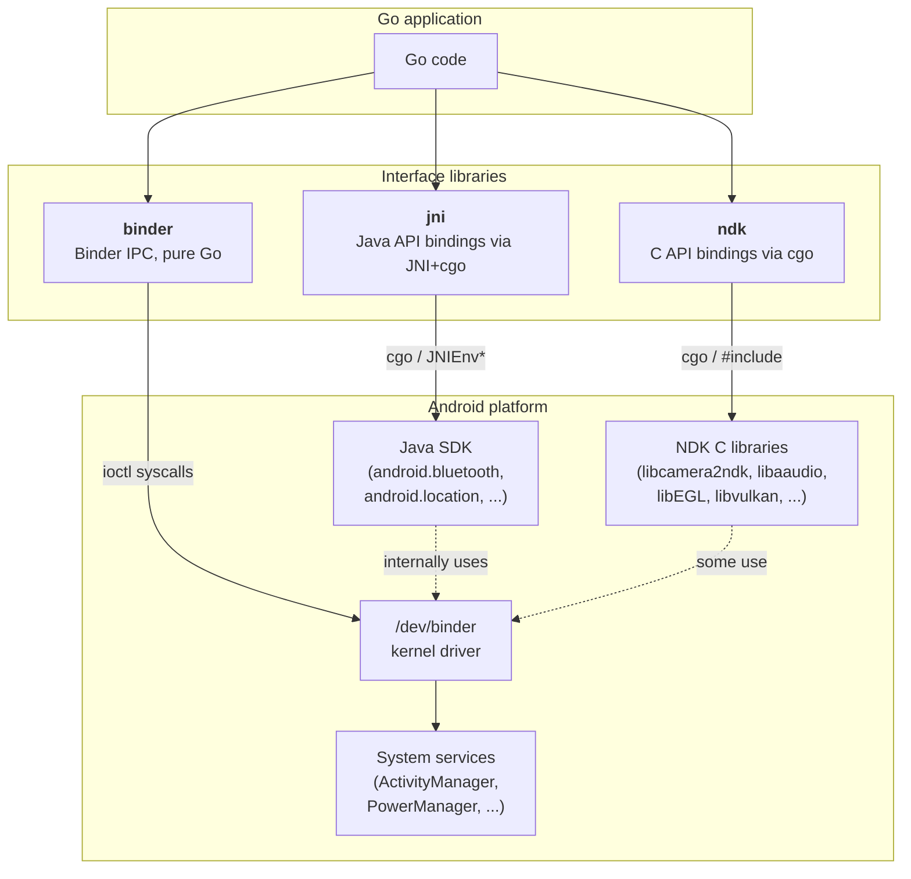
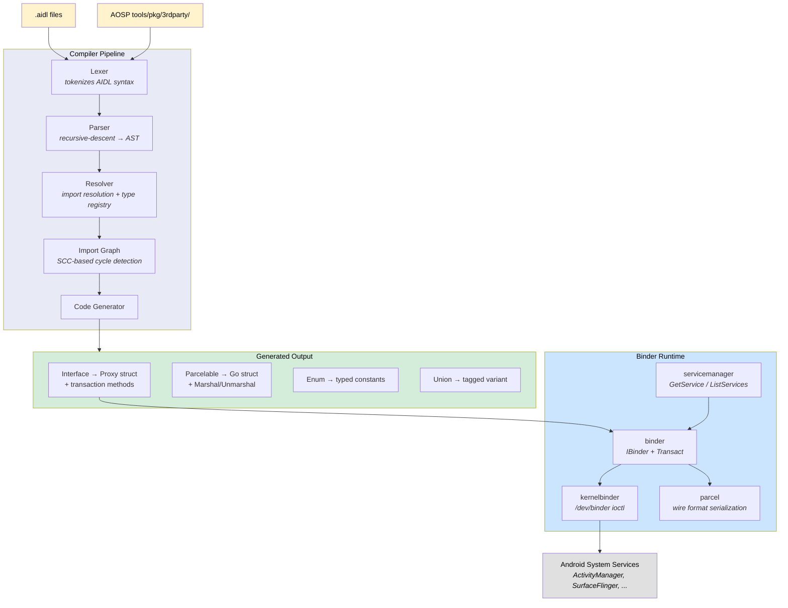
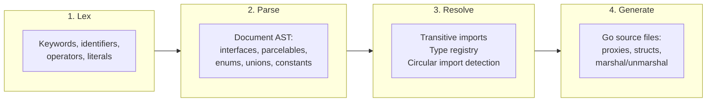
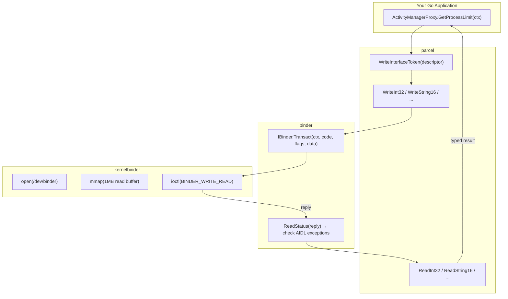

# binder

[](https://pkg.go.dev/github.com/xaionaro-go/binder)
[](https://goreportcard.com/report/github.com/xaionaro-go/binder)
[](https://github.com/AndroidGoLab/binder/actions/workflows/ci.yml)
[](LICENSE)
[](go.mod)
[](https://context7.com/androidgolab/binder)

Call Android system services from pure Go. Provides ~14,000 type-safe Go methods across 1,500+ Android interfaces — ActivityManager, PowerManager, SurfaceFlinger, PackageManager, audio, camera and sensor HALs, and more — by speaking the Binder IPC wire protocol directly via `/dev/binder` ioctl syscalls. No Java, no NDK, no cgo required.

Includes a complete AIDL compiler that parses Android Interface Definition Language files and generates the Go proxies, a version-aware runtime that adapts transaction codes across Android API levels, and a CLI tool (`bindercli`) for interactive service discovery and invocation.

## What can it do?

- **Query system services** — battery level, GPS location, thermal status, running processes, installed packages
- **Control hardware** — connect to WiFi, toggle flashlight, manage Bluetooth, configure audio
- **Interact with any binder service** — ActivityManager, PowerManager, SurfaceFlinger, camera/sensor HALs, and more
- **No Java, no cgo** — pure Go, cross-compiles to a static binary, runs on Android or any Linux with `/dev/binder`
- **CLI tool included** — `bindercli` for interactive service discovery, method invocation, and debugging

## Quick start

<!-- BEGIN GENERATED QUICK_START -->

**Go library** — `go get github.com/AndroidGoLab/binder` — live GPS location via binder IPC:

```go
package main

import (
    "context"
    "fmt"
    "math"
    "os"
    "time"

    "github.com/AndroidGoLab/binder/android/location"
    androidos "github.com/AndroidGoLab/binder/android/os"
    "github.com/AndroidGoLab/binder/binder"
    "github.com/AndroidGoLab/binder/binder/versionaware"
    "github.com/AndroidGoLab/binder/kernelbinder"
    "github.com/AndroidGoLab/binder/servicemanager"
)

// gpsListener receives location callbacks from the LocationManager.
type gpsListener struct{ fixCh chan location.Location }

func (l *gpsListener) OnLocationChanged(_ context.Context, locs []location.Location, _ androidos.IRemoteCallback) error {
    for _, loc := range locs { select { case l.fixCh <- loc: default: } }
    return nil
}
func (l *gpsListener) OnProviderEnabledChanged(_ context.Context, _ string, _ bool) error { return nil }
func (l *gpsListener) OnFlushComplete(_ context.Context, _ int32) error                   { return nil }

func main() {
    ctx := context.Background()
    drv, _ := kernelbinder.Open(ctx, binder.WithMapSize(128*1024))
    defer drv.Close(ctx)
    transport, _ := versionaware.NewTransport(ctx, drv, 0)
    sm := servicemanager.New(transport)

    lm, _ := location.GetLocationManager(ctx, sm)

    impl := &gpsListener{fixCh: make(chan location.Location, 1)}
    listener := location.NewLocationListenerStub(impl)

    request := location.LocationRequest{
        Provider: location.GpsProvider, IntervalMillis: 1000,
        ExpireAtRealtimeMillis: math.MaxInt64, DurationMillis: math.MaxInt64,
    }
    pkg := binder.DefaultCallerIdentity().PackageName
    _ = lm.RegisterLocationListener(ctx, location.GpsProvider, request, listener, pkg, "gps")
    defer lm.UnregisterLocationListener(ctx, listener)

    select {
    case loc := <-impl.fixCh:
        fmt.Printf("Lat: %.6f  Lon: %.6f  Alt: %.1f m  Accuracy: %.1f m\n",
            loc.LatitudeDegrees, loc.LongitudeDegrees, loc.AltitudeMeters, loc.HorizontalAccuracyMeters)
    case <-time.After(30 * time.Second):
        fmt.Fprintln(os.Stderr, "timed out")
    }
}
```

Full runnable example: [`examples/gps_location/`](examples/gps_location/)

Or query power state:

```go
power, _ := os.GetPowerManager(ctx, sm)
interactive, _ := power.IsInteractive(ctx)
fmt.Printf("Screen on: %v\n", interactive)
```

<!-- END GENERATED QUICK_START -->

## Related Projects

<details>
<summary>ndk, jni, binder (click to expand)</summary>

This project is part of a family of three Go libraries that cover the major Android interface surfaces. Each wraps a different layer of the Android platform:



| Library                                                             | Interface                    | Requires            | Best for                                                                                            |
| ------------------------------------------------------------------- | ---------------------------- | ------------------- | --------------------------------------------------------------------------------------------------- |
| **[ndk](https://github.com/xaionaro-go/ndk)**                       | Android NDK C APIs           | cgo + NDK toolchain | High-performance hardware access: camera, audio, sensors, OpenGL/Vulkan, media codecs               |
| **[jni](https://github.com/xaionaro-go/jni)**                       | Java Android SDK via JNI     | cgo + JNI + JVM/ART | Java-only APIs with no NDK equivalent: Bluetooth, WiFi, NFC, location, telephony, content providers |
| **[binder](https://github.com/AndroidGoLab/binder)** (this project) | Binder IPC (system services) | pure Go (no cgo)    | Direct system service calls without Java: works on non-Android Linux with binder, minimal footprint |

### When to use which

- **Start with ndk** when the NDK provides a C API for what you need (camera, audio, sensors, EGL/Vulkan, media codecs). These are the lowest-latency, lowest-overhead bindings since they go straight from Go to the C library via cgo.

- **Use jni** when you need a Java Android SDK API that the NDK does not expose. Examples: Bluetooth discovery, WiFi P2P, NFC tag reading, location services, telephony, content providers, notifications. JNI is also the right choice when you need to interact with Java components (Activities, Services, BroadcastReceivers) or when you need the gRPC remote-access layer.

- **Use binder** when you want pure-Go access to Android system services without any cgo dependency. This is ideal for lightweight tools, CLI programs, or scenarios where you want to talk to the binder driver from a non-Android Linux system. AIDL covers the same system services that Java SDK wraps (ActivityManager, PowerManager, etc.) but at the wire-protocol level.

- **Combine them** when your application needs multiple layers. For example, a streaming app might use **ndk** for camera capture and audio encoding, **jni** for Bluetooth controller discovery, and **binder** for querying battery status from a companion daemon.

### How they relate to each other

All three libraries talk to the same Android system services, but through different paths:

- The **NDK C APIs** are provided by Google as stable C interfaces to Android platform features. Some (camera, sensors, audio) internally use binder IPC to talk to system services; others (EGL, Vulkan, OpenGL) talk directly to kernel drivers. The `ndk` library wraps these C APIs via cgo.
- The **Java SDK** uses binder IPC internally for system service access (BluetoothManager, LocationManager, etc.), routing calls through the Android Runtime (ART/Dalvik). The `jni` library calls into these Java APIs via the JNI C interface and cgo.
- The **AIDL binder protocol** is the underlying IPC mechanism that system-facing NDK and Java SDK APIs use. The `binder` library implements this protocol directly in pure Go, bypassing both C and Java layers entirely.

</details>

## Usage Examples

<!-- BEGIN GENERATED USAGE_EXAMPLES -->

### Get GPS Location

```go
import (
    "context"
    "fmt"
    "log"

    "github.com/AndroidGoLab/binder/android/location"
    "github.com/AndroidGoLab/binder/binder"
    "github.com/AndroidGoLab/binder/binder/versionaware"
    "github.com/AndroidGoLab/binder/kernelbinder"
    "github.com/AndroidGoLab/binder/servicemanager"
)

    ctx := context.Background()

    driver, err := kernelbinder.Open(ctx, binder.WithMapSize(128*1024))
    if err != nil {
        log.Fatal(err)
    }
    defer driver.Close(ctx)

    transport, err := versionaware.NewTransport(ctx, driver, 0)
    if err != nil {
        log.Fatal(err)
    }
    sm := servicemanager.New(transport)

    lm, err := location.GetLocationManager(ctx, sm)
    if err != nil {
        log.Fatal(err)
    }

    loc, err := lm.GetLastLocation(ctx, location.FusedProvider, location.LastLocationRequest{}, binder.DefaultCallerIdentity().PackageName)
    if err != nil {
        log.Fatal(err)
    }

    fmt.Printf("Lat: %f, Lon: %f, Alt: %f\n",
        loc.LatitudeDegrees, loc.LongitudeDegrees, loc.AltitudeMeters)
    fmt.Printf("Speed: %f m/s, Bearing: %f°\n",
        loc.SpeedMetersPerSecond, loc.BearingDegrees)
```

### Check Power State

```go
import (
    "context"
    "fmt"
    "log"

    genOs "github.com/AndroidGoLab/binder/android/os"
    "github.com/AndroidGoLab/binder/binder"
    "github.com/AndroidGoLab/binder/binder/versionaware"
    "github.com/AndroidGoLab/binder/kernelbinder"
    "github.com/AndroidGoLab/binder/servicemanager"
)

    ctx := context.Background()

    driver, err := kernelbinder.Open(ctx, binder.WithMapSize(128*1024))
    if err != nil {
        log.Fatal(err)
    }
    defer driver.Close(ctx)

    transport, err := versionaware.NewTransport(ctx, driver, 0)
    if err != nil {
        log.Fatal(err)
    }
    sm := servicemanager.New(transport)

    power, err := genOs.GetPowerManager(ctx, sm)
    if err != nil {
        log.Fatal(err)
    }

    interactive, _ := power.IsInteractive(ctx)
    fmt.Printf("Screen on: %v\n", interactive)

    powerSave, _ := power.IsPowerSaveMode(ctx)
    fmt.Printf("Power save: %v\n", powerSave)
```

### List Binder Services

```go
    sm := servicemanager.New(transport)

    services, err := sm.ListServices(ctx)
    if err != nil {
        log.Fatal(err)
    }

    for _, name := range services {
        svc, err := sm.CheckService(ctx, name)
        if err == nil && svc != nil && svc.IsAlive(ctx) {
            fmt.Printf("%-60s alive\n", name)
        }
    }
```

### Call a System Service (ActivityManager)

```go
import (
    "github.com/AndroidGoLab/binder/android/app"
    "github.com/AndroidGoLab/binder/servicemanager"
)

    svc, err := sm.GetService(ctx, servicemanager.ActivityService)
    if err != nil {
        log.Fatal(err)
    }
    am := app.NewActivityManagerProxy(svc)

    limit, _ := am.GetProcessLimit(ctx)
    fmt.Printf("Process limit: %d\n", limit)

    monkey, _ := am.IsUserAMonkey(ctx)
    fmt.Printf("Is monkey: %v\n", monkey)
```

### Toggle Flashlight

Requires `android.permission.CAMERA`; see [`examples/flashlight_torch/`](examples/flashlight_torch/) for the full runnable example with permission handling.

```go
import (
    "context"

    "github.com/AndroidGoLab/binder/android/hardware"
    "github.com/AndroidGoLab/binder/binder"
    "github.com/AndroidGoLab/binder/parcel"
    "github.com/AndroidGoLab/binder/servicemanager"
)

// torchToken is a minimal TransactionReceiver for SetTorchMode's client binder.
type torchToken struct{}

func (t *torchToken) Descriptor() string { return "torch.client" }

func (t *torchToken) OnTransaction(
    _ context.Context,
    _ binder.TransactionCode,
    _ *parcel.Parcel,
) (*parcel.Parcel, error) {
    return parcel.New(), nil
}
```

```go
    svc, err := sm.GetService(ctx, servicemanager.MediaCameraService)
    if err != nil {
        log.Fatal(err)
    }
    camera := hardware.NewCameraServiceProxy(svc)

    // The camera service requires a non-null client binder token.
    clientToken := binder.NewStubBinder(&torchToken{})
    clientToken.RegisterWithTransport(ctx, transport)

    // Turn torch on for camera "0"
    if err := camera.SetTorchMode(ctx, "0", true, clientToken); err != nil {
        log.Fatal(err)
    }
    fmt.Println("Torch ON")

    // Turn torch off
    _ = camera.SetTorchMode(ctx, "0", false, clientToken)
```

### List All Installed Packages

```go
import (
    "github.com/AndroidGoLab/binder/android/content/pm"
    "github.com/AndroidGoLab/binder/servicemanager"
)

    svc, err := sm.GetService(ctx, servicemanager.PackageService)
    if err != nil {
        log.Fatal(err)
    }
    pkgMgr := pm.NewPackageManagerProxy(svc)

    packages, err := pkgMgr.GetAllPackages(ctx)
    if err != nil {
        log.Fatal(err)
    }

    fmt.Printf("Found %d packages:\n", len(packages))
    for _, pkg := range packages {
        fmt.Println(" ", pkg)
    }
```

### Handle Errors Gracefully

```go
import (
    "errors"
    aidlerrors "github.com/AndroidGoLab/binder/errors"
    "github.com/AndroidGoLab/binder/servicemanager"
)

    // Non-blocking service check (returns nil if not found)
    svc, err := sm.CheckService(ctx, servicemanager.MediaCameraService)
    if err != nil {
        log.Fatal(err)
    }
    if svc == nil {
        fmt.Println("Camera service not available")
        return
    }

    // Typed error inspection
    _, err = someProxy.SomeMethod(ctx)
    var status *aidlerrors.StatusError
    if errors.As(err, &status) {
        switch status.Exception {
        case aidlerrors.ExceptionSecurity:
            fmt.Printf("Permission denied: %s\n", status.Message)
        case aidlerrors.ExceptionServiceSpecific:
            fmt.Printf("Service error %d: %s\n", status.ServiceSpecificCode, status.Message)
        default:
            fmt.Printf("AIDL error: %v\n", status)
        }
    }
```

### Query Battery Level

```go
import (
    "github.com/AndroidGoLab/binder/android/hardware/health"
    "github.com/AndroidGoLab/binder/servicemanager"
)

    svc, err := sm.GetService(ctx, servicemanager.ServiceName(health.DescriptorIHealth+"/default"))
    if err != nil {
        log.Fatal(err)
    }
    h := health.NewHealthProxy(svc)

    capacity, err := h.GetCapacity(ctx)
    if err != nil {
        log.Fatal(err)
    }
    fmt.Printf("Battery level: %d%%\n", capacity)

    info, err := h.GetHealthInfo(ctx)
    if err != nil {
        log.Fatal(err)
    }
    fmt.Printf("Status: %v, Temperature: %.1f °C\n",
        info.BatteryStatus, float64(info.BatteryTemperatureTenthsCelsius)/10)
    fmt.Printf("Voltage: %d mV, Current: %d µA\n",
        info.BatteryVoltageMillivolts, info.BatteryCurrentMicroamps)
```

### Send a Raw Binder Transaction

```go
import (
    "github.com/AndroidGoLab/binder/binder"
    "github.com/AndroidGoLab/binder/parcel"
    "github.com/AndroidGoLab/binder/servicemanager"
)

    svc, err := sm.GetService(ctx, servicemanager.ActivityService)
    if err != nil {
        log.Fatal(err)
    }

    // Build the request parcel.
    data := parcel.New()
    defer data.Recycle()
    data.WriteInterfaceToken("android.app.IActivityManager")
    data.WriteString16("android.permission.INTERNET")
    data.WriteInt32(int32(os.Getpid()))
    data.WriteInt32(int32(os.Getuid()))

    // Resolve the method's transaction code and send.
    code, err := svc.ResolveCode(ctx, "android.app.IActivityManager", "checkPermission")
    if err != nil {
        log.Fatal(err)
    }
    reply, err := svc.Transact(ctx, code, 0, data)
    if err != nil {
        log.Fatal(err)
    }
    defer reply.Recycle()

    // Read the AIDL status header, then the return value.
    if err := binder.ReadStatus(reply); err != nil {
        log.Fatal(err)
    }
    result, _ := reply.ReadInt32()
    fmt.Printf("checkPermission returned: %d\n", result)
```

### Register a Server-Side Service

```go
import (
    "context"

    "github.com/AndroidGoLab/binder/binder"
    "github.com/AndroidGoLab/binder/parcel"
    "github.com/AndroidGoLab/binder/servicemanager"
)

// myService implements binder.TransactionReceiver for a simple ping service.
type myService struct{}

func (s *myService) Descriptor() string { return "com.example.IPingService" }

func (s *myService) OnTransaction(
    ctx context.Context,
    code binder.TransactionCode,
    data *parcel.Parcel,
) (*parcel.Parcel, error) {
    reply := parcel.New()
    binder.WriteStatus(reply, nil)
    reply.WriteString16("pong")
    return reply, nil
}
```

```go
    // Register with ServiceManager
    err := sm.AddService(ctx, servicemanager.ServiceName("my.service"), &myService{}, false, 0)
```

<details>
<summary><strong>Using other services</strong></summary>

The examples above cover specific subsystems, but the library supports **all** Android binder services — over 1,500 interfaces. To work with a service not shown above:

1. **Find the service name.** Run `bindercli service list` on the device, or check `servicemanager/service_names_gen.go` for well-known constants.

2. **Find the generated proxy.** Browse the `android/` and `com/` packages on [pkg.go.dev](https://pkg.go.dev/github.com/AndroidGoLab/binder) or use `grep`:

```bash
# Find the proxy for a known AIDL interface
grep -r 'DescriptorI.*= "android.os.IVibratorService"' android/
```

3. **Connect and call methods:**

```go
    svc, err := sm.GetService(ctx, servicemanager.VibratorService)
    if err != nil {
        log.Fatal(err)
    }
    proxy := genOs.NewVibratorServiceProxy(svc)
    result, err := proxy.SomeMethod(ctx, args...)
```

4. **For HAL services** (hardware abstraction layers), the service name is the AIDL descriptor plus `/default`:

```go
    svc, err := sm.GetService(ctx, servicemanager.ServiceName(health.DescriptorIHealth+"/default"))
```

5. **For services without a generated proxy**, use raw transactions (see [Send a Raw Binder Transaction](#send-a-raw-binder-transaction) above).

</details>

More examples: [`examples/`](examples/)

<!-- END GENERATED USAGE_EXAMPLES -->

<!-- BEGIN GENERATED EXAMPLES_TABLE -->

| Example                                                    | Queries                                             |
| ---------------------------------------------------------- | --------------------------------------------------- |
| [`account_manager`](examples/account_manager/) | List accounts on the device via AccountManager. |
| [`activity_manager`](examples/activity_manager/) | Process limits, monkey test flag, permission checks |
| [`aidl_bridge`](examples/aidl_bridge/) | Expose a bridge service that forwards calls to another binder service. |
| [`aidl_explorer`](examples/aidl_explorer/) | Introspect methods on binder services. |
| [`alarm_auditor`](examples/alarm_auditor/) | Audit pending alarms via AlarmManager. |
| [`app_hibernation`](examples/app_hibernation/) | Query app hibernation status via the AppHibernationService. |
| [`attention_monitor`](examples/attention_monitor/) | Monitor user presence via PowerManager and display state. |
| [`attestation_verify`](examples/attestation_verify/) | Query attestation verification and related security services. |
| [`audio_focus`](examples/audio_focus/) | Query current audio focus state via AudioService. |
| [`audio_recording_monitor`](examples/audio_recording_monitor/) | Detect which apps are currently recording audio. |
| [`audio_status`](examples/audio_status/) | Audio device info, volume state |
| [`battery_health`](examples/battery_health/) | Capacity, charge status, current draw |
| [`binder_fuzzer`](examples/binder_fuzzer/) | Send randomized parcel data to services to test robustness. |
| [`binder_latency`](examples/binder_latency/) | Measure round-trip binder transaction times. |
| [`ble_sensor_collector`](examples/ble_sensor_collector/) | BLE sensor collector: scan for BLE devices and register a GATT client. |
| [`bluetooth_audio_routing`](examples/bluetooth_audio_routing/) | Manage Bluetooth A2DP audio connections via binder. |
| [`bluetooth_inventory`](examples/bluetooth_inventory/) | Enumerate paired/bonded Bluetooth devices and query adapter info. |
| [`bluetooth_status`](examples/bluetooth_status/) | Query Bluetooth adapter status and scan for BLE devices via binder. |
| [`camera_capture`](examples/camera_capture/) | Camera frame capture using gralloc-allocated buffers. |
| [`camera_connect`](examples/camera_connect/) | Camera device connection with callback stub |
| [`carrier_config`](examples/carrier_config/) | Query carrier configuration: default carrier service package, |
| [`charge_monitor`](examples/charge_monitor/) | Monitor charging status and battery health via the Health HAL. |
| [`clipboard_monitor`](examples/clipboard_monitor/) | Access the clipboard service to check clipboard state. |
| [`compliance_checker`](examples/compliance_checker/) | Verify device compliance: encryption, security state, OTA update status. |
| [`credential_manager`](examples/credential_manager/) | Query the CredentialManager service for availability. |
| [`device_info`](examples/device_info/) | Device properties, build info |
| [`device_policy`](examples/device_policy/) | Query DevicePolicyManager for device administration state. |
| [`display_info`](examples/display_info/) | Display IDs, brightness, night mode |
| [`dnd_controller`](examples/dnd_controller/) | Query and display Do Not Disturb (Zen) mode via NotificationManager. |
| [`dns_config`](examples/dns_config/) | Query network configuration via the netd system service. |
| [`dream_manager`](examples/dream_manager/) | Query screensaver/daydream state via DreamManager. |
| [`dual_sim`](examples/dual_sim/) | Monitor SIM slots: query active subscription count, slot info, |
| [`error_handling`](examples/error_handling/) | Graceful error handling: service checks, typed errors, permissions |
| [`esim_manager`](examples/esim_manager/) | Query eSIM/eUICC profile management: OTA status, supported countries, |
| [`factory_reset`](examples/factory_reset/) | Factory reset demonstration via DevicePolicyManager. |
| [`flashlight_torch`](examples/flashlight_torch/) | Toggle flashlight/torch via ICameraService |
| [`geofence`](examples/geofence/) | Query location provider availability for geofencing use cases. |
| [`getservice_vs_checkservice`](examples/getservice_vs_checkservice/) | Binary getservice_vs_checkservice compares GetService vs CheckService |
| [`gnss_diagnostics`](examples/gnss_diagnostics/) | Query GNSS hardware model name, year, and capabilities via LocationManager. |
| [`gps_location`](examples/gps_location/) | Live GPS fix via ILocationListener callback |
| [`headless_controller`](examples/headless_controller/) | Headless device orchestration: query power, display, and process state. |
| [`ims_monitor`](examples/ims_monitor/) | Monitor IMS registration state via ITelephony proxy. |
| [`input_injector`](examples/input_injector/) | Query input devices from InputManager. |
| [`job_scheduler_monitor`](examples/job_scheduler_monitor/) | Query JobScheduler state from the "jobscheduler" service. |
| [`keymint_delete_test`](examples/keymint_delete_test/) | Binary keymint_delete_test calls DeleteAllKeys on the KeyMint HAL |
| [`keystore_ops`](examples/keystore_ops/) | Query Keystore2 service for key entries and counts (read-only). |
| [`kiosk_lockdown`](examples/kiosk_lockdown/) | Query activity/window manager for kiosk lockdown information. |
| [`last_location`](examples/last_location/) | Retrieve the last known fused location without registering a listener. |
| [`list_packages`](examples/list_packages/) | List all installed packages via GetAllPackages |
| [`list_services`](examples/list_services/) | Enumerate all binder services, ping each |
| [`location_benchmark`](examples/location_benchmark/) | Compare location providers by querying all providers and their properties. |
| [`mdm_agent`](examples/mdm_agent/) | Lightweight MDM agent querying device policies via DevicePolicyManager. |
| [`media_session_control`](examples/media_session_control/) | Enumerate active media sessions and query global priority. |
| [`media_transcoding`](examples/media_transcoding/) | Query media transcoding service status and media metrics session IDs. |
| [`memory_pressure`](examples/memory_pressure/) | Read memory pressure info from ActivityManager. |
| [`mock_service`](examples/mock_service/) | Create a mock binder service for testing. |
| [`network_monitor`](examples/network_monitor/) | Check network connectivity status via NetworkManagementService. |
| [`network_policy`](examples/network_policy/) | Query network policy settings via the INetworkPolicyManager system service. |
| [`notification_listener`](examples/notification_listener/) | Query notification state via NotificationManager: zen mode, active notifications. |
| [`oem_lock_status`](examples/oem_lock_status/) | Query OemLockService for bootloader lock state and OEM unlock status. |
| [`ota_status`](examples/ota_status/) | Query update engine for OTA update status. |
| [`package_monitor`](examples/package_monitor/) | Monitor installed packages by polling the PackageManager. |
| [`package_query`](examples/package_query/) | Package list, installation info |
| [`permission_audit`](examples/permission_audit/) | Audit permissions for installed apps via the ActivityManager. |
| [`permission_boundary`](examples/permission_boundary/) | Test which binder calls succeed or fail from the current security context. |
| [`permission_checker`](examples/permission_checker/) | Check permissions for UIDs/PIDs via ActivityManager. |
| [`power_profiling`](examples/power_profiling/) | Measure battery current draw over time via the Health HAL. |
| [`power_save_auto`](examples/power_save_auto/) | Query power save mode status and related settings via PowerManager. |
| [`power_status`](examples/power_status/) | Power supply state, charging info |
| [`process_watchdog`](examples/process_watchdog/) | List running processes via ActivityManager and check resource usage. |
| [`qr_scanner_daemon`](examples/qr_scanner_daemon/) | QR/barcode scanner daemon that captures camera frames for processing. |
| [`remote_diagnostics`](examples/remote_diagnostics/) | Collect comprehensive device state for remote diagnostics. |
| [`rkp_monitor`](examples/rkp_monitor/) | Monitor remote key provisioning (RKP) and device security state. |
| [`rotation_resolver`](examples/rotation_resolver/) | Query device rotation and display state via WindowManager and DisplayManager. |
| [`satellite_check`](examples/satellite_check/) | Check satellite telephony readiness by querying the telephony service. |
| [`screen_control`](examples/screen_control/) | Check screen on/off state and display interactivity via PowerManager. |
| [`secure_element`](examples/secure_element/) | Query OMAPI SecureElementService for available readers. |
| [`security_test_apk`](examples/security_test_apk/) | Binary security_test_apk probes whether an app-sandboxed process can |
| [`sensor_gateway`](examples/sensor_gateway/) | Sensor data collection relay: list available sensors and query defaults. |
| [`sensor_reader`](examples/sensor_reader/) | Read sensor data from the SensorManager HAL. |
| [`server_service`](examples/server_service/) | Register a Go service and call it back via binder |
| [`server_service_aidl`](examples/server_service_aidl/) | Register a Go binder service using a generated AIDL stub. |
| [`signage_controller`](examples/signage_controller/) | Display brightness and power control for digital signage. |
| [`sim_status`](examples/sim_status/) | Query telephony service for SIM state: radio, ICC card, data state. |
| [`sms_monitor`](examples/sms_monitor/) | Query SMS service: preferred subscription, IMS SMS support. |
| [`softap_manage`](examples/softap_manage/) | WiFi hotspot enable/disable, config |
| [`softap_tether_offload`](examples/softap_tether_offload/) | Tethering offload config, stats |
| [`softap_wifi_hal`](examples/softap_wifi_hal/) | WiFi chip info, AP interface state |
| [`sound_trigger`](examples/sound_trigger/) | List sound trigger modules via SoundTriggerMiddlewareService. |
| [`statusbar_control`](examples/statusbar_control/) | Query status bar state: navigation bar mode, tracing, last system key. |
| [`storage_info`](examples/storage_info/) | Storage device stats, mount points |
| [`suspend_logger`](examples/suspend_logger/) | Acquire and release a wake lock via the PowerManager binder service. |
| [`system_app_classifier`](examples/system_app_classifier/) | Classify installed packages as system or user apps. |
| [`thermal_monitor`](examples/thermal_monitor/) | Poll thermal service for CPU/GPU temperatures, throttling status, and cooling devices. |
| [`timelapse_capture`](examples/timelapse_capture/) | Periodic timelapse camera capture via binder. |
| [`transaction_resolver`](examples/transaction_resolver/) | Resolve AIDL method names to transaction codes for binder services. |
| [`usage_stats`](examples/usage_stats/) | Query app usage statistics via the UsageStatsManager. |
| [`usb_tracker`](examples/usb_tracker/) | Query USB device state: ports, functions, speed, and HAL versions. |
| [`user_manager`](examples/user_manager/) | Query user profiles from the UserManager service. |
| [`vehicle_telematics`](examples/vehicle_telematics/) | Collect GPS, battery, and device diagnostics for vehicle telematics. |
| [`version_compat`](examples/version_compat/) | Validate proxy compatibility across API levels. |
| [`volume_control`](examples/volume_control/) | Get and set stream volumes via AudioService. |
| [`vpn_monitor`](examples/vpn_monitor/) | Check VPN status via the IVpnManager system service. |
| [`wakelock_audit`](examples/wakelock_audit/) | Enumerate supported wake lock levels via PowerManager. |
| [`wifi_scanner`](examples/wifi_scanner/) | Scan available WiFi networks via the wificond system service. |

<!-- END GENERATED EXAMPLES_TABLE -->

## bindercli Quick Start

`bindercli` lets you call any Android system service from the command line — no Go code needed.

**Install and deploy:**

```bash
GOOS=linux GOARCH=arm64 go build -o build/bindercli ./cmd/bindercli/
adb push build/bindercli /data/local/tmp/
```

**Try it:**

```bash
# List all binder services
adb shell /data/local/tmp/bindercli service list

# Check battery level
adb shell /data/local/tmp/bindercli android.hardware.health.IHealth get-health-info

# Query ActivityManager
adb shell /data/local/tmp/bindercli android.app.IActivityManager get-process-limit

# Get GPS hardware info
adb shell /data/local/tmp/bindercli android.location.ILocationManager get-gnss-hardware-model-name
```

See the full [bindercli reference](#bindercli) for all subcommands and more examples.

## Packages

|                                                                                                                                                            | Package              | Description                                                                            | Import Path                                         |
| ---------------------------------------------------------------------------------------------------------------------------------------------------------- | -------------------- | -------------------------------------------------------------------------------------- | --------------------------------------------------- |
| **AIDL Pipeline** ([`tools/pkg/`](tools/pkg/))                                                                                                             |                      |                                                                                        |                                                     |
| [](https://pkg.go.dev/github.com/AndroidGoLab/binder/tools/pkg/parser)                    | `tools/pkg/parser`   | Lexer and recursive-descent parser producing an AST from `.aidl` files                 | `github.com/AndroidGoLab/binder/tools/pkg/parser`   |
| [](https://pkg.go.dev/github.com/AndroidGoLab/binder/tools/pkg/resolver)          | `tools/pkg/resolver` | Import resolution across search paths with type registry and circular-import detection | `github.com/AndroidGoLab/binder/tools/pkg/resolver` |
| [](https://pkg.go.dev/github.com/AndroidGoLab/binder/tools/pkg/codegen)              | `tools/pkg/codegen`  | Go code generator for proxies, parcelables, enums, unions, and constants               | `github.com/AndroidGoLab/binder/tools/pkg/codegen`  |
| [](https://pkg.go.dev/github.com/AndroidGoLab/binder/tools/pkg/validate)          | `tools/pkg/validate` | Semantic validation: type resolution, parameter directions, oneway constraints         | `github.com/AndroidGoLab/binder/tools/pkg/validate` |
| **Runtime**                                                                                                                                                |                      |                                                                                        |                                                     |
| [](https://pkg.go.dev/github.com/AndroidGoLab/binder/binder)                               | `binder`             | Binder IPC abstractions: `IBinder` interface, `Transact()`, status/exception handling  | `github.com/AndroidGoLab/binder/binder`             |
| [](https://pkg.go.dev/github.com/AndroidGoLab/binder/parcel)                            | `parcel`             | Binder wire format: 4-byte aligned, little-endian serialization                        | `github.com/AndroidGoLab/binder/parcel`             |
| [](https://pkg.go.dev/github.com/AndroidGoLab/binder/kernelbinder)          | `kernelbinder`       | Linux `/dev/binder` driver: open, mmap, ioctl, protocol negotiation                    | `github.com/AndroidGoLab/binder/kernelbinder`       |
| [](https://pkg.go.dev/github.com/AndroidGoLab/binder/servicemanager) | `servicemanager`     | Client for `android.os.IServiceManager`: `GetService()`, `ListServices()`, etc.        | `github.com/AndroidGoLab/binder/servicemanager`     |
| [](https://pkg.go.dev/github.com/AndroidGoLab/binder/errors)                          | `errors`             | AIDL exception types: `ExceptionCode`, `StatusError`                                   | `github.com/AndroidGoLab/binder/errors`             |
| **Testing**                                                                                                                                                |                      |                                                                                        |                                                     |
| [](https://pkg.go.dev/github.com/AndroidGoLab/binder/tools/pkg/testutil)           | `tools/pkg/testutil` | Mock binder and reflection-based smoke testing for generated proxies                   | `github.com/AndroidGoLab/binder/tools/pkg/testutil` |

### Generated AOSP Packages

<!-- BEGIN GENERATED PACKAGES -->

385 packages: 1513 interfaces, 2370 parcelables, 957 enums, 133 unions.

<details>
<summary><strong>aaudio</strong> (1 packages)</summary>

| Package | Interfaces | Parcelables | Enums | Unions | Import Path |
|---|---|---|---|---|---|
| [`aaudio`](https://pkg.go.dev/github.com/AndroidGoLab/binder/aaudio) | 2 | 5 | 0 | 0 | `github.com/AndroidGoLab/binder/aaudio` |

</details>

<details>
<summary><strong>android</strong> (1 packages)</summary>

| Package | Interfaces | Parcelables | Enums | Unions | Import Path |
|---|---|---|---|---|---|
| [`android`](https://pkg.go.dev/github.com/AndroidGoLab/binder/android) | 6 | 1 | 0 | 0 | `github.com/AndroidGoLab/binder/android` |

</details>

<details>
<summary><strong>android/accessibilityservice</strong> (1 packages)</summary>

| Package | Interfaces | Parcelables | Enums | Unions | Import Path |
|---|---|---|---|---|---|
| [`android/accessibilityservice`](https://pkg.go.dev/github.com/AndroidGoLab/binder/android/accessibilityservice) | 4 | 3 | 0 | 0 | `github.com/AndroidGoLab/binder/android/accessibilityservice` |

</details>

<details>
<summary><strong>android/accounts</strong> (1 packages)</summary>

| Package | Interfaces | Parcelables | Enums | Unions | Import Path |
|---|---|---|---|---|---|
| [`android/accounts`](https://pkg.go.dev/github.com/AndroidGoLab/binder/android/accounts) | 4 | 2 | 0 | 0 | `github.com/AndroidGoLab/binder/android/accounts` |

</details>

<details>
<summary><strong>android/app</strong> (24 packages)</summary>

| Package | Interfaces | Parcelables | Enums | Unions | Import Path |
|---|---|---|---|---|---|
| [`android/app`](https://pkg.go.dev/github.com/AndroidGoLab/binder/android/app) | 50 | 61 | 1 | 0 | `github.com/AndroidGoLab/binder/android/app` |
| [`android/app/admin`](https://pkg.go.dev/github.com/AndroidGoLab/binder/android/app/admin) | 6 | 20 | 0 | 0 | `github.com/AndroidGoLab/binder/android/app/admin` |
| [`android/app/ambientcontext`](https://pkg.go.dev/github.com/AndroidGoLab/binder/android/app/ambientcontext) | 2 | 2 | 0 | 0 | `github.com/AndroidGoLab/binder/android/app/ambientcontext` |
| [`android/app/assist`](https://pkg.go.dev/github.com/AndroidGoLab/binder/android/app/assist) | 0 | 3 | 0 | 0 | `github.com/AndroidGoLab/binder/android/app/assist` |
| [`android/app/backup`](https://pkg.go.dev/github.com/AndroidGoLab/binder/android/app/backup) | 8 | 4 | 0 | 0 | `github.com/AndroidGoLab/binder/android/app/backup` |
| [`android/app/blob`](https://pkg.go.dev/github.com/AndroidGoLab/binder/android/app/blob) | 3 | 3 | 0 | 0 | `github.com/AndroidGoLab/binder/android/app/blob` |
| [`android/app/contentsuggestions`](https://pkg.go.dev/github.com/AndroidGoLab/binder/android/app/contentsuggestions) | 3 | 4 | 0 | 0 | `github.com/AndroidGoLab/binder/android/app/contentsuggestions` |
| [`android/app/job`](https://pkg.go.dev/github.com/AndroidGoLab/binder/android/app/job) | 4 | 5 | 0 | 0 | `github.com/AndroidGoLab/binder/android/app/job` |
| [`android/app/ondeviceintelligence`](https://pkg.go.dev/github.com/AndroidGoLab/binder/android/app/ondeviceintelligence) | 9 | 3 | 0 | 0 | `github.com/AndroidGoLab/binder/android/app/ondeviceintelligence` |
| [`android/app/people`](https://pkg.go.dev/github.com/AndroidGoLab/binder/android/app/people) | 2 | 2 | 0 | 0 | `github.com/AndroidGoLab/binder/android/app/people` |
| [`android/app/pinner`](https://pkg.go.dev/github.com/AndroidGoLab/binder/android/app/pinner) | 1 | 1 | 0 | 0 | `github.com/AndroidGoLab/binder/android/app/pinner` |
| [`android/app/prediction`](https://pkg.go.dev/github.com/AndroidGoLab/binder/android/app/prediction) | 2 | 5 | 0 | 0 | `github.com/AndroidGoLab/binder/android/app/prediction` |
| [`android/app/search`](https://pkg.go.dev/github.com/AndroidGoLab/binder/android/app/search) | 2 | 5 | 0 | 0 | `github.com/AndroidGoLab/binder/android/app/search` |
| [`android/app/servertransaction`](https://pkg.go.dev/github.com/AndroidGoLab/binder/android/app/servertransaction) | 0 | 1 | 0 | 0 | `github.com/AndroidGoLab/binder/android/app/servertransaction` |
| [`android/app/slice`](https://pkg.go.dev/github.com/AndroidGoLab/binder/android/app/slice) | 2 | 2 | 0 | 0 | `github.com/AndroidGoLab/binder/android/app/slice` |
| [`android/app/smartspace`](https://pkg.go.dev/github.com/AndroidGoLab/binder/android/app/smartspace) | 2 | 4 | 0 | 0 | `github.com/AndroidGoLab/binder/android/app/smartspace` |
| [`android/app/tare`](https://pkg.go.dev/github.com/AndroidGoLab/binder/android/app/tare) | 1 | 0 | 0 | 0 | `github.com/AndroidGoLab/binder/android/app/tare` |
| [`android/app/time`](https://pkg.go.dev/github.com/AndroidGoLab/binder/android/app/time) | 2 | 13 | 0 | 0 | `github.com/AndroidGoLab/binder/android/app/time` |
| [`android/app/timedetector`](https://pkg.go.dev/github.com/AndroidGoLab/binder/android/app/timedetector) | 1 | 2 | 0 | 0 | `github.com/AndroidGoLab/binder/android/app/timedetector` |
| [`android/app/timezonedetector`](https://pkg.go.dev/github.com/AndroidGoLab/binder/android/app/timezonedetector) | 1 | 2 | 0 | 0 | `github.com/AndroidGoLab/binder/android/app/timezonedetector` |
| [`android/app/trust`](https://pkg.go.dev/github.com/AndroidGoLab/binder/android/app/trust) | 3 | 0 | 0 | 0 | `github.com/AndroidGoLab/binder/android/app/trust` |
| [`android/app/usage`](https://pkg.go.dev/github.com/AndroidGoLab/binder/android/app/usage) | 3 | 9 | 0 | 0 | `github.com/AndroidGoLab/binder/android/app/usage` |
| [`android/app/wallpapereffectsgeneration`](https://pkg.go.dev/github.com/AndroidGoLab/binder/android/app/wallpapereffectsgeneration) | 2 | 2 | 0 | 0 | `github.com/AndroidGoLab/binder/android/app/wallpapereffectsgeneration` |
| [`android/app/wearable`](https://pkg.go.dev/github.com/AndroidGoLab/binder/android/app/wearable) | 1 | 0 | 0 | 0 | `github.com/AndroidGoLab/binder/android/app/wearable` |

</details>

<details>
<summary><strong>android/apphibernation</strong> (1 packages)</summary>

| Package | Interfaces | Parcelables | Enums | Unions | Import Path |
|---|---|---|---|---|---|
| [`android/apphibernation`](https://pkg.go.dev/github.com/AndroidGoLab/binder/android/apphibernation) | 1 | 1 | 0 | 0 | `github.com/AndroidGoLab/binder/android/apphibernation` |

</details>

<details>
<summary><strong>android/appwidget</strong> (1 packages)</summary>

| Package | Interfaces | Parcelables | Enums | Unions | Import Path |
|---|---|---|---|---|---|
| [`android/appwidget`](https://pkg.go.dev/github.com/AndroidGoLab/binder/android/appwidget) | 0 | 1 | 0 | 0 | `github.com/AndroidGoLab/binder/android/appwidget` |

</details>

<details>
<summary><strong>android/binderdebug</strong> (1 packages)</summary>

| Package | Interfaces | Parcelables | Enums | Unions | Import Path |
|---|---|---|---|---|---|
| [`android/binderdebug/test`](https://pkg.go.dev/github.com/AndroidGoLab/binder/android/binderdebug/test) | 1 | 0 | 0 | 0 | `github.com/AndroidGoLab/binder/android/binderdebug/test` |

</details>

<details>
<summary><strong>android/bluetooth</strong> (2 packages)</summary>

| Package | Interfaces | Parcelables | Enums | Unions | Import Path |
|---|---|---|---|---|---|
| [`android/bluetooth`](https://pkg.go.dev/github.com/AndroidGoLab/binder/android/bluetooth) | 50 | 32 | 1 | 0 | `github.com/AndroidGoLab/binder/android/bluetooth` |
| [`android/bluetooth/le`](https://pkg.go.dev/github.com/AndroidGoLab/binder/android/bluetooth/le) | 4 | 12 | 0 | 0 | `github.com/AndroidGoLab/binder/android/bluetooth/le` |

</details>

<details>
<summary><strong>android/companion</strong> (8 packages)</summary>

| Package | Interfaces | Parcelables | Enums | Unions | Import Path |
|---|---|---|---|---|---|
| [`android/companion`](https://pkg.go.dev/github.com/AndroidGoLab/binder/android/companion) | 8 | 5 | 0 | 0 | `github.com/AndroidGoLab/binder/android/companion` |
| [`android/companion/datatransfer`](https://pkg.go.dev/github.com/AndroidGoLab/binder/android/companion/datatransfer) | 0 | 1 | 0 | 0 | `github.com/AndroidGoLab/binder/android/companion/datatransfer` |
| [`android/companion/virtual`](https://pkg.go.dev/github.com/AndroidGoLab/binder/android/companion/virtual) | 6 | 2 | 0 | 0 | `github.com/AndroidGoLab/binder/android/companion/virtual` |
| [`android/companion/virtual/audio`](https://pkg.go.dev/github.com/AndroidGoLab/binder/android/companion/virtual/audio) | 2 | 0 | 0 | 0 | `github.com/AndroidGoLab/binder/android/companion/virtual/audio` |
| [`android/companion/virtual/camera`](https://pkg.go.dev/github.com/AndroidGoLab/binder/android/companion/virtual/camera) | 1 | 1 | 0 | 0 | `github.com/AndroidGoLab/binder/android/companion/virtual/camera` |
| [`android/companion/virtual/sensor`](https://pkg.go.dev/github.com/AndroidGoLab/binder/android/companion/virtual/sensor) | 1 | 3 | 0 | 0 | `github.com/AndroidGoLab/binder/android/companion/virtual/sensor` |
| [`android/companion/virtualcamera`](https://pkg.go.dev/github.com/AndroidGoLab/binder/android/companion/virtualcamera) | 2 | 2 | 3 | 0 | `github.com/AndroidGoLab/binder/android/companion/virtualcamera` |
| [`android/companion/virtualnative`](https://pkg.go.dev/github.com/AndroidGoLab/binder/android/companion/virtualnative) | 1 | 0 | 0 | 0 | `github.com/AndroidGoLab/binder/android/companion/virtualnative` |

</details>

<details>
<summary><strong>android/content</strong> (9 packages)</summary>

| Package | Interfaces | Parcelables | Enums | Unions | Import Path |
|---|---|---|---|---|---|
| [`android/content`](https://pkg.go.dev/github.com/AndroidGoLab/binder/android/content) | 12 | 23 | 0 | 0 | `github.com/AndroidGoLab/binder/android/content` |
| [`android/content/integrity`](https://pkg.go.dev/github.com/AndroidGoLab/binder/android/content/integrity) | 1 | 1 | 0 | 0 | `github.com/AndroidGoLab/binder/android/content/integrity` |
| [`android/content/om`](https://pkg.go.dev/github.com/AndroidGoLab/binder/android/content/om) | 1 | 3 | 0 | 0 | `github.com/AndroidGoLab/binder/android/content/om` |
| [`android/content/pm`](https://pkg.go.dev/github.com/AndroidGoLab/binder/android/content/pm) | 27 | 59 | 2 | 0 | `github.com/AndroidGoLab/binder/android/content/pm` |
| [`android/content/pm/dex`](https://pkg.go.dev/github.com/AndroidGoLab/binder/android/content/pm/dex) | 2 | 0 | 0 | 0 | `github.com/AndroidGoLab/binder/android/content/pm/dex` |
| [`android/content/pm/permission`](https://pkg.go.dev/github.com/AndroidGoLab/binder/android/content/pm/permission) | 1 | 1 | 0 | 0 | `github.com/AndroidGoLab/binder/android/content/pm/permission` |
| [`android/content/pm/verify/domain`](https://pkg.go.dev/github.com/AndroidGoLab/binder/android/content/pm/verify/domain) | 1 | 4 | 0 | 0 | `github.com/AndroidGoLab/binder/android/content/pm/verify/domain` |
| [`android/content/res`](https://pkg.go.dev/github.com/AndroidGoLab/binder/android/content/res) | 1 | 3 | 0 | 0 | `github.com/AndroidGoLab/binder/android/content/res` |
| [`android/content/rollback`](https://pkg.go.dev/github.com/AndroidGoLab/binder/android/content/rollback) | 1 | 2 | 0 | 0 | `github.com/AndroidGoLab/binder/android/content/rollback` |

</details>

<details>
<summary><strong>android/credentials</strong> (1 packages)</summary>

| Package | Interfaces | Parcelables | Enums | Unions | Import Path |
|---|---|---|---|---|---|
| [`android/credentials`](https://pkg.go.dev/github.com/AndroidGoLab/binder/android/credentials) | 7 | 14 | 0 | 0 | `github.com/AndroidGoLab/binder/android/credentials` |

</details>

<details>
<summary><strong>android/database</strong> (1 packages)</summary>

| Package | Interfaces | Parcelables | Enums | Unions | Import Path |
|---|---|---|---|---|---|
| [`android/database`](https://pkg.go.dev/github.com/AndroidGoLab/binder/android/database) | 1 | 1 | 0 | 0 | `github.com/AndroidGoLab/binder/android/database` |

</details>

<details>
<summary><strong>android/debug</strong> (1 packages)</summary>

| Package | Interfaces | Parcelables | Enums | Unions | Import Path |
|---|---|---|---|---|---|
| [`android/debug`](https://pkg.go.dev/github.com/AndroidGoLab/binder/android/debug) | 3 | 2 | 1 | 0 | `github.com/AndroidGoLab/binder/android/debug` |

</details>

<details>
<summary><strong>android/dvr</strong> (1 packages)</summary>

| Package | Interfaces | Parcelables | Enums | Unions | Import Path |
|---|---|---|---|---|---|
| [`android/dvr`](https://pkg.go.dev/github.com/AndroidGoLab/binder/android/dvr) | 1 | 0 | 0 | 0 | `github.com/AndroidGoLab/binder/android/dvr` |

</details>

<details>
<summary><strong>android/flags</strong> (1 packages)</summary>

| Package | Interfaces | Parcelables | Enums | Unions | Import Path |
|---|---|---|---|---|---|
| [`android/flags`](https://pkg.go.dev/github.com/AndroidGoLab/binder/android/flags) | 2 | 1 | 0 | 0 | `github.com/AndroidGoLab/binder/android/flags` |

</details>

<details>
<summary><strong>android/frameworks</strong> (11 packages)</summary>

| Package | Interfaces | Parcelables | Enums | Unions | Import Path |
|---|---|---|---|---|---|
| [`android/frameworks/automotive/display`](https://pkg.go.dev/github.com/AndroidGoLab/binder/android/frameworks/automotive/display) | 1 | 1 | 1 | 0 | `github.com/AndroidGoLab/binder/android/frameworks/automotive/display` |
| [`android/frameworks/automotive/powerpolicy`](https://pkg.go.dev/github.com/AndroidGoLab/binder/android/frameworks/automotive/powerpolicy) | 2 | 2 | 1 | 0 | `github.com/AndroidGoLab/binder/android/frameworks/automotive/powerpolicy` |
| [`android/frameworks/automotive/powerpolicy/internal_`](https://pkg.go.dev/github.com/AndroidGoLab/binder/android/frameworks/automotive/powerpolicy/internal_) | 1 | 1 | 0 | 0 | `github.com/AndroidGoLab/binder/android/frameworks/automotive/powerpolicy/internal_` |
| [`android/frameworks/automotive/telemetry`](https://pkg.go.dev/github.com/AndroidGoLab/binder/android/frameworks/automotive/telemetry) | 2 | 2 | 0 | 0 | `github.com/AndroidGoLab/binder/android/frameworks/automotive/telemetry` |
| [`android/frameworks/cameraservice/common`](https://pkg.go.dev/github.com/AndroidGoLab/binder/android/frameworks/cameraservice/common) | 0 | 3 | 3 | 0 | `github.com/AndroidGoLab/binder/android/frameworks/cameraservice/common` |
| [`android/frameworks/cameraservice/device`](https://pkg.go.dev/github.com/AndroidGoLab/binder/android/frameworks/cameraservice/device) | 2 | 9 | 5 | 1 | `github.com/AndroidGoLab/binder/android/frameworks/cameraservice/device` |
| [`android/frameworks/cameraservice/service`](https://pkg.go.dev/github.com/AndroidGoLab/binder/android/frameworks/cameraservice/service) | 2 | 1 | 1 | 0 | `github.com/AndroidGoLab/binder/android/frameworks/cameraservice/service` |
| [`android/frameworks/location/altitude`](https://pkg.go.dev/github.com/AndroidGoLab/binder/android/frameworks/location/altitude) | 1 | 4 | 0 | 0 | `github.com/AndroidGoLab/binder/android/frameworks/location/altitude` |
| [`android/frameworks/sensorservice`](https://pkg.go.dev/github.com/AndroidGoLab/binder/android/frameworks/sensorservice) | 4 | 0 | 0 | 0 | `github.com/AndroidGoLab/binder/android/frameworks/sensorservice` |
| [`android/frameworks/stats`](https://pkg.go.dev/github.com/AndroidGoLab/binder/android/frameworks/stats) | 1 | 3 | 2 | 2 | `github.com/AndroidGoLab/binder/android/frameworks/stats` |
| [`android/frameworks/vibrator`](https://pkg.go.dev/github.com/AndroidGoLab/binder/android/frameworks/vibrator) | 2 | 1 | 0 | 1 | `github.com/AndroidGoLab/binder/android/frameworks/vibrator` |

</details>

<details>
<summary><strong>android/graphics</strong> (4 packages)</summary>

| Package | Interfaces | Parcelables | Enums | Unions | Import Path |
|---|---|---|---|---|---|
| [`android/graphics`](https://pkg.go.dev/github.com/AndroidGoLab/binder/android/graphics) | 0 | 8 | 0 | 0 | `github.com/AndroidGoLab/binder/android/graphics` |
| [`android/graphics/bufferstreams`](https://pkg.go.dev/github.com/AndroidGoLab/binder/android/graphics/bufferstreams) | 3 | 4 | 0 | 1 | `github.com/AndroidGoLab/binder/android/graphics/bufferstreams` |
| [`android/graphics/drawable`](https://pkg.go.dev/github.com/AndroidGoLab/binder/android/graphics/drawable) | 0 | 1 | 0 | 0 | `github.com/AndroidGoLab/binder/android/graphics/drawable` |
| [`android/graphics/fonts`](https://pkg.go.dev/github.com/AndroidGoLab/binder/android/graphics/fonts) | 0 | 1 | 0 | 0 | `github.com/AndroidGoLab/binder/android/graphics/fonts` |

</details>

<details>
<summary><strong>android/gui</strong> (1 packages)</summary>

| Package | Interfaces | Parcelables | Enums | Unions | Import Path |
|---|---|---|---|---|---|
| [`android/gui`](https://pkg.go.dev/github.com/AndroidGoLab/binder/android/gui) | 12 | 47 | 8 | 2 | `github.com/AndroidGoLab/binder/android/gui` |

</details>

<details>
<summary><strong>android/hardware</strong> (118 packages)</summary>

| Package | Interfaces | Parcelables | Enums | Unions | Import Path |
|---|---|---|---|---|---|
| [`android/hardware`](https://pkg.go.dev/github.com/AndroidGoLab/binder/android/hardware) | 9 | 9 | 1 | 0 | `github.com/AndroidGoLab/binder/android/hardware` |
| [`android/hardware/audio/common`](https://pkg.go.dev/github.com/AndroidGoLab/binder/android/hardware/audio/common) | 0 | 5 | 0 | 0 | `github.com/AndroidGoLab/binder/android/hardware/audio/common` |
| [`android/hardware/audio/core`](https://pkg.go.dev/github.com/AndroidGoLab/binder/android/hardware/audio/core) | 11 | 18 | 6 | 2 | `github.com/AndroidGoLab/binder/android/hardware/audio/core` |
| [`android/hardware/audio/core/sounddose`](https://pkg.go.dev/github.com/AndroidGoLab/binder/android/hardware/audio/core/sounddose) | 2 | 1 | 0 | 0 | `github.com/AndroidGoLab/binder/android/hardware/audio/core/sounddose` |
| [`android/hardware/audio/effect`](https://pkg.go.dev/github.com/AndroidGoLab/binder/android/hardware/audio/effect) | 2 | 44 | 15 | 37 | `github.com/AndroidGoLab/binder/android/hardware/audio/effect` |
| [`android/hardware/audio/sounddose`](https://pkg.go.dev/github.com/AndroidGoLab/binder/android/hardware/audio/sounddose) | 1 | 0 | 0 | 0 | `github.com/AndroidGoLab/binder/android/hardware/audio/sounddose` |
| [`android/hardware/authsecret`](https://pkg.go.dev/github.com/AndroidGoLab/binder/android/hardware/authsecret) | 1 | 0 | 0 | 0 | `github.com/AndroidGoLab/binder/android/hardware/authsecret` |
| [`android/hardware/automotive/audiocontrol`](https://pkg.go.dev/github.com/AndroidGoLab/binder/android/hardware/automotive/audiocontrol) | 4 | 3 | 2 | 0 | `github.com/AndroidGoLab/binder/android/hardware/automotive/audiocontrol` |
| [`android/hardware/automotive/can`](https://pkg.go.dev/github.com/AndroidGoLab/binder/android/hardware/automotive/can) | 1 | 5 | 2 | 3 | `github.com/AndroidGoLab/binder/android/hardware/automotive/can` |
| [`android/hardware/automotive/evs`](https://pkg.go.dev/github.com/AndroidGoLab/binder/android/hardware/automotive/evs) | 7 | 19 | 9 | 0 | `github.com/AndroidGoLab/binder/android/hardware/automotive/evs` |
| [`android/hardware/automotive/ivn`](https://pkg.go.dev/github.com/AndroidGoLab/binder/android/hardware/automotive/ivn) | 1 | 3 | 2 | 0 | `github.com/AndroidGoLab/binder/android/hardware/automotive/ivn` |
| [`android/hardware/automotive/occupant_awareness`](https://pkg.go.dev/github.com/AndroidGoLab/binder/android/hardware/automotive/occupant_awareness) | 2 | 5 | 4 | 0 | `github.com/AndroidGoLab/binder/android/hardware/automotive/occupant_awareness` |
| [`android/hardware/automotive/remoteaccess`](https://pkg.go.dev/github.com/AndroidGoLab/binder/android/hardware/automotive/remoteaccess) | 2 | 2 | 1 | 0 | `github.com/AndroidGoLab/binder/android/hardware/automotive/remoteaccess` |
| [`android/hardware/automotive/vehicle`](https://pkg.go.dev/github.com/AndroidGoLab/binder/android/hardware/automotive/vehicle) | 2 | 31 | 107 | 0 | `github.com/AndroidGoLab/binder/android/hardware/automotive/vehicle` |
| [`android/hardware/biometrics`](https://pkg.go.dev/github.com/AndroidGoLab/binder/android/hardware/biometrics) | 14 | 5 | 1 | 0 | `github.com/AndroidGoLab/binder/android/hardware/biometrics` |
| [`android/hardware/biometrics/common`](https://pkg.go.dev/github.com/AndroidGoLab/binder/android/hardware/biometrics/common) | 1 | 6 | 7 | 2 | `github.com/AndroidGoLab/binder/android/hardware/biometrics/common` |
| [`android/hardware/biometrics/face`](https://pkg.go.dev/github.com/AndroidGoLab/binder/android/hardware/biometrics/face) | 3 | 7 | 6 | 0 | `github.com/AndroidGoLab/binder/android/hardware/biometrics/face` |
| [`android/hardware/biometrics/fingerprint`](https://pkg.go.dev/github.com/AndroidGoLab/binder/android/hardware/biometrics/fingerprint) | 3 | 4 | 4 | 0 | `github.com/AndroidGoLab/binder/android/hardware/biometrics/fingerprint` |
| [`android/hardware/bluetooth`](https://pkg.go.dev/github.com/AndroidGoLab/binder/android/hardware/bluetooth) | 2 | 0 | 1 | 0 | `github.com/AndroidGoLab/binder/android/hardware/bluetooth` |
| [`android/hardware/bluetooth/audio`](https://pkg.go.dev/github.com/AndroidGoLab/binder/android/hardware/bluetooth/audio) | 3 | 83 | 26 | 12 | `github.com/AndroidGoLab/binder/android/hardware/bluetooth/audio` |
| [`android/hardware/bluetooth/finder`](https://pkg.go.dev/github.com/AndroidGoLab/binder/android/hardware/bluetooth/finder) | 1 | 1 | 0 | 0 | `github.com/AndroidGoLab/binder/android/hardware/bluetooth/finder` |
| [`android/hardware/bluetooth/lmp_event`](https://pkg.go.dev/github.com/AndroidGoLab/binder/android/hardware/bluetooth/lmp_event) | 2 | 1 | 3 | 0 | `github.com/AndroidGoLab/binder/android/hardware/bluetooth/lmp_event` |
| [`android/hardware/bluetooth/offload/leaudio`](https://pkg.go.dev/github.com/AndroidGoLab/binder/android/hardware/bluetooth/offload/leaudio) | 2 | 1 | 0 | 0 | `github.com/AndroidGoLab/binder/android/hardware/bluetooth/offload/leaudio` |
| [`android/hardware/bluetooth/ranging`](https://pkg.go.dev/github.com/AndroidGoLab/binder/android/hardware/bluetooth/ranging) | 3 | 9 | 12 | 0 | `github.com/AndroidGoLab/binder/android/hardware/bluetooth/ranging` |
| [`android/hardware/boot`](https://pkg.go.dev/github.com/AndroidGoLab/binder/android/hardware/boot) | 1 | 0 | 1 | 0 | `github.com/AndroidGoLab/binder/android/hardware/boot` |
| [`android/hardware/broadcastradio`](https://pkg.go.dev/github.com/AndroidGoLab/binder/android/hardware/broadcastradio) | 4 | 11 | 5 | 1 | `github.com/AndroidGoLab/binder/android/hardware/broadcastradio` |
| [`android/hardware/camera/common`](https://pkg.go.dev/github.com/AndroidGoLab/binder/android/hardware/camera/common) | 0 | 3 | 5 | 0 | `github.com/AndroidGoLab/binder/android/hardware/camera/common` |
| [`android/hardware/camera/device`](https://pkg.go.dev/github.com/AndroidGoLab/binder/android/hardware/camera/device) | 5 | 19 | 9 | 2 | `github.com/AndroidGoLab/binder/android/hardware/camera/device` |
| [`android/hardware/camera/metadata`](https://pkg.go.dev/github.com/AndroidGoLab/binder/android/hardware/camera/metadata) | 0 | 0 | 97 | 0 | `github.com/AndroidGoLab/binder/android/hardware/camera/metadata` |
| [`android/hardware/camera/provider`](https://pkg.go.dev/github.com/AndroidGoLab/binder/android/hardware/camera/provider) | 2 | 2 | 0 | 0 | `github.com/AndroidGoLab/binder/android/hardware/camera/provider` |
| [`android/hardware/camera2`](https://pkg.go.dev/github.com/AndroidGoLab/binder/android/hardware/camera2) | 5 | 1 | 0 | 0 | `github.com/AndroidGoLab/binder/android/hardware/camera2` |
| [`android/hardware/camera2/extension`](https://pkg.go.dev/github.com/AndroidGoLab/binder/android/hardware/camera2/extension) | 15 | 15 | 0 | 0 | `github.com/AndroidGoLab/binder/android/hardware/camera2/extension` |
| [`android/hardware/camera2/impl`](https://pkg.go.dev/github.com/AndroidGoLab/binder/android/hardware/camera2/impl) | 0 | 3 | 0 | 0 | `github.com/AndroidGoLab/binder/android/hardware/camera2/impl` |
| [`android/hardware/camera2/params`](https://pkg.go.dev/github.com/AndroidGoLab/binder/android/hardware/camera2/params) | 0 | 4 | 0 | 0 | `github.com/AndroidGoLab/binder/android/hardware/camera2/params` |
| [`android/hardware/camera2/utils`](https://pkg.go.dev/github.com/AndroidGoLab/binder/android/hardware/camera2/utils) | 0 | 3 | 0 | 0 | `github.com/AndroidGoLab/binder/android/hardware/camera2/utils` |
| [`android/hardware/cas`](https://pkg.go.dev/github.com/AndroidGoLab/binder/android/hardware/cas) | 4 | 4 | 4 | 1 | `github.com/AndroidGoLab/binder/android/hardware/cas` |
| [`android/hardware/common`](https://pkg.go.dev/github.com/AndroidGoLab/binder/android/hardware/common) | 0 | 3 | 0 | 0 | `github.com/AndroidGoLab/binder/android/hardware/common` |
| [`android/hardware/common/fmq`](https://pkg.go.dev/github.com/AndroidGoLab/binder/android/hardware/common/fmq) | 0 | 2 | 2 | 0 | `github.com/AndroidGoLab/binder/android/hardware/common/fmq` |
| [`android/hardware/confirmationui`](https://pkg.go.dev/github.com/AndroidGoLab/binder/android/hardware/confirmationui) | 2 | 0 | 2 | 0 | `github.com/AndroidGoLab/binder/android/hardware/confirmationui` |
| [`android/hardware/contexthub`](https://pkg.go.dev/github.com/AndroidGoLab/binder/android/hardware/contexthub) | 2 | 9 | 4 | 0 | `github.com/AndroidGoLab/binder/android/hardware/contexthub` |
| [`android/hardware/devicestate`](https://pkg.go.dev/github.com/AndroidGoLab/binder/android/hardware/devicestate) | 2 | 1 | 0 | 0 | `github.com/AndroidGoLab/binder/android/hardware/devicestate` |
| [`android/hardware/display`](https://pkg.go.dev/github.com/AndroidGoLab/binder/android/hardware/display) | 5 | 11 | 0 | 0 | `github.com/AndroidGoLab/binder/android/hardware/display` |
| [`android/hardware/drm`](https://pkg.go.dev/github.com/AndroidGoLab/binder/android/hardware/drm) | 4 | 22 | 10 | 2 | `github.com/AndroidGoLab/binder/android/hardware/drm` |
| [`android/hardware/dumpstate`](https://pkg.go.dev/github.com/AndroidGoLab/binder/android/hardware/dumpstate) | 1 | 0 | 1 | 0 | `github.com/AndroidGoLab/binder/android/hardware/dumpstate` |
| [`android/hardware/face`](https://pkg.go.dev/github.com/AndroidGoLab/binder/android/hardware/face) | 3 | 7 | 0 | 0 | `github.com/AndroidGoLab/binder/android/hardware/face` |
| [`android/hardware/fastboot`](https://pkg.go.dev/github.com/AndroidGoLab/binder/android/hardware/fastboot) | 1 | 0 | 1 | 0 | `github.com/AndroidGoLab/binder/android/hardware/fastboot` |
| [`android/hardware/fingerprint`](https://pkg.go.dev/github.com/AndroidGoLab/binder/android/hardware/fingerprint) | 8 | 5 | 0 | 0 | `github.com/AndroidGoLab/binder/android/hardware/fingerprint` |
| [`android/hardware/gatekeeper`](https://pkg.go.dev/github.com/AndroidGoLab/binder/android/hardware/gatekeeper) | 1 | 2 | 0 | 0 | `github.com/AndroidGoLab/binder/android/hardware/gatekeeper` |
| [`android/hardware/gnss`](https://pkg.go.dev/github.com/AndroidGoLab/binder/android/hardware/gnss) | 22 | 30 | 17 | 0 | `github.com/AndroidGoLab/binder/android/hardware/gnss` |
| [`android/hardware/gnss/measurement_corrections`](https://pkg.go.dev/github.com/AndroidGoLab/binder/android/hardware/gnss/measurement_corrections) | 2 | 4 | 0 | 0 | `github.com/AndroidGoLab/binder/android/hardware/gnss/measurement_corrections` |
| [`android/hardware/gnss/visibility_control`](https://pkg.go.dev/github.com/AndroidGoLab/binder/android/hardware/gnss/visibility_control) | 2 | 1 | 3 | 0 | `github.com/AndroidGoLab/binder/android/hardware/gnss/visibility_control` |
| [`android/hardware/graphics/allocator`](https://pkg.go.dev/github.com/AndroidGoLab/binder/android/hardware/graphics/allocator) | 1 | 2 | 1 | 0 | `github.com/AndroidGoLab/binder/android/hardware/graphics/allocator` |
| [`android/hardware/graphics/common`](https://pkg.go.dev/github.com/AndroidGoLab/binder/android/hardware/graphics/common) | 0 | 13 | 14 | 1 | `github.com/AndroidGoLab/binder/android/hardware/graphics/common` |
| [`android/hardware/graphics/composer3`](https://pkg.go.dev/github.com/AndroidGoLab/binder/android/hardware/graphics/composer3) | 3 | 43 | 14 | 1 | `github.com/AndroidGoLab/binder/android/hardware/graphics/composer3` |
| [`android/hardware/hdmi`](https://pkg.go.dev/github.com/AndroidGoLab/binder/android/hardware/hdmi) | 12 | 3 | 0 | 0 | `github.com/AndroidGoLab/binder/android/hardware/hdmi` |
| [`android/hardware/health`](https://pkg.go.dev/github.com/AndroidGoLab/binder/android/hardware/health) | 2 | 4 | 6 | 0 | `github.com/AndroidGoLab/binder/android/hardware/health` |
| [`android/hardware/health/storage`](https://pkg.go.dev/github.com/AndroidGoLab/binder/android/hardware/health/storage) | 2 | 0 | 1 | 0 | `github.com/AndroidGoLab/binder/android/hardware/health/storage` |
| [`android/hardware/identity`](https://pkg.go.dev/github.com/AndroidGoLab/binder/android/hardware/identity) | 4 | 5 | 1 | 0 | `github.com/AndroidGoLab/binder/android/hardware/identity` |
| [`android/hardware/input`](https://pkg.go.dev/github.com/AndroidGoLab/binder/android/hardware/input) | 7 | 21 | 0 | 0 | `github.com/AndroidGoLab/binder/android/hardware/input` |
| [`android/hardware/input/common`](https://pkg.go.dev/github.com/AndroidGoLab/binder/android/hardware/input/common) | 0 | 4 | 11 | 0 | `github.com/AndroidGoLab/binder/android/hardware/input/common` |
| [`android/hardware/input/processor`](https://pkg.go.dev/github.com/AndroidGoLab/binder/android/hardware/input/processor) | 1 | 0 | 0 | 0 | `github.com/AndroidGoLab/binder/android/hardware/input/processor` |
| [`android/hardware/ir`](https://pkg.go.dev/github.com/AndroidGoLab/binder/android/hardware/ir) | 1 | 1 | 0 | 0 | `github.com/AndroidGoLab/binder/android/hardware/ir` |
| [`android/hardware/iris`](https://pkg.go.dev/github.com/AndroidGoLab/binder/android/hardware/iris) | 1 | 0 | 0 | 0 | `github.com/AndroidGoLab/binder/android/hardware/iris` |
| [`android/hardware/keymaster`](https://pkg.go.dev/github.com/AndroidGoLab/binder/android/hardware/keymaster) | 0 | 3 | 2 | 0 | `github.com/AndroidGoLab/binder/android/hardware/keymaster` |
| [`android/hardware/light`](https://pkg.go.dev/github.com/AndroidGoLab/binder/android/hardware/light) | 1 | 2 | 3 | 0 | `github.com/AndroidGoLab/binder/android/hardware/light` |
| [`android/hardware/lights`](https://pkg.go.dev/github.com/AndroidGoLab/binder/android/hardware/lights) | 1 | 2 | 0 | 0 | `github.com/AndroidGoLab/binder/android/hardware/lights` |
| [`android/hardware/location`](https://pkg.go.dev/github.com/AndroidGoLab/binder/android/hardware/location) | 12 | 12 | 0 | 0 | `github.com/AndroidGoLab/binder/android/hardware/location` |
| [`android/hardware/macsec`](https://pkg.go.dev/github.com/AndroidGoLab/binder/android/hardware/macsec) | 1 | 0 | 0 | 0 | `github.com/AndroidGoLab/binder/android/hardware/macsec` |
| [`android/hardware/media/bufferpool2`](https://pkg.go.dev/github.com/AndroidGoLab/binder/android/hardware/media/bufferpool2) | 4 | 7 | 1 | 1 | `github.com/AndroidGoLab/binder/android/hardware/media/bufferpool2` |
| [`android/hardware/media/c2`](https://pkg.go.dev/github.com/AndroidGoLab/binder/android/hardware/media/c2) | 10 | 35 | 5 | 2 | `github.com/AndroidGoLab/binder/android/hardware/media/c2` |
| [`android/hardware/memtrack`](https://pkg.go.dev/github.com/AndroidGoLab/binder/android/hardware/memtrack) | 1 | 2 | 1 | 0 | `github.com/AndroidGoLab/binder/android/hardware/memtrack` |
| [`android/hardware/net/nlinterceptor`](https://pkg.go.dev/github.com/AndroidGoLab/binder/android/hardware/net/nlinterceptor) | 1 | 1 | 0 | 0 | `github.com/AndroidGoLab/binder/android/hardware/net/nlinterceptor` |
| [`android/hardware/neuralnetworks`](https://pkg.go.dev/github.com/AndroidGoLab/binder/android/hardware/neuralnetworks) | 7 | 26 | 8 | 3 | `github.com/AndroidGoLab/binder/android/hardware/neuralnetworks` |
| [`android/hardware/nfc`](https://pkg.go.dev/github.com/AndroidGoLab/binder/android/hardware/nfc) | 2 | 2 | 4 | 0 | `github.com/AndroidGoLab/binder/android/hardware/nfc` |
| [`android/hardware/oemlock`](https://pkg.go.dev/github.com/AndroidGoLab/binder/android/hardware/oemlock) | 1 | 0 | 1 | 0 | `github.com/AndroidGoLab/binder/android/hardware/oemlock` |
| [`android/hardware/power`](https://pkg.go.dev/github.com/AndroidGoLab/binder/android/hardware/power) | 2 | 6 | 5 | 1 | `github.com/AndroidGoLab/binder/android/hardware/power` |
| [`android/hardware/power/stats`](https://pkg.go.dev/github.com/AndroidGoLab/binder/android/hardware/power/stats) | 1 | 9 | 1 | 0 | `github.com/AndroidGoLab/binder/android/hardware/power/stats` |
| [`android/hardware/radio`](https://pkg.go.dev/github.com/AndroidGoLab/binder/android/hardware/radio) | 5 | 13 | 7 | 0 | `github.com/AndroidGoLab/binder/android/hardware/radio` |
| [`android/hardware/radio/config`](https://pkg.go.dev/github.com/AndroidGoLab/binder/android/hardware/radio/config) | 3 | 4 | 1 | 0 | `github.com/AndroidGoLab/binder/android/hardware/radio/config` |
| [`android/hardware/radio/data`](https://pkg.go.dev/github.com/AndroidGoLab/binder/android/hardware/radio/data) | 3 | 18 | 6 | 4 | `github.com/AndroidGoLab/binder/android/hardware/radio/data` |
| [`android/hardware/radio/ims`](https://pkg.go.dev/github.com/AndroidGoLab/binder/android/hardware/radio/ims) | 3 | 4 | 14 | 0 | `github.com/AndroidGoLab/binder/android/hardware/radio/ims` |
| [`android/hardware/radio/ims/media`](https://pkg.go.dev/github.com/AndroidGoLab/binder/android/hardware/radio/ims/media) | 4 | 15 | 7 | 2 | `github.com/AndroidGoLab/binder/android/hardware/radio/ims/media` |
| [`android/hardware/radio/messaging`](https://pkg.go.dev/github.com/AndroidGoLab/binder/android/hardware/radio/messaging) | 3 | 11 | 1 | 0 | `github.com/AndroidGoLab/binder/android/hardware/radio/messaging` |
| [`android/hardware/radio/modem`](https://pkg.go.dev/github.com/AndroidGoLab/binder/android/hardware/radio/modem) | 3 | 8 | 5 | 0 | `github.com/AndroidGoLab/binder/android/hardware/radio/modem` |
| [`android/hardware/radio/network`](https://pkg.go.dev/github.com/AndroidGoLab/binder/android/hardware/radio/network) | 3 | 43 | 21 | 5 | `github.com/AndroidGoLab/binder/android/hardware/radio/network` |
| [`android/hardware/radio/sap`](https://pkg.go.dev/github.com/AndroidGoLab/binder/android/hardware/radio/sap) | 2 | 0 | 6 | 0 | `github.com/AndroidGoLab/binder/android/hardware/radio/sap` |
| [`android/hardware/radio/sim`](https://pkg.go.dev/github.com/AndroidGoLab/binder/android/hardware/radio/sim) | 3 | 15 | 7 | 0 | `github.com/AndroidGoLab/binder/android/hardware/radio/sim` |
| [`android/hardware/radio/voice`](https://pkg.go.dev/github.com/AndroidGoLab/binder/android/hardware/radio/voice) | 3 | 18 | 9 | 0 | `github.com/AndroidGoLab/binder/android/hardware/radio/voice` |
| [`android/hardware/rebootescrow`](https://pkg.go.dev/github.com/AndroidGoLab/binder/android/hardware/rebootescrow) | 1 | 0 | 0 | 0 | `github.com/AndroidGoLab/binder/android/hardware/rebootescrow` |
| [`android/hardware/secure_element`](https://pkg.go.dev/github.com/AndroidGoLab/binder/android/hardware/secure_element) | 2 | 1 | 0 | 0 | `github.com/AndroidGoLab/binder/android/hardware/secure_element` |
| [`android/hardware/security/authgraph`](https://pkg.go.dev/github.com/AndroidGoLab/binder/android/hardware/security/authgraph) | 1 | 9 | 1 | 1 | `github.com/AndroidGoLab/binder/android/hardware/security/authgraph` |
| [`android/hardware/security/keymint`](https://pkg.go.dev/github.com/AndroidGoLab/binder/android/hardware/security/keymint) | 3 | 12 | 13 | 1 | `github.com/AndroidGoLab/binder/android/hardware/security/keymint` |
| [`android/hardware/security/secretkeeper`](https://pkg.go.dev/github.com/AndroidGoLab/binder/android/hardware/security/secretkeeper) | 1 | 1 | 0 | 0 | `github.com/AndroidGoLab/binder/android/hardware/security/secretkeeper` |
| [`android/hardware/security/secureclock`](https://pkg.go.dev/github.com/AndroidGoLab/binder/android/hardware/security/secureclock) | 1 | 2 | 0 | 0 | `github.com/AndroidGoLab/binder/android/hardware/security/secureclock` |
| [`android/hardware/security/see/storage`](https://pkg.go.dev/github.com/AndroidGoLab/binder/android/hardware/security/see/storage) | 4 | 4 | 6 | 0 | `github.com/AndroidGoLab/binder/android/hardware/security/see/storage` |
| [`android/hardware/security/sharedsecret`](https://pkg.go.dev/github.com/AndroidGoLab/binder/android/hardware/security/sharedsecret) | 1 | 1 | 0 | 0 | `github.com/AndroidGoLab/binder/android/hardware/security/sharedsecret` |
| [`android/hardware/sensors`](https://pkg.go.dev/github.com/AndroidGoLab/binder/android/hardware/sensors) | 2 | 19 | 8 | 2 | `github.com/AndroidGoLab/binder/android/hardware/sensors` |
| [`android/hardware/soundtrigger`](https://pkg.go.dev/github.com/AndroidGoLab/binder/android/hardware/soundtrigger) | 1 | 12 | 1 | 0 | `github.com/AndroidGoLab/binder/android/hardware/soundtrigger` |
| [`android/hardware/soundtrigger3`](https://pkg.go.dev/github.com/AndroidGoLab/binder/android/hardware/soundtrigger3) | 3 | 0 | 0 | 0 | `github.com/AndroidGoLab/binder/android/hardware/soundtrigger3` |
| [`android/hardware/tests/extension/vibrator`](https://pkg.go.dev/github.com/AndroidGoLab/binder/android/hardware/tests/extension/vibrator) | 1 | 0 | 2 | 0 | `github.com/AndroidGoLab/binder/android/hardware/tests/extension/vibrator` |
| [`android/hardware/tetheroffload`](https://pkg.go.dev/github.com/AndroidGoLab/binder/android/hardware/tetheroffload) | 2 | 3 | 2 | 0 | `github.com/AndroidGoLab/binder/android/hardware/tetheroffload` |
| [`android/hardware/thermal`](https://pkg.go.dev/github.com/AndroidGoLab/binder/android/hardware/thermal) | 3 | 3 | 3 | 0 | `github.com/AndroidGoLab/binder/android/hardware/thermal` |
| [`android/hardware/threadnetwork`](https://pkg.go.dev/github.com/AndroidGoLab/binder/android/hardware/threadnetwork) | 2 | 0 | 0 | 0 | `github.com/AndroidGoLab/binder/android/hardware/threadnetwork` |
| [`android/hardware/tv/hdmi/cec`](https://pkg.go.dev/github.com/AndroidGoLab/binder/android/hardware/tv/hdmi/cec) | 2 | 1 | 6 | 0 | `github.com/AndroidGoLab/binder/android/hardware/tv/hdmi/cec` |
| [`android/hardware/tv/hdmi/connection`](https://pkg.go.dev/github.com/AndroidGoLab/binder/android/hardware/tv/hdmi/connection) | 2 | 1 | 3 | 0 | `github.com/AndroidGoLab/binder/android/hardware/tv/hdmi/connection` |
| [`android/hardware/tv/hdmi/earc`](https://pkg.go.dev/github.com/AndroidGoLab/binder/android/hardware/tv/hdmi/earc) | 2 | 0 | 2 | 0 | `github.com/AndroidGoLab/binder/android/hardware/tv/hdmi/earc` |
| [`android/hardware/tv/input`](https://pkg.go.dev/github.com/AndroidGoLab/binder/android/hardware/tv/input) | 2 | 5 | 4 | 0 | `github.com/AndroidGoLab/binder/android/hardware/tv/input` |
| [`android/hardware/tv/tuner`](https://pkg.go.dev/github.com/AndroidGoLab/binder/android/hardware/tv/tuner) | 12 | 60 | 92 | 28 | `github.com/AndroidGoLab/binder/android/hardware/tv/tuner` |
| [`android/hardware/usb`](https://pkg.go.dev/github.com/AndroidGoLab/binder/android/hardware/usb) | 6 | 9 | 14 | 2 | `github.com/AndroidGoLab/binder/android/hardware/usb` |
| [`android/hardware/usb/gadget`](https://pkg.go.dev/github.com/AndroidGoLab/binder/android/hardware/usb/gadget) | 2 | 1 | 2 | 0 | `github.com/AndroidGoLab/binder/android/hardware/usb/gadget` |
| [`android/hardware/uwb`](https://pkg.go.dev/github.com/AndroidGoLab/binder/android/hardware/uwb) | 3 | 0 | 2 | 0 | `github.com/AndroidGoLab/binder/android/hardware/uwb` |
| [`android/hardware/uwb/fira_android`](https://pkg.go.dev/github.com/AndroidGoLab/binder/android/hardware/uwb/fira_android) | 0 | 0 | 12 | 0 | `github.com/AndroidGoLab/binder/android/hardware/uwb/fira_android` |
| [`android/hardware/vibrator`](https://pkg.go.dev/github.com/AndroidGoLab/binder/android/hardware/vibrator) | 3 | 3 | 4 | 1 | `github.com/AndroidGoLab/binder/android/hardware/vibrator` |
| [`android/hardware/weaver`](https://pkg.go.dev/github.com/AndroidGoLab/binder/android/hardware/weaver) | 1 | 2 | 1 | 0 | `github.com/AndroidGoLab/binder/android/hardware/weaver` |
| [`android/hardware/wifi`](https://pkg.go.dev/github.com/AndroidGoLab/binder/android/hardware/wifi) | 12 | 92 | 55 | 0 | `github.com/AndroidGoLab/binder/android/hardware/wifi` |
| [`android/hardware/wifi/common`](https://pkg.go.dev/github.com/AndroidGoLab/binder/android/hardware/wifi/common) | 0 | 1 | 0 | 0 | `github.com/AndroidGoLab/binder/android/hardware/wifi/common` |
| [`android/hardware/wifi/hostapd`](https://pkg.go.dev/github.com/AndroidGoLab/binder/android/hardware/wifi/hostapd) | 2 | 7 | 8 | 0 | `github.com/AndroidGoLab/binder/android/hardware/wifi/hostapd` |
| [`android/hardware/wifi/supplicant`](https://pkg.go.dev/github.com/AndroidGoLab/binder/android/hardware/wifi/supplicant) | 10 | 45 | 65 | 0 | `github.com/AndroidGoLab/binder/android/hardware/wifi/supplicant` |

</details>

<details>
<summary><strong>android/location</strong> (2 packages)</summary>

| Package | Interfaces | Parcelables | Enums | Unions | Import Path |
|---|---|---|---|---|---|
| [`android/location`](https://pkg.go.dev/github.com/AndroidGoLab/binder/android/location) | 14 | 20 | 0 | 0 | `github.com/AndroidGoLab/binder/android/location` |
| [`android/location/provider`](https://pkg.go.dev/github.com/AndroidGoLab/binder/android/location/provider) | 5 | 4 | 0 | 0 | `github.com/AndroidGoLab/binder/android/location/provider` |

</details>

<details>
<summary><strong>android/media</strong> (18 packages)</summary>

| Package | Interfaces | Parcelables | Enums | Unions | Import Path |
|---|---|---|---|---|---|
| [`android/media`](https://pkg.go.dev/github.com/AndroidGoLab/binder/android/media) | 66 | 97 | 29 | 2 | `github.com/AndroidGoLab/binder/android/media` |
| [`android/media/audio`](https://pkg.go.dev/github.com/AndroidGoLab/binder/android/media/audio) | 1 | 0 | 1 | 0 | `github.com/AndroidGoLab/binder/android/media/audio` |
| [`android/media/audio/common`](https://pkg.go.dev/github.com/AndroidGoLab/binder/android/media/audio/common) | 0 | 41 | 31 | 6 | `github.com/AndroidGoLab/binder/android/media/audio/common` |
| [`android/media/audiopolicy`](https://pkg.go.dev/github.com/AndroidGoLab/binder/android/media/audiopolicy) | 1 | 5 | 0 | 0 | `github.com/AndroidGoLab/binder/android/media/audiopolicy` |
| [`android/media/browse`](https://pkg.go.dev/github.com/AndroidGoLab/binder/android/media/browse) | 0 | 1 | 0 | 0 | `github.com/AndroidGoLab/binder/android/media/browse` |
| [`android/media/metrics`](https://pkg.go.dev/github.com/AndroidGoLab/binder/android/media/metrics) | 1 | 6 | 0 | 0 | `github.com/AndroidGoLab/binder/android/media/metrics` |
| [`android/media/midi`](https://pkg.go.dev/github.com/AndroidGoLab/binder/android/media/midi) | 5 | 2 | 0 | 0 | `github.com/AndroidGoLab/binder/android/media/midi` |
| [`android/media/musicrecognition`](https://pkg.go.dev/github.com/AndroidGoLab/binder/android/media/musicrecognition) | 5 | 1 | 0 | 0 | `github.com/AndroidGoLab/binder/android/media/musicrecognition` |
| [`android/media/permission`](https://pkg.go.dev/github.com/AndroidGoLab/binder/android/media/permission) | 0 | 1 | 0 | 0 | `github.com/AndroidGoLab/binder/android/media/permission` |
| [`android/media/projection`](https://pkg.go.dev/github.com/AndroidGoLab/binder/android/media/projection) | 4 | 2 | 1 | 0 | `github.com/AndroidGoLab/binder/android/media/projection` |
| [`android/media/session`](https://pkg.go.dev/github.com/AndroidGoLab/binder/android/media/session) | 11 | 4 | 0 | 0 | `github.com/AndroidGoLab/binder/android/media/session` |
| [`android/media/soundtrigger`](https://pkg.go.dev/github.com/AndroidGoLab/binder/android/media/soundtrigger) | 2 | 10 | 6 | 0 | `github.com/AndroidGoLab/binder/android/media/soundtrigger` |
| [`android/media/soundtrigger_middleware`](https://pkg.go.dev/github.com/AndroidGoLab/binder/android/media/soundtrigger_middleware) | 8 | 3 | 0 | 0 | `github.com/AndroidGoLab/binder/android/media/soundtrigger_middleware` |
| [`android/media/tv`](https://pkg.go.dev/github.com/AndroidGoLab/binder/android/media/tv) | 11 | 17 | 0 | 0 | `github.com/AndroidGoLab/binder/android/media/tv` |
| [`android/media/tv/ad`](https://pkg.go.dev/github.com/AndroidGoLab/binder/android/media/tv/ad) | 7 | 1 | 0 | 0 | `github.com/AndroidGoLab/binder/android/media/tv/ad` |
| [`android/media/tv/interactive`](https://pkg.go.dev/github.com/AndroidGoLab/binder/android/media/tv/interactive) | 7 | 2 | 0 | 0 | `github.com/AndroidGoLab/binder/android/media/tv/interactive` |
| [`android/media/tv/tuner`](https://pkg.go.dev/github.com/AndroidGoLab/binder/android/media/tv/tuner) | 12 | 0 | 0 | 0 | `github.com/AndroidGoLab/binder/android/media/tv/tuner` |
| [`android/media/tv/tunerresourcemanager`](https://pkg.go.dev/github.com/AndroidGoLab/binder/android/media/tv/tunerresourcemanager) | 2 | 9 | 0 | 0 | `github.com/AndroidGoLab/binder/android/media/tv/tunerresourcemanager` |

</details>

<details>
<summary><strong>android/net</strong> (5 packages)</summary>

| Package | Interfaces | Parcelables | Enums | Unions | Import Path |
|---|---|---|---|---|---|
| [`android/net`](https://pkg.go.dev/github.com/AndroidGoLab/binder/android/net) | 11 | 13 | 0 | 0 | `github.com/AndroidGoLab/binder/android/net` |
| [`android/net/vcn`](https://pkg.go.dev/github.com/AndroidGoLab/binder/android/net/vcn) | 3 | 3 | 0 | 0 | `github.com/AndroidGoLab/binder/android/net/vcn` |
| [`android/net/wifi/nl80211`](https://pkg.go.dev/github.com/AndroidGoLab/binder/android/net/wifi/nl80211) | 10 | 6 | 0 | 0 | `github.com/AndroidGoLab/binder/android/net/wifi/nl80211` |
| [`android/net/wifi/sharedconnectivity/app`](https://pkg.go.dev/github.com/AndroidGoLab/binder/android/net/wifi/sharedconnectivity/app) | 0 | 6 | 0 | 0 | `github.com/AndroidGoLab/binder/android/net/wifi/sharedconnectivity/app` |
| [`android/net/wifi/sharedconnectivity/service`](https://pkg.go.dev/github.com/AndroidGoLab/binder/android/net/wifi/sharedconnectivity/service) | 2 | 0 | 0 | 0 | `github.com/AndroidGoLab/binder/android/net/wifi/sharedconnectivity/service` |

</details>

<details>
<summary><strong>android/nfc</strong> (2 packages)</summary>

| Package | Interfaces | Parcelables | Enums | Unions | Import Path |
|---|---|---|---|---|---|
| [`android/nfc`](https://pkg.go.dev/github.com/AndroidGoLab/binder/android/nfc) | 12 | 9 | 0 | 0 | `github.com/AndroidGoLab/binder/android/nfc` |
| [`android/nfc/cardemulation`](https://pkg.go.dev/github.com/AndroidGoLab/binder/android/nfc/cardemulation) | 0 | 3 | 0 | 0 | `github.com/AndroidGoLab/binder/android/nfc/cardemulation` |

</details>

<details>
<summary><strong>android/os</strong> (7 packages)</summary>

| Package | Interfaces | Parcelables | Enums | Unions | Import Path |
|---|---|---|---|---|---|
| [`android/os`](https://pkg.go.dev/github.com/AndroidGoLab/binder/android/os) | 53 | 54 | 5 | 1 | `github.com/AndroidGoLab/binder/android/os` |
| [`android/os/connectivity`](https://pkg.go.dev/github.com/AndroidGoLab/binder/android/os/connectivity) | 0 | 4 | 0 | 0 | `github.com/AndroidGoLab/binder/android/os/connectivity` |
| [`android/os/health`](https://pkg.go.dev/github.com/AndroidGoLab/binder/android/os/health) | 0 | 1 | 0 | 0 | `github.com/AndroidGoLab/binder/android/os/health` |
| [`android/os/image`](https://pkg.go.dev/github.com/AndroidGoLab/binder/android/os/image) | 1 | 0 | 0 | 0 | `github.com/AndroidGoLab/binder/android/os/image` |
| [`android/os/incremental`](https://pkg.go.dev/github.com/AndroidGoLab/binder/android/os/incremental) | 4 | 4 | 0 | 0 | `github.com/AndroidGoLab/binder/android/os/incremental` |
| [`android/os/logcat`](https://pkg.go.dev/github.com/AndroidGoLab/binder/android/os/logcat) | 1 | 0 | 0 | 0 | `github.com/AndroidGoLab/binder/android/os/logcat` |
| [`android/os/storage`](https://pkg.go.dev/github.com/AndroidGoLab/binder/android/os/storage) | 4 | 6 | 0 | 0 | `github.com/AndroidGoLab/binder/android/os/storage` |

</details>

<details>
<summary><strong>android/permission</strong> (1 packages)</summary>

| Package | Interfaces | Parcelables | Enums | Unions | Import Path |
|---|---|---|---|---|---|
| [`android/permission`](https://pkg.go.dev/github.com/AndroidGoLab/binder/android/permission) | 5 | 5 | 0 | 0 | `github.com/AndroidGoLab/binder/android/permission` |

</details>

<details>
<summary><strong>android/print</strong> (1 packages)</summary>

| Package | Interfaces | Parcelables | Enums | Unions | Import Path |
|---|---|---|---|---|---|
| [`android/print`](https://pkg.go.dev/github.com/AndroidGoLab/binder/android/print) | 11 | 8 | 0 | 0 | `github.com/AndroidGoLab/binder/android/print` |

</details>

<details>
<summary><strong>android/printservice</strong> (2 packages)</summary>

| Package | Interfaces | Parcelables | Enums | Unions | Import Path |
|---|---|---|---|---|---|
| [`android/printservice`](https://pkg.go.dev/github.com/AndroidGoLab/binder/android/printservice) | 2 | 1 | 0 | 0 | `github.com/AndroidGoLab/binder/android/printservice` |
| [`android/printservice/recommendation`](https://pkg.go.dev/github.com/AndroidGoLab/binder/android/printservice/recommendation) | 3 | 1 | 0 | 0 | `github.com/AndroidGoLab/binder/android/printservice/recommendation` |

</details>

<details>
<summary><strong>android/se</strong> (1 packages)</summary>

| Package | Interfaces | Parcelables | Enums | Unions | Import Path |
|---|---|---|---|---|---|
| [`android/se/omapi`](https://pkg.go.dev/github.com/AndroidGoLab/binder/android/se/omapi) | 5 | 0 | 0 | 0 | `github.com/AndroidGoLab/binder/android/se/omapi` |

</details>

<details>
<summary><strong>android/security</strong> (6 packages)</summary>

| Package | Interfaces | Parcelables | Enums | Unions | Import Path |
|---|---|---|---|---|---|
| [`android/security`](https://pkg.go.dev/github.com/AndroidGoLab/binder/android/security) | 3 | 1 | 0 | 0 | `github.com/AndroidGoLab/binder/android/security` |
| [`android/security/attestationverification`](https://pkg.go.dev/github.com/AndroidGoLab/binder/android/security/attestationverification) | 2 | 3 | 0 | 0 | `github.com/AndroidGoLab/binder/android/security/attestationverification` |
| [`android/security/keymaster`](https://pkg.go.dev/github.com/AndroidGoLab/binder/android/security/keymaster) | 0 | 1 | 0 | 0 | `github.com/AndroidGoLab/binder/android/security/keymaster` |
| [`android/security/keystore`](https://pkg.go.dev/github.com/AndroidGoLab/binder/android/security/keystore) | 1 | 4 | 0 | 0 | `github.com/AndroidGoLab/binder/android/security/keystore` |
| [`android/security/keystore/recovery`](https://pkg.go.dev/github.com/AndroidGoLab/binder/android/security/keystore/recovery) | 0 | 5 | 0 | 0 | `github.com/AndroidGoLab/binder/android/security/keystore/recovery` |
| [`android/security/rkp`](https://pkg.go.dev/github.com/AndroidGoLab/binder/android/security/rkp) | 5 | 1 | 1 | 0 | `github.com/AndroidGoLab/binder/android/security/rkp` |

</details>

<details>
<summary><strong>android/service</strong> (43 packages)</summary>

| Package | Interfaces | Parcelables | Enums | Unions | Import Path |
|---|---|---|---|---|---|
| [`android/service/ambientcontext`](https://pkg.go.dev/github.com/AndroidGoLab/binder/android/service/ambientcontext) | 1 | 2 | 0 | 0 | `github.com/AndroidGoLab/binder/android/service/ambientcontext` |
| [`android/service/appprediction`](https://pkg.go.dev/github.com/AndroidGoLab/binder/android/service/appprediction) | 1 | 0 | 0 | 0 | `github.com/AndroidGoLab/binder/android/service/appprediction` |
| [`android/service/assist/classification`](https://pkg.go.dev/github.com/AndroidGoLab/binder/android/service/assist/classification) | 2 | 3 | 0 | 0 | `github.com/AndroidGoLab/binder/android/service/assist/classification` |
| [`android/service/attention`](https://pkg.go.dev/github.com/AndroidGoLab/binder/android/service/attention) | 3 | 0 | 0 | 0 | `github.com/AndroidGoLab/binder/android/service/attention` |
| [`android/service/autofill`](https://pkg.go.dev/github.com/AndroidGoLab/binder/android/service/autofill) | 9 | 10 | 0 | 0 | `github.com/AndroidGoLab/binder/android/service/autofill` |
| [`android/service/autofill/augmented`](https://pkg.go.dev/github.com/AndroidGoLab/binder/android/service/autofill/augmented) | 2 | 0 | 0 | 0 | `github.com/AndroidGoLab/binder/android/service/autofill/augmented` |
| [`android/service/carrier`](https://pkg.go.dev/github.com/AndroidGoLab/binder/android/service/carrier) | 5 | 2 | 0 | 0 | `github.com/AndroidGoLab/binder/android/service/carrier` |
| [`android/service/chooser`](https://pkg.go.dev/github.com/AndroidGoLab/binder/android/service/chooser) | 2 | 1 | 0 | 0 | `github.com/AndroidGoLab/binder/android/service/chooser` |
| [`android/service/contentcapture`](https://pkg.go.dev/github.com/AndroidGoLab/binder/android/service/contentcapture) | 6 | 3 | 0 | 0 | `github.com/AndroidGoLab/binder/android/service/contentcapture` |
| [`android/service/contentsuggestions`](https://pkg.go.dev/github.com/AndroidGoLab/binder/android/service/contentsuggestions) | 1 | 0 | 0 | 0 | `github.com/AndroidGoLab/binder/android/service/contentsuggestions` |
| [`android/service/controls`](https://pkg.go.dev/github.com/AndroidGoLab/binder/android/service/controls) | 4 | 1 | 0 | 0 | `github.com/AndroidGoLab/binder/android/service/controls` |
| [`android/service/controls/actions`](https://pkg.go.dev/github.com/AndroidGoLab/binder/android/service/controls/actions) | 0 | 1 | 0 | 0 | `github.com/AndroidGoLab/binder/android/service/controls/actions` |
| [`android/service/controls/templates`](https://pkg.go.dev/github.com/AndroidGoLab/binder/android/service/controls/templates) | 0 | 2 | 0 | 0 | `github.com/AndroidGoLab/binder/android/service/controls/templates` |
| [`android/service/credentials`](https://pkg.go.dev/github.com/AndroidGoLab/binder/android/service/credentials) | 4 | 5 | 0 | 0 | `github.com/AndroidGoLab/binder/android/service/credentials` |
| [`android/service/displayhash`](https://pkg.go.dev/github.com/AndroidGoLab/binder/android/service/displayhash) | 1 | 1 | 0 | 0 | `github.com/AndroidGoLab/binder/android/service/displayhash` |
| [`android/service/dreams`](https://pkg.go.dev/github.com/AndroidGoLab/binder/android/service/dreams) | 6 | 0 | 0 | 0 | `github.com/AndroidGoLab/binder/android/service/dreams` |
| [`android/service/euicc`](https://pkg.go.dev/github.com/AndroidGoLab/binder/android/service/euicc) | 16 | 5 | 0 | 0 | `github.com/AndroidGoLab/binder/android/service/euicc` |
| [`android/service/games`](https://pkg.go.dev/github.com/AndroidGoLab/binder/android/service/games) | 5 | 4 | 0 | 0 | `github.com/AndroidGoLab/binder/android/service/games` |
| [`android/service/media`](https://pkg.go.dev/github.com/AndroidGoLab/binder/android/service/media) | 2 | 0 | 0 | 0 | `github.com/AndroidGoLab/binder/android/service/media` |
| [`android/service/notification`](https://pkg.go.dev/github.com/AndroidGoLab/binder/android/service/notification) | 4 | 12 | 0 | 0 | `github.com/AndroidGoLab/binder/android/service/notification` |
| [`android/service/oemlock`](https://pkg.go.dev/github.com/AndroidGoLab/binder/android/service/oemlock) | 1 | 0 | 0 | 0 | `github.com/AndroidGoLab/binder/android/service/oemlock` |
| [`android/service/ondeviceintelligence`](https://pkg.go.dev/github.com/AndroidGoLab/binder/android/service/ondeviceintelligence) | 5 | 0 | 0 | 0 | `github.com/AndroidGoLab/binder/android/service/ondeviceintelligence` |
| [`android/service/persistentdata`](https://pkg.go.dev/github.com/AndroidGoLab/binder/android/service/persistentdata) | 1 | 0 | 0 | 0 | `github.com/AndroidGoLab/binder/android/service/persistentdata` |
| [`android/service/quickaccesswallet`](https://pkg.go.dev/github.com/AndroidGoLab/binder/android/service/quickaccesswallet) | 2 | 7 | 0 | 0 | `github.com/AndroidGoLab/binder/android/service/quickaccesswallet` |
| [`android/service/quicksettings`](https://pkg.go.dev/github.com/AndroidGoLab/binder/android/service/quicksettings) | 2 | 1 | 0 | 0 | `github.com/AndroidGoLab/binder/android/service/quicksettings` |
| [`android/service/remotelockscreenvalidation`](https://pkg.go.dev/github.com/AndroidGoLab/binder/android/service/remotelockscreenvalidation) | 2 | 0 | 0 | 0 | `github.com/AndroidGoLab/binder/android/service/remotelockscreenvalidation` |
| [`android/service/resolver`](https://pkg.go.dev/github.com/AndroidGoLab/binder/android/service/resolver) | 2 | 1 | 0 | 0 | `github.com/AndroidGoLab/binder/android/service/resolver` |
| [`android/service/resumeonreboot`](https://pkg.go.dev/github.com/AndroidGoLab/binder/android/service/resumeonreboot) | 1 | 0 | 0 | 0 | `github.com/AndroidGoLab/binder/android/service/resumeonreboot` |
| [`android/service/rotationresolver`](https://pkg.go.dev/github.com/AndroidGoLab/binder/android/service/rotationresolver) | 2 | 1 | 0 | 0 | `github.com/AndroidGoLab/binder/android/service/rotationresolver` |
| [`android/service/search`](https://pkg.go.dev/github.com/AndroidGoLab/binder/android/service/search) | 1 | 0 | 0 | 0 | `github.com/AndroidGoLab/binder/android/service/search` |
| [`android/service/settings/suggestions`](https://pkg.go.dev/github.com/AndroidGoLab/binder/android/service/settings/suggestions) | 1 | 1 | 0 | 0 | `github.com/AndroidGoLab/binder/android/service/settings/suggestions` |
| [`android/service/smartspace`](https://pkg.go.dev/github.com/AndroidGoLab/binder/android/service/smartspace) | 1 | 0 | 0 | 0 | `github.com/AndroidGoLab/binder/android/service/smartspace` |
| [`android/service/storage`](https://pkg.go.dev/github.com/AndroidGoLab/binder/android/service/storage) | 1 | 0 | 0 | 0 | `github.com/AndroidGoLab/binder/android/service/storage` |
| [`android/service/textclassifier`](https://pkg.go.dev/github.com/AndroidGoLab/binder/android/service/textclassifier) | 2 | 0 | 0 | 0 | `github.com/AndroidGoLab/binder/android/service/textclassifier` |
| [`android/service/timezone`](https://pkg.go.dev/github.com/AndroidGoLab/binder/android/service/timezone) | 2 | 3 | 0 | 0 | `github.com/AndroidGoLab/binder/android/service/timezone` |
| [`android/service/translation`](https://pkg.go.dev/github.com/AndroidGoLab/binder/android/service/translation) | 2 | 0 | 0 | 0 | `github.com/AndroidGoLab/binder/android/service/translation` |
| [`android/service/trust`](https://pkg.go.dev/github.com/AndroidGoLab/binder/android/service/trust) | 2 | 1 | 0 | 0 | `github.com/AndroidGoLab/binder/android/service/trust` |
| [`android/service/voice`](https://pkg.go.dev/github.com/AndroidGoLab/binder/android/service/voice) | 9 | 9 | 0 | 0 | `github.com/AndroidGoLab/binder/android/service/voice` |
| [`android/service/vr`](https://pkg.go.dev/github.com/AndroidGoLab/binder/android/service/vr) | 4 | 0 | 0 | 0 | `github.com/AndroidGoLab/binder/android/service/vr` |
| [`android/service/wallpaper`](https://pkg.go.dev/github.com/AndroidGoLab/binder/android/service/wallpaper) | 3 | 0 | 0 | 0 | `github.com/AndroidGoLab/binder/android/service/wallpaper` |
| [`android/service/wallpapereffectsgeneration`](https://pkg.go.dev/github.com/AndroidGoLab/binder/android/service/wallpapereffectsgeneration) | 1 | 0 | 0 | 0 | `github.com/AndroidGoLab/binder/android/service/wallpapereffectsgeneration` |
| [`android/service/watchdog`](https://pkg.go.dev/github.com/AndroidGoLab/binder/android/service/watchdog) | 1 | 1 | 0 | 0 | `github.com/AndroidGoLab/binder/android/service/watchdog` |
| [`android/service/wearable`](https://pkg.go.dev/github.com/AndroidGoLab/binder/android/service/wearable) | 1 | 0 | 0 | 0 | `github.com/AndroidGoLab/binder/android/service/wearable` |

</details>

<details>
<summary><strong>android/speech</strong> (2 packages)</summary>

| Package | Interfaces | Parcelables | Enums | Unions | Import Path |
|---|---|---|---|---|---|
| [`android/speech`](https://pkg.go.dev/github.com/AndroidGoLab/binder/android/speech) | 6 | 4 | 0 | 0 | `github.com/AndroidGoLab/binder/android/speech` |
| [`android/speech/tts`](https://pkg.go.dev/github.com/AndroidGoLab/binder/android/speech/tts) | 5 | 1 | 0 | 0 | `github.com/AndroidGoLab/binder/android/speech/tts` |

</details>

<details>
<summary><strong>android/system</strong> (4 packages)</summary>

| Package | Interfaces | Parcelables | Enums | Unions | Import Path |
|---|---|---|---|---|---|
| [`android/system/keystore2`](https://pkg.go.dev/github.com/AndroidGoLab/binder/android/system/keystore2) | 3 | 9 | 3 | 0 | `github.com/AndroidGoLab/binder/android/system/keystore2` |
| [`android/system/net/netd`](https://pkg.go.dev/github.com/AndroidGoLab/binder/android/system/net/netd) | 1 | 1 | 0 | 0 | `github.com/AndroidGoLab/binder/android/system/net/netd` |
| [`android/system/suspend`](https://pkg.go.dev/github.com/AndroidGoLab/binder/android/system/suspend) | 5 | 0 | 1 | 0 | `github.com/AndroidGoLab/binder/android/system/suspend` |
| [`android/system/suspend/internal_`](https://pkg.go.dev/github.com/AndroidGoLab/binder/android/system/suspend/internal_) | 1 | 3 | 0 | 0 | `github.com/AndroidGoLab/binder/android/system/suspend/internal_` |

</details>

<details>
<summary><strong>android/telecom</strong> (1 packages)</summary>

| Package | Interfaces | Parcelables | Enums | Unions | Import Path |
|---|---|---|---|---|---|
| [`android/telecom`](https://pkg.go.dev/github.com/AndroidGoLab/binder/android/telecom) | 0 | 28 | 0 | 0 | `github.com/AndroidGoLab/binder/android/telecom` |

</details>

<details>
<summary><strong>android/telephony</strong> (14 packages)</summary>

| Package | Interfaces | Parcelables | Enums | Unions | Import Path |
|---|---|---|---|---|---|
| [`android/telephony`](https://pkg.go.dev/github.com/AndroidGoLab/binder/android/telephony) | 7 | 56 | 0 | 0 | `github.com/AndroidGoLab/binder/android/telephony` |
| [`android/telephony/cdma`](https://pkg.go.dev/github.com/AndroidGoLab/binder/android/telephony/cdma) | 0 | 1 | 0 | 0 | `github.com/AndroidGoLab/binder/android/telephony/cdma` |
| [`android/telephony/data`](https://pkg.go.dev/github.com/AndroidGoLab/binder/android/telephony/data) | 4 | 11 | 0 | 0 | `github.com/AndroidGoLab/binder/android/telephony/data` |
| [`android/telephony/emergency`](https://pkg.go.dev/github.com/AndroidGoLab/binder/android/telephony/emergency) | 0 | 1 | 0 | 0 | `github.com/AndroidGoLab/binder/android/telephony/emergency` |
| [`android/telephony/euicc`](https://pkg.go.dev/github.com/AndroidGoLab/binder/android/telephony/euicc) | 0 | 4 | 0 | 0 | `github.com/AndroidGoLab/binder/android/telephony/euicc` |
| [`android/telephony/gba`](https://pkg.go.dev/github.com/AndroidGoLab/binder/android/telephony/gba) | 1 | 2 | 0 | 0 | `github.com/AndroidGoLab/binder/android/telephony/gba` |
| [`android/telephony/ims`](https://pkg.go.dev/github.com/AndroidGoLab/binder/android/telephony/ims) | 0 | 29 | 0 | 0 | `github.com/AndroidGoLab/binder/android/telephony/ims` |
| [`android/telephony/ims/aidl`](https://pkg.go.dev/github.com/AndroidGoLab/binder/android/telephony/ims/aidl) | 29 | 0 | 0 | 0 | `github.com/AndroidGoLab/binder/android/telephony/ims/aidl` |
| [`android/telephony/ims/feature`](https://pkg.go.dev/github.com/AndroidGoLab/binder/android/telephony/ims/feature) | 0 | 2 | 0 | 0 | `github.com/AndroidGoLab/binder/android/telephony/ims/feature` |
| [`android/telephony/ims/stub`](https://pkg.go.dev/github.com/AndroidGoLab/binder/android/telephony/ims/stub) | 0 | 1 | 0 | 0 | `github.com/AndroidGoLab/binder/android/telephony/ims/stub` |
| [`android/telephony/mbms`](https://pkg.go.dev/github.com/AndroidGoLab/binder/android/telephony/mbms) | 7 | 6 | 0 | 0 | `github.com/AndroidGoLab/binder/android/telephony/mbms` |
| [`android/telephony/mbms/vendor`](https://pkg.go.dev/github.com/AndroidGoLab/binder/android/telephony/mbms/vendor) | 3 | 0 | 0 | 0 | `github.com/AndroidGoLab/binder/android/telephony/mbms/vendor` |
| [`android/telephony/satellite`](https://pkg.go.dev/github.com/AndroidGoLab/binder/android/telephony/satellite) | 8 | 7 | 0 | 0 | `github.com/AndroidGoLab/binder/android/telephony/satellite` |
| [`android/telephony/satellite/stub`](https://pkg.go.dev/github.com/AndroidGoLab/binder/android/telephony/satellite/stub) | 5 | 4 | 4 | 0 | `github.com/AndroidGoLab/binder/android/telephony/satellite/stub` |

</details>

<details>
<summary><strong>android/tests</strong> (2 packages)</summary>

| Package | Interfaces | Parcelables | Enums | Unions | Import Path |
|---|---|---|---|---|---|
| [`android/tests/binder`](https://pkg.go.dev/github.com/AndroidGoLab/binder/android/tests/binder) | 1 | 0 | 0 | 0 | `github.com/AndroidGoLab/binder/android/tests/binder` |
| [`android/tests/enforcepermission`](https://pkg.go.dev/github.com/AndroidGoLab/binder/android/tests/enforcepermission) | 2 | 0 | 0 | 0 | `github.com/AndroidGoLab/binder/android/tests/enforcepermission` |

</details>

<details>
<summary><strong>android/text</strong> (2 packages)</summary>

| Package | Interfaces | Parcelables | Enums | Unions | Import Path |
|---|---|---|---|---|---|
| [`android/text`](https://pkg.go.dev/github.com/AndroidGoLab/binder/android/text) | 0 | 2 | 0 | 0 | `github.com/AndroidGoLab/binder/android/text` |
| [`android/text/style`](https://pkg.go.dev/github.com/AndroidGoLab/binder/android/text/style) | 0 | 1 | 0 | 0 | `github.com/AndroidGoLab/binder/android/text/style` |

</details>

<details>
<summary><strong>android/tracing</strong> (1 packages)</summary>

| Package | Interfaces | Parcelables | Enums | Unions | Import Path |
|---|---|---|---|---|---|
| [`android/tracing`](https://pkg.go.dev/github.com/AndroidGoLab/binder/android/tracing) | 1 | 1 | 0 | 0 | `github.com/AndroidGoLab/binder/android/tracing` |

</details>

<details>
<summary><strong>android/util</strong> (1 packages)</summary>

| Package | Interfaces | Parcelables | Enums | Unions | Import Path |
|---|---|---|---|---|---|
| [`android/util`](https://pkg.go.dev/github.com/AndroidGoLab/binder/android/util) | 1 | 2 | 0 | 0 | `github.com/AndroidGoLab/binder/android/util` |

</details>

<details>
<summary><strong>android/view</strong> (9 packages)</summary>

| Package | Interfaces | Parcelables | Enums | Unions | Import Path |
|---|---|---|---|---|---|
| [`android/view`](https://pkg.go.dev/github.com/AndroidGoLab/binder/android/view) | 35 | 38 | 1 | 0 | `github.com/AndroidGoLab/binder/android/view` |
| [`android/view/accessibility`](https://pkg.go.dev/github.com/AndroidGoLab/binder/android/view/accessibility) | 8 | 8 | 0 | 0 | `github.com/AndroidGoLab/binder/android/view/accessibility` |
| [`android/view/autofill`](https://pkg.go.dev/github.com/AndroidGoLab/binder/android/view/autofill) | 4 | 2 | 0 | 0 | `github.com/AndroidGoLab/binder/android/view/autofill` |
| [`android/view/contentcapture`](https://pkg.go.dev/github.com/AndroidGoLab/binder/android/view/contentcapture) | 4 | 5 | 0 | 0 | `github.com/AndroidGoLab/binder/android/view/contentcapture` |
| [`android/view/displayhash`](https://pkg.go.dev/github.com/AndroidGoLab/binder/android/view/displayhash) | 0 | 2 | 0 | 0 | `github.com/AndroidGoLab/binder/android/view/displayhash` |
| [`android/view/inputmethod`](https://pkg.go.dev/github.com/AndroidGoLab/binder/android/view/inputmethod) | 0 | 26 | 0 | 0 | `github.com/AndroidGoLab/binder/android/view/inputmethod` |
| [`android/view/textclassifier`](https://pkg.go.dev/github.com/AndroidGoLab/binder/android/view/textclassifier) | 0 | 15 | 0 | 0 | `github.com/AndroidGoLab/binder/android/view/textclassifier` |
| [`android/view/textservice`](https://pkg.go.dev/github.com/AndroidGoLab/binder/android/view/textservice) | 0 | 5 | 0 | 0 | `github.com/AndroidGoLab/binder/android/view/textservice` |
| [`android/view/translation`](https://pkg.go.dev/github.com/AndroidGoLab/binder/android/view/translation) | 3 | 10 | 0 | 0 | `github.com/AndroidGoLab/binder/android/view/translation` |

</details>

<details>
<summary><strong>android/webkit</strong> (1 packages)</summary>

| Package | Interfaces | Parcelables | Enums | Unions | Import Path |
|---|---|---|---|---|---|
| [`android/webkit`](https://pkg.go.dev/github.com/AndroidGoLab/binder/android/webkit) | 1 | 2 | 0 | 0 | `github.com/AndroidGoLab/binder/android/webkit` |

</details>

<details>
<summary><strong>android/widget</strong> (2 packages)</summary>

| Package | Interfaces | Parcelables | Enums | Unions | Import Path |
|---|---|---|---|---|---|
| [`android/widget`](https://pkg.go.dev/github.com/AndroidGoLab/binder/android/widget) | 0 | 3 | 0 | 0 | `github.com/AndroidGoLab/binder/android/widget` |
| [`android/widget/inline`](https://pkg.go.dev/github.com/AndroidGoLab/binder/android/widget/inline) | 0 | 1 | 0 | 0 | `github.com/AndroidGoLab/binder/android/widget/inline` |

</details>

<details>
<summary><strong>android/window</strong> (1 packages)</summary>

| Package | Interfaces | Parcelables | Enums | Unions | Import Path |
|---|---|---|---|---|---|
| [`android/window`](https://pkg.go.dev/github.com/AndroidGoLab/binder/android/window) | 26 | 38 | 0 | 0 | `github.com/AndroidGoLab/binder/android/window` |

</details>

<details>
<summary><strong>bluetooth/constants</strong> (2 packages)</summary>

| Package | Interfaces | Parcelables | Enums | Unions | Import Path |
|---|---|---|---|---|---|
| [`bluetooth/constants`](https://pkg.go.dev/github.com/AndroidGoLab/binder/bluetooth/constants) | 0 | 0 | 1 | 0 | `github.com/AndroidGoLab/binder/bluetooth/constants` |
| [`bluetooth/constants/aics`](https://pkg.go.dev/github.com/AndroidGoLab/binder/bluetooth/constants/aics) | 0 | 0 | 3 | 0 | `github.com/AndroidGoLab/binder/bluetooth/constants/aics` |

</details>

<details>
<summary><strong>com/android</strong> (61 packages)</summary>

| Package | Interfaces | Parcelables | Enums | Unions | Import Path |
|---|---|---|---|---|---|
| [`com/android/codegentest`](https://pkg.go.dev/github.com/AndroidGoLab/binder/com/android/codegentest) | 0 | 3 | 0 | 0 | `github.com/AndroidGoLab/binder/com/android/codegentest` |
| [`com/android/frameworks/coretests/aidl`](https://pkg.go.dev/github.com/AndroidGoLab/binder/com/android/frameworks/coretests/aidl) | 8 | 0 | 0 | 0 | `github.com/AndroidGoLab/binder/com/android/frameworks/coretests/aidl` |
| [`com/android/frameworks/perftests/am/util`](https://pkg.go.dev/github.com/AndroidGoLab/binder/com/android/frameworks/perftests/am/util) | 2 | 0 | 0 | 0 | `github.com/AndroidGoLab/binder/com/android/frameworks/perftests/am/util` |
| [`com/android/ims`](https://pkg.go.dev/github.com/AndroidGoLab/binder/com/android/ims) | 1 | 1 | 0 | 0 | `github.com/AndroidGoLab/binder/com/android/ims` |
| [`com/android/ims/internal_`](https://pkg.go.dev/github.com/AndroidGoLab/binder/com/android/ims/internal_) | 19 | 0 | 0 | 0 | `github.com/AndroidGoLab/binder/com/android/ims/internal_` |
| [`com/android/ims/internal_/uce/common`](https://pkg.go.dev/github.com/AndroidGoLab/binder/com/android/ims/internal_/uce/common) | 0 | 3 | 0 | 0 | `github.com/AndroidGoLab/binder/com/android/ims/internal_/uce/common` |
| [`com/android/ims/internal_/uce/options`](https://pkg.go.dev/github.com/AndroidGoLab/binder/com/android/ims/internal_/uce/options) | 2 | 4 | 0 | 0 | `github.com/AndroidGoLab/binder/com/android/ims/internal_/uce/options` |
| [`com/android/ims/internal_/uce/presence`](https://pkg.go.dev/github.com/AndroidGoLab/binder/com/android/ims/internal_/uce/presence) | 2 | 11 | 0 | 0 | `github.com/AndroidGoLab/binder/com/android/ims/internal_/uce/presence` |
| [`com/android/ims/internal_/uce/uceservice`](https://pkg.go.dev/github.com/AndroidGoLab/binder/com/android/ims/internal_/uce/uceservice) | 2 | 0 | 0 | 0 | `github.com/AndroidGoLab/binder/com/android/ims/internal_/uce/uceservice` |
| [`com/android/internal_/app`](https://pkg.go.dev/github.com/AndroidGoLab/binder/com/android/internal_/app) | 23 | 1 | 0 | 0 | `github.com/AndroidGoLab/binder/com/android/internal_/app` |
| [`com/android/internal_/app/procstats`](https://pkg.go.dev/github.com/AndroidGoLab/binder/com/android/internal_/app/procstats) | 1 | 1 | 0 | 0 | `github.com/AndroidGoLab/binder/com/android/internal_/app/procstats` |
| [`com/android/internal_/appwidget`](https://pkg.go.dev/github.com/AndroidGoLab/binder/com/android/internal_/appwidget) | 2 | 0 | 0 | 0 | `github.com/AndroidGoLab/binder/com/android/internal_/appwidget` |
| [`com/android/internal_/backup`](https://pkg.go.dev/github.com/AndroidGoLab/binder/com/android/internal_/backup) | 3 | 0 | 0 | 0 | `github.com/AndroidGoLab/binder/com/android/internal_/backup` |
| [`com/android/internal_/compat`](https://pkg.go.dev/github.com/AndroidGoLab/binder/com/android/internal_/compat) | 3 | 7 | 0 | 0 | `github.com/AndroidGoLab/binder/com/android/internal_/compat` |
| [`com/android/internal_/content`](https://pkg.go.dev/github.com/AndroidGoLab/binder/com/android/internal_/content) | 0 | 1 | 0 | 0 | `github.com/AndroidGoLab/binder/com/android/internal_/content` |
| [`com/android/internal_/graphics/fonts`](https://pkg.go.dev/github.com/AndroidGoLab/binder/com/android/internal_/graphics/fonts) | 1 | 0 | 0 | 0 | `github.com/AndroidGoLab/binder/com/android/internal_/graphics/fonts` |
| [`com/android/internal_/infra`](https://pkg.go.dev/github.com/AndroidGoLab/binder/com/android/internal_/infra) | 1 | 1 | 0 | 0 | `github.com/AndroidGoLab/binder/com/android/internal_/infra` |
| [`com/android/internal_/inputmethod`](https://pkg.go.dev/github.com/AndroidGoLab/binder/com/android/internal_/inputmethod) | 15 | 6 | 0 | 0 | `github.com/AndroidGoLab/binder/com/android/internal_/inputmethod` |
| [`com/android/internal_/logging`](https://pkg.go.dev/github.com/AndroidGoLab/binder/com/android/internal_/logging) | 0 | 1 | 0 | 0 | `github.com/AndroidGoLab/binder/com/android/internal_/logging` |
| [`com/android/internal_/net`](https://pkg.go.dev/github.com/AndroidGoLab/binder/com/android/internal_/net) | 3 | 3 | 0 | 0 | `github.com/AndroidGoLab/binder/com/android/internal_/net` |
| [`com/android/internal_/os`](https://pkg.go.dev/github.com/AndroidGoLab/binder/com/android/internal_/os) | 5 | 3 | 0 | 0 | `github.com/AndroidGoLab/binder/com/android/internal_/os` |
| [`com/android/internal_/policy`](https://pkg.go.dev/github.com/AndroidGoLab/binder/com/android/internal_/policy) | 7 | 0 | 0 | 0 | `github.com/AndroidGoLab/binder/com/android/internal_/policy` |
| [`com/android/internal_/statusbar`](https://pkg.go.dev/github.com/AndroidGoLab/binder/com/android/internal_/statusbar) | 6 | 6 | 0 | 0 | `github.com/AndroidGoLab/binder/com/android/internal_/statusbar` |
| [`com/android/internal_/telecom`](https://pkg.go.dev/github.com/AndroidGoLab/binder/com/android/internal_/telecom) | 23 | 0 | 0 | 0 | `github.com/AndroidGoLab/binder/com/android/internal_/telecom` |
| [`com/android/internal_/telephony`](https://pkg.go.dev/github.com/AndroidGoLab/binder/com/android/internal_/telephony) | 29 | 5 | 0 | 0 | `github.com/AndroidGoLab/binder/com/android/internal_/telephony` |
| [`com/android/internal_/telephony/euicc`](https://pkg.go.dev/github.com/AndroidGoLab/binder/com/android/internal_/telephony/euicc) | 24 | 0 | 0 | 0 | `github.com/AndroidGoLab/binder/com/android/internal_/telephony/euicc` |
| [`com/android/internal_/textservice`](https://pkg.go.dev/github.com/AndroidGoLab/binder/com/android/internal_/textservice) | 6 | 0 | 0 | 0 | `github.com/AndroidGoLab/binder/com/android/internal_/textservice` |
| [`com/android/internal_/util`](https://pkg.go.dev/github.com/AndroidGoLab/binder/com/android/internal_/util) | 0 | 1 | 0 | 0 | `github.com/AndroidGoLab/binder/com/android/internal_/util` |
| [`com/android/internal_/view`](https://pkg.go.dev/github.com/AndroidGoLab/binder/com/android/internal_/view) | 2 | 1 | 0 | 0 | `github.com/AndroidGoLab/binder/com/android/internal_/view` |
| [`com/android/internal_/view/inline`](https://pkg.go.dev/github.com/AndroidGoLab/binder/com/android/internal_/view/inline) | 2 | 0 | 0 | 0 | `github.com/AndroidGoLab/binder/com/android/internal_/view/inline` |
| [`com/android/internal_/widget`](https://pkg.go.dev/github.com/AndroidGoLab/binder/com/android/internal_/widget) | 5 | 2 | 0 | 0 | `github.com/AndroidGoLab/binder/com/android/internal_/widget` |
| [`com/android/net`](https://pkg.go.dev/github.com/AndroidGoLab/binder/com/android/net) | 3 | 0 | 0 | 0 | `github.com/AndroidGoLab/binder/com/android/net` |
| [`com/android/onemedia`](https://pkg.go.dev/github.com/AndroidGoLab/binder/com/android/onemedia) | 2 | 0 | 0 | 0 | `github.com/AndroidGoLab/binder/com/android/onemedia` |
| [`com/android/onemedia/playback`](https://pkg.go.dev/github.com/AndroidGoLab/binder/com/android/onemedia/playback) | 1 | 0 | 0 | 0 | `github.com/AndroidGoLab/binder/com/android/onemedia/playback` |
| [`com/android/printspooler/renderer`](https://pkg.go.dev/github.com/AndroidGoLab/binder/com/android/printspooler/renderer) | 2 | 0 | 0 | 0 | `github.com/AndroidGoLab/binder/com/android/printspooler/renderer` |
| [`com/android/server/bluetooth`](https://pkg.go.dev/github.com/AndroidGoLab/binder/com/android/server/bluetooth) | 1 | 28 | 0 | 0 | `github.com/AndroidGoLab/binder/com/android/server/bluetooth` |
| [`com/android/server/inputflinger`](https://pkg.go.dev/github.com/AndroidGoLab/binder/com/android/server/inputflinger) | 6 | 3 | 1 | 0 | `github.com/AndroidGoLab/binder/com/android/server/inputflinger` |
| [`com/android/server/power/stats`](https://pkg.go.dev/github.com/AndroidGoLab/binder/com/android/server/power/stats) | 0 | 1 | 0 | 0 | `github.com/AndroidGoLab/binder/com/android/server/power/stats` |
| [`com/android/smspush/unitTests`](https://pkg.go.dev/github.com/AndroidGoLab/binder/com/android/smspush/unitTests) | 1 | 0 | 0 | 0 | `github.com/AndroidGoLab/binder/com/android/smspush/unitTests` |
| [`com/android/systemui/assist`](https://pkg.go.dev/github.com/AndroidGoLab/binder/com/android/systemui/assist) | 1 | 0 | 0 | 0 | `github.com/AndroidGoLab/binder/com/android/systemui/assist` |
| [`com/android/systemui/notetask`](https://pkg.go.dev/github.com/AndroidGoLab/binder/com/android/systemui/notetask) | 1 | 0 | 0 | 0 | `github.com/AndroidGoLab/binder/com/android/systemui/notetask` |
| [`com/android/systemui/screenshot`](https://pkg.go.dev/github.com/AndroidGoLab/binder/com/android/systemui/screenshot) | 3 | 0 | 0 | 0 | `github.com/AndroidGoLab/binder/com/android/systemui/screenshot` |
| [`com/android/systemui/screenshot/appclips`](https://pkg.go.dev/github.com/AndroidGoLab/binder/com/android/systemui/screenshot/appclips) | 1 | 1 | 0 | 0 | `github.com/AndroidGoLab/binder/com/android/systemui/screenshot/appclips` |
| [`com/android/systemui/shared/recents`](https://pkg.go.dev/github.com/AndroidGoLab/binder/com/android/systemui/shared/recents) | 2 | 0 | 0 | 0 | `github.com/AndroidGoLab/binder/com/android/systemui/shared/recents` |
| [`com/android/systemui/shared/recents/model`](https://pkg.go.dev/github.com/AndroidGoLab/binder/com/android/systemui/shared/recents/model) | 0 | 1 | 0 | 0 | `github.com/AndroidGoLab/binder/com/android/systemui/shared/recents/model` |
| [`com/android/systemui/shared/system/smartspace`](https://pkg.go.dev/github.com/AndroidGoLab/binder/com/android/systemui/shared/system/smartspace) | 2 | 1 | 0 | 0 | `github.com/AndroidGoLab/binder/com/android/systemui/shared/system/smartspace` |
| [`com/android/systemui/unfold/progress`](https://pkg.go.dev/github.com/AndroidGoLab/binder/com/android/systemui/unfold/progress) | 2 | 0 | 0 | 0 | `github.com/AndroidGoLab/binder/com/android/systemui/unfold/progress` |
| [`com/android/systemui/wallet/controller`](https://pkg.go.dev/github.com/AndroidGoLab/binder/com/android/systemui/wallet/controller) | 2 | 0 | 0 | 0 | `github.com/AndroidGoLab/binder/com/android/systemui/wallet/controller` |
| [`com/android/test/binder`](https://pkg.go.dev/github.com/AndroidGoLab/binder/com/android/test/binder) | 2 | 0 | 0 | 0 | `github.com/AndroidGoLab/binder/com/android/test/binder` |
| [`com/android/test/viewembed`](https://pkg.go.dev/github.com/AndroidGoLab/binder/com/android/test/viewembed) | 2 | 0 | 0 | 0 | `github.com/AndroidGoLab/binder/com/android/test/viewembed` |
| [`com/android/wm/shell/back`](https://pkg.go.dev/github.com/AndroidGoLab/binder/com/android/wm/shell/back) | 1 | 0 | 0 | 0 | `github.com/AndroidGoLab/binder/com/android/wm/shell/back` |
| [`com/android/wm/shell/bubbles`](https://pkg.go.dev/github.com/AndroidGoLab/binder/com/android/wm/shell/bubbles) | 2 | 0 | 0 | 0 | `github.com/AndroidGoLab/binder/com/android/wm/shell/bubbles` |
| [`com/android/wm/shell/common/pip`](https://pkg.go.dev/github.com/AndroidGoLab/binder/com/android/wm/shell/common/pip) | 2 | 0 | 0 | 0 | `github.com/AndroidGoLab/binder/com/android/wm/shell/common/pip` |
| [`com/android/wm/shell/desktopmode`](https://pkg.go.dev/github.com/AndroidGoLab/binder/com/android/wm/shell/desktopmode) | 2 | 0 | 0 | 0 | `github.com/AndroidGoLab/binder/com/android/wm/shell/desktopmode` |
| [`com/android/wm/shell/draganddrop`](https://pkg.go.dev/github.com/AndroidGoLab/binder/com/android/wm/shell/draganddrop) | 1 | 0 | 0 | 0 | `github.com/AndroidGoLab/binder/com/android/wm/shell/draganddrop` |
| [`com/android/wm/shell/onehanded`](https://pkg.go.dev/github.com/AndroidGoLab/binder/com/android/wm/shell/onehanded) | 1 | 0 | 0 | 0 | `github.com/AndroidGoLab/binder/com/android/wm/shell/onehanded` |
| [`com/android/wm/shell/recents`](https://pkg.go.dev/github.com/AndroidGoLab/binder/com/android/wm/shell/recents) | 2 | 0 | 0 | 0 | `github.com/AndroidGoLab/binder/com/android/wm/shell/recents` |
| [`com/android/wm/shell/splitscreen`](https://pkg.go.dev/github.com/AndroidGoLab/binder/com/android/wm/shell/splitscreen) | 3 | 0 | 0 | 0 | `github.com/AndroidGoLab/binder/com/android/wm/shell/splitscreen` |
| [`com/android/wm/shell/startingsurface`](https://pkg.go.dev/github.com/AndroidGoLab/binder/com/android/wm/shell/startingsurface) | 2 | 0 | 0 | 0 | `github.com/AndroidGoLab/binder/com/android/wm/shell/startingsurface` |
| [`com/android/wm/shell/transition`](https://pkg.go.dev/github.com/AndroidGoLab/binder/com/android/wm/shell/transition) | 2 | 0 | 0 | 0 | `github.com/AndroidGoLab/binder/com/android/wm/shell/transition` |
| [`com/android/wm/shell/util`](https://pkg.go.dev/github.com/AndroidGoLab/binder/com/android/wm/shell/util) | 0 | 1 | 0 | 0 | `github.com/AndroidGoLab/binder/com/android/wm/shell/util` |

</details>

<details>
<summary><strong>com/example</strong> (1 packages)</summary>

| Package | Interfaces | Parcelables | Enums | Unions | Import Path |
|---|---|---|---|---|---|
| [`com/example`](https://pkg.go.dev/github.com/AndroidGoLab/binder/com/example) | 1 | 0 | 0 | 0 | `github.com/AndroidGoLab/binder/com/example` |

</details>

<details>
<summary><strong>com/google</strong> (1 packages)</summary>

| Package | Interfaces | Parcelables | Enums | Unions | Import Path |
|---|---|---|---|---|---|
| [`com/google/android/lint/integration_tests`](https://pkg.go.dev/github.com/AndroidGoLab/binder/com/google/android/lint/integration_tests) | 1 | 0 | 0 | 0 | `github.com/AndroidGoLab/binder/com/google/android/lint/integration_tests` |

</details>

<details>
<summary><strong>fuzztest</strong> (1 packages)</summary>

| Package | Interfaces | Parcelables | Enums | Unions | Import Path |
|---|---|---|---|---|---|
| [`fuzztest`](https://pkg.go.dev/github.com/AndroidGoLab/binder/fuzztest) | 1 | 0 | 0 | 0 | `github.com/AndroidGoLab/binder/fuzztest` |

</details>

<details>
<summary><strong>parcelables</strong> (1 packages)</summary>

| Package | Interfaces | Parcelables | Enums | Unions | Import Path |
|---|---|---|---|---|---|
| [`parcelables`](https://pkg.go.dev/github.com/AndroidGoLab/binder/parcelables) | 0 | 3 | 1 | 0 | `github.com/AndroidGoLab/binder/parcelables` |

</details>

<details>
<summary><strong>src/com</strong> (1 packages)</summary>

| Package | Interfaces | Parcelables | Enums | Unions | Import Path |
|---|---|---|---|---|---|
| [`src/com/android/commands/uinput`](https://pkg.go.dev/github.com/AndroidGoLab/binder/src/com/android/commands/uinput) | 0 | 1 | 0 | 0 | `github.com/AndroidGoLab/binder/src/com/android/commands/uinput` |

</details>


<!-- END GENERATED PACKAGES -->

### Commands and Tools

|                                                       | Description                                                                       |
| ----------------------------------------------------- | --------------------------------------------------------------------------------- |
| [`tools/cmd/aidlgen`](tools/cmd/aidlgen/)             | AIDL-to-Go compiler: reads search paths + AIDL files, generates Go code           |
| [`tools/cmd/aospgen`](tools/cmd/aospgen/)             | Bulk generator: discovers all AIDL files in AOSP submodules, generates everything |
| [`tools/cmd/gen_e2e_smoke`](tools/cmd/gen_e2e_smoke/) | Generates smoke tests exercising every proxy type in generated packages           |
| [`tools/cmd/genreadme`](tools/cmd/genreadme/)         | Regenerates the package table in this README from generated packages              |

## bindercli

`bindercli` is a unified command-line tool for interacting with Android Binder services and the AIDL compiler. It auto-generates subcommands for every AIDL interface in the project (1,500+ interfaces, 14,000+ methods), so you can call any Android system service method directly from the command line with typed flags.

Build and deploy:

```bash
GOOS=linux GOARCH=arm64 go build -o build/bindercli ./cmd/bindercli/
adb push build/bindercli /data/local/tmp/
```

Core subcommands:

| Command                                          | Description                                                |
| ------------------------------------------------ | ---------------------------------------------------------- |
| `bindercli service list`                         | List all registered binder services with alive/dead status |
| `bindercli service inspect <name>`               | Show a service's handle, descriptor, and alive status      |
| `bindercli service methods <name>`               | List all methods available on a service                    |
| `bindercli service transact <name> <code> [hex]` | Send a raw binder transaction                              |
| `bindercli aidl compile [-I path] <files>`       | Compile `.aidl` files to Go                                |
| `bindercli aidl parse <file>`                    | Dump parsed AIDL AST as JSON                               |
| `bindercli aidl check <files>`                   | Validate AIDL files without generating                     |
| `bindercli <descriptor> <method> [--flags]`      | Call any AIDL method with typed parameters                 |

Global flags: `--format json|text|auto`, `--binder-device`, `--map-size`.

### Examples

> **Note:** Generated proxy commands use transaction codes compiled from the AIDL snapshot in
> `tools/pkg/3rdparty/`. If the device runs a different Android version, some proxy methods may
> return parse errors due to transaction code mismatches. The `service` subcommands and
> ServiceManager-level lookups work across all versions.

<details>
<summary>List and inspect services</summary>

```bash
# List all registered binder services with alive/dead status
bindercli service list

# Inspect a specific service (show handle, descriptor, alive status)
bindercli service inspect SurfaceFlinger

# List methods available on a service (from generated registry)
bindercli service methods activity

# Send a raw binder transaction (service name, transaction code, optional hex data)
bindercli service transact SurfaceFlinger 64
```

</details>

<details>
<!-- BEGIN GENERATED BINDERCLI_POWER -->

<summary>Query power and battery state</summary>

```bash
# Check if screen is on
bindercli android.os.IPowerManager is-interactive
# Example output: {"result":true}

# Check power save mode
bindercli android.os.IPowerManager is-power-save-mode
# Example output: {"result":false}

# Check if device is in Doze mode
bindercli android.os.IPowerManager is-device-idle-mode
# Example output: {"result":false}

# Get battery health info
bindercli android.hardware.health.IHealth get-health-info
```

<!-- END GENERATED BINDERCLI_POWER -->
</details>

<details>
<summary>Connect to a WiFi AP with SSID "MyNetwork" and PSK "secret123"</summary>

```bash
# Step 1: Add a new network via the supplicant
bindercli android.hardware.wifi.supplicant.ISupplicantStaIface add-network

# Step 2: Set the SSID (pass as hex-encoded bytes; "MyNetwork" = 4d794e6574776f726b)
bindercli android.hardware.wifi.supplicant.ISupplicantStaNetwork set-ssid \
  --ssid 4d794e6574776f726b

# Step 3: Set the WPA passphrase
bindercli android.hardware.wifi.supplicant.ISupplicantStaNetwork set-psk-passphrase \
  --psk secret123

# Step 4: Set key management to WPA-PSK (bit 1 = 0x02)
bindercli android.hardware.wifi.supplicant.ISupplicantStaNetwork set-key-mgmt \
  --keyMgmtMask 2

# Step 5: Enable the network to trigger connection
bindercli android.hardware.wifi.supplicant.ISupplicantStaNetwork enable \
  --noConnect false

# Disconnect from current network
bindercli android.hardware.wifi.supplicant.ISupplicantStaIface disconnect

# List saved networks
bindercli android.hardware.wifi.supplicant.ISupplicantStaIface list-networks
```

</details>

<details>
<summary>Take a picture from the camera</summary>

```bash
# List available camera devices
bindercli android.hardware.camera.provider.ICameraProvider get-camera-id-list

# Get camera characteristics (resolution, capabilities, etc.)
bindercli android.hardware.camera.device.ICameraDevice get-camera-characteristics

# Toggle flashlight/torch mode
bindercli android.hardware.camera.provider.ICameraProvider set-torch-mode \
  --cameraDeviceName "0" --enabled true
```

Note: Full camera capture requires a callback-driven session flow (open -> configure streams -> capture request -> receive frames). The individual steps are available as commands, but the session orchestration needs a script or the Go API directly.

</details>

<details>
<summary>Record from microphone</summary>

```bash
# Get active microphones on an input stream
bindercli android.hardware.audio.core.IStreamIn get-active-microphones

# Set microphone field dimension (for directional recording)
bindercli android.hardware.audio.core.IStreamIn set-microphone-field-dimension \
  --zoom 1.0

# Set microphone direction
# 0=UNSPECIFIED, 1=FRONT, 2=BACK, 3=EXTERNAL
bindercli android.hardware.audio.core.IStreamIn set-microphone-direction \
  --direction 1
```

Note: Actual audio capture requires opening an input stream via `IModule.openInputStream()` with an audio configuration, then reading PCM data from the returned stream handle. Use the Go API for the full recording flow.

</details>

<details>
<summary>Query battery, power, and thermal status</summary>

```bash
# Get current thermal status (0=none, 1=light, 2=moderate, ...)
bindercli android.os.IThermalService get-current-thermal-status
# Example output: {"result":0}

# Check if device is in power save mode
bindercli android.os.IPowerManager is-power-save-mode
# Example output: {"result":false}

# Check if device is interactive (screen on)
bindercli android.os.IPowerManager is-interactive

# Reboot the device
bindercli android.os.IPowerManager reboot \
  --confirm false --reason "cli-reboot" --wait true
```

</details>

<details>
<summary>Query packages and app info</summary>

```bash
# Check if a package is installed
bindercli android.content.pm.IPackageManager is-package-available \
  --packageName com.android.settings --userId 0
# Example output: {"result":true}

# Check a permission
bindercli android.content.pm.IPackageManager check-permission \
  --permName android.permission.INTERNET \
  --pkgName com.android.settings --userId 0

# Get the installer of a package
bindercli android.content.pm.IPackageManager get-installer-package-name \
  --packageName com.android.chrome
```

</details>

<details>
<summary>Display info</summary>

```bash
# Get display IDs
bindercli android.hardware.display.IDisplayManager get-display-ids \
  --includeDisabled false
# Example output: {"result":[0]}
```

</details>

<details>
<summary>Clipboard operations</summary>

```bash
# Check if clipboard has text
bindercli android.content.IClipboard has-clipboard-text \
  --callingPackage com.android.shell \
  --attributionTag "" --userId 0 --deviceId 0
# Example output: {"result":false}
```

</details>

<details>
<summary>Bluetooth operations</summary>

```bash
# Initialize Bluetooth HCI
bindercli android.hardware.bluetooth.IBluetoothHci initialize \
  --callback <callback_service>

# Send raw HCI command (hex bytes)
bindercli android.hardware.bluetooth.IBluetoothHci send-hci-command \
  --command 01030c00

# Close Bluetooth HCI
bindercli android.hardware.bluetooth.IBluetoothHci close
```

</details>

<details>
<summary>ActivityManager queries</summary>

```bash
# Check if user is a monkey (automated test)
bindercli android.app.IActivityManager is-user-a-monkey

# Get process memory limit
bindercli android.app.IActivityManager get-process-limit

# Check a permission for a process
bindercli android.app.IActivityManager check-permission \
  --permission android.permission.INTERNET --pid 1 --uid 0

# Force stop a package
bindercli android.app.IActivityManager force-stop-package \
  --packageName com.example.app --userId 0

# Check if app freezer is supported
bindercli android.app.IActivityManager is-app-freezer-supported
```

</details>

<details>
<summary>Telephony</summary>

```bash
# Get active phone type (0=NONE, 1=GSM, 2=CDMA)
bindercli com.android.internal.telephony.ITelephony get-active-phone-type

# Get network country ISO
bindercli com.android.internal.telephony.ITelephony get-network-country-iso-for-phone \
  --phoneId 0
```

</details>

### Verified Devices

Commands are tested against the following devices. The runtime uses version-aware transaction code resolution (`binder/versionaware`) with tables for API 34, 35, and 36. "SM" = ServiceManager-level lookup, "Proxy" = generated proxy method with version-aware code resolution.

<details>
<summary>Verification matrix</summary>

| Command                                 | Type  | Pixel 8a (API 36) | Emulator (API 35) |
| --------------------------------------- | ----- | ----------------- | ----------------- |
| `service list`                          | SM    | PASS              | PASS              |
| `service inspect`                       | SM    | PASS              | PASS              |
| `location get-all-providers`            | Proxy | PASS              | PASS              |
| `location is-provider-enabled-for-user` | Proxy | PASS              | PASS              |
| `location get-gnss-hardware-model-name` | Proxy | PASS              | PASS              |
| `location get-gnss-year-of-hardware`    | Proxy | PASS              | PASS              |
| `thermal get-current-thermal-status`    | Proxy | PASS              | PASS              |
| `power is-power-save-mode`              | Proxy | PASS              | PASS              |
| `power is-interactive`                  | Proxy | PASS              | PASS              |
| `pm is-package-available`               | Proxy | PASS              | PASS              |
| `display get-display-ids`               | Proxy | PASS              | PASS              |
| `clipboard has-clipboard-text`          | Proxy | PASS              | PASS              |
| `am check-permission`                   | Proxy | PASS              | PASS              |
| `am is-user-a-monkey`                   | Proxy | FLAKY\*           | PASS              |
| `am get-process-limit`                  | Proxy | FLAKY\*           | PASS              |

\* Some IActivityManager methods return empty replies intermittently on the Pixel 8a, likely due to the device's firmware AIDL revision having additional methods beyond the `android-16.0.0_r1` snapshot. The transaction code offset may be off by 1-2 for some methods.

</details>

## Architecture

The project has two major parts: a **compiler** that turns `.aidl` files into Go source code, and a **runtime** that implements the Binder IPC protocol for communicating with Android services.



### Compiler Pipeline

The compiler transforms AIDL source files into Go code through four stages:



**Stage 1 — Lexer** (`tools/pkg/parser/lexer.go`): Tokenizes AIDL source into keywords (`interface`, `parcelable`, `oneway`, ...), identifiers, operators, and literals. Handles `>>` splitting for nested generics like `List<List<String>>`.

**Stage 2 — Parser** (`tools/pkg/parser/parser.go`): Recursive-descent parser builds a typed AST. Supports the full AIDL grammar: interfaces with methods and transaction codes, parcelables with typed fields and defaults, enums with explicit or implicit values, unions, nested types, generics (`List<T>`, `Map<K,V>`), annotations (`@nullable`, `@Backing`, `@utf8InCpp`), and constant expressions with arithmetic/bitwise operators.

**Stage 3 — Resolver** (`tools/pkg/resolver/resolver.go`): Given search paths (`-I` flags), resolves AIDL imports transitively. Converts qualified names like `android.os.IServiceManager` to file paths, parses each imported file, and registers all definitions in a shared `TypeRegistry`. Detects circular imports. Supports skip-unresolved mode for bulk AOSP processing where some imports reference unavailable files.

**Stage 4 — Code Generator** (`tools/pkg/codegen/`): Produces Go source for each AIDL definition:

| AIDL Type      | Generated Go Code                                                                                            |
| -------------- | ------------------------------------------------------------------------------------------------------------ |
| **Interface**  | Go interface + proxy struct with `Transact()`-based methods, descriptor constant, transaction code constants |
| **Parcelable** | Go struct with `MarshalParcel(*parcel.Parcel) error` and `UnmarshalParcel(*parcel.Parcel) error`             |
| **Enum**       | Type alias on backing type (`int32`, `int64`, `byte`) + typed `const` block                                  |
| **Union**      | Struct with tag field + typed variant accessors                                                              |

The code generator includes an **import graph** (`tools/pkg/codegen/import_graph.go`) that computes strongly-connected components (Tarjan's SCC algorithm) to detect and break import cycles between generated packages.

### Binder Runtime

The runtime implements the Android Binder IPC protocol in pure Go:



**`kernelbinder.Driver`**: Opens `/dev/binder`, verifies the protocol version via ioctl, memory-maps the kernel buffer, and implements `Transact()` as a write-read ioctl. Handles transaction replies, error codes, and death notifications.

**`parcel.Parcel`**: 4-byte aligned, little-endian byte buffer implementing the Binder wire format. Writes/reads all AIDL primitive types (int32, int64, float, double, bool, byte, String as UTF-16), arrays, binder handles (`flat_binder_object`), and file descriptors.

**`binder.ProxyBinder`**: Client-side handle wrapping a kernel binder reference. Provides `Transact()`, `IsAlive()` (ping), and death notification registration (`LinkToDeath`/`UnlinkToDeath`).

**`servicemanager`**: Client for Android's ServiceManager, the registry of all system services. Implements `GetService()`, `CheckService()`, `ListServices()`, and `AddService()` as typed binder transactions.

### Generated Code

<!-- BEGIN GENERATED GENERATED_CODE -->

For an AIDL interface like:

```java
// android/app/IActivityManager.aidl
package android.app;

interface IActivityManager {
    int getProcessLimit();
    int checkPermission(in String permission, int pid, int uid);
    boolean isUserAMonkey();
    // ... 200+ more methods
}
```

The compiler generates:

```go
package app

const DescriptorIActivityManager = "android.app.IActivityManager"

const (
    TransactionIActivityManagerGetProcessLimit  = binder.FirstCallTransaction + 51
    TransactionIActivityManagerCheckPermission  = binder.FirstCallTransaction + 8
    // ...
)

const (
    MethodIActivityManagerGetProcessLimit  = "getProcessLimit"
    MethodIActivityManagerCheckPermission  = "checkPermission"
    // ...
)

type IActivityManager interface {
    GetProcessLimit(ctx context.Context) (int32, error)
    CheckPermission(ctx context.Context, permission string, pid int32, uid int32) (int32, error)
    IsUserAMonkey(ctx context.Context) (bool, error)
    // ...
}

type ActivityManagerProxy struct {
    Remote binder.IBinder
}

func NewActivityManagerProxy(remote binder.IBinder) *ActivityManagerProxy {
    return &ActivityManagerProxy{Remote: remote}
}

func (p *ActivityManagerProxy) GetProcessLimit(ctx context.Context) (int32, error) {
    var _result int32
    _data := parcel.New()
    defer _data.Recycle()
    _data.WriteInterfaceToken(DescriptorIActivityManager)

    _code, _err := p.Remote.ResolveCode(ctx, DescriptorIActivityManager, MethodIActivityManagerGetProcessLimit)
    if _err != nil {
        return _result, fmt.Errorf("resolving %s.%s: %w", DescriptorIActivityManager, MethodIActivityManagerGetProcessLimit, _err)
    }

    _reply, _err := p.Remote.Transact(ctx, _code, 0, _data)
    if _err != nil {
        return _result, _err
    }
    defer _reply.Recycle()

    if _err = binder.ReadStatus(_reply); _err != nil {
        return _result, _err
    }

    _result, _err = _reply.ReadInt32()
    if _err != nil {
        return _result, _err
    }
    return _result, nil
}
```

<!-- END GENERATED GENERATED_CODE -->

### Supported AIDL Constructs

| Construct         | Example                                         | Generated Go                               |
| ----------------- | ----------------------------------------------- | ------------------------------------------ |
| Interface methods | `String getName();`                             | Proxy method with marshal/unmarshal        |
| `oneway` methods  | `oneway void fire(in String msg);`              | Fire-and-forget (no reply parcel)          |
| Parcelable fields | `int id; String name;`                          | Struct + `MarshalParcel`/`UnmarshalParcel` |
| Enums             | `@Backing(type="int") enum Status { OK, FAIL }` | `type Status int32` + typed constants      |
| Unions            | `union Result { int value; String error; }`     | Struct with tag + variant accessors        |
| Generics          | `List<String>`, `Map<String, int>`              | `[]string`, `map[string]int32`             |
| Nullable types    | `@nullable String desc;`                        | `*string`                                  |
| Constants         | `const int VERSION = 1;`                        | Package-level `const`                      |
| Nested types      | Parcelable inside interface                     | Separate file, qualified name              |
| In/out/inout      | `void read(out byte[] buf);`                    | Bidirectional parcel marshaling            |
| Annotations       | `@nullable`, `@utf8InCpp`, `@Backing`           | Affects type mapping and codegen           |

## Code Generation

### From Individual AIDL Files

```bash
go run ./tools/cmd/aidlgen -I path/to/search/root -output . file1.aidl file2.aidl
```

### From AOSP (Bulk Generation)

With the AOSP submodules in `tools/pkg/3rdparty/`:

```bash
git submodule update --init --depth 1
go run ./tools/cmd/aospgen -3rdparty tools/pkg/3rdparty -output . -smoke-tests
```

This discovers all AIDL files across `frameworks-base`, `frameworks-native`, `hardware-interfaces`, and `system-hardware-interfaces`, infers search roots from package declarations, and generates Go proxies for all AOSP services. The current AOSP snapshot produces **5,144 Go files** across **405 packages**.

### Transaction Code Resolution

Each binder method has a numeric transaction code that can differ between Android versions. The generated proxies call `ResolveCode()` at runtime to get the correct code for the device, using a three-layer detection strategy:

1. **DEX bytecode extraction** (primary) — scans `/system/framework/*.jar`, parses DEX bytecode, and reads `TRANSACTION_*` constants from `$Stub` classes. This gives definitive codes for the exact firmware running on the device. This method is expected to work on all Android devices. If it fails on your platform, please [open an issue](https://github.com/AndroidGoLab/binder/issues).

2. **Compiled version tables + ELF filtering** (fallback) — pre-compiled tables from multiple AOSP revision tags, narrowed by API level (from ELF `.note.android.ident`) and exported symbols in `libbinder.so`.

3. **Live transaction probing** (last resort) — sends a test transaction (`isUserAMonkey()` on ActivityManager) with each candidate code and picks the one that returns a valid response.

Methods 2 and 3 exist only for extra reliability in edge cases (e.g. no read access to `/system/framework/`). The `genversions` tool builds the version tables by checking out AOSP revision tags and recording method→code mappings.

## Testing and Verification

The project is verified at four levels:

### 1. Unit Tests

The compiler packages (`parser`, `codegen`, `resolver`, `binder`, `parcel`, `typesys`) and `tools/pkg/testutil` have unit tests that run without any Android device or special environment:

```bash
go test ./tools/pkg/... ./binder/ ./parcel/
```

These test:

- **Parser correctness**: Lexing/parsing of all AIDL constructs against [testdata](testdata/) fixtures (interfaces, parcelables, enums, unions, generics, constants, annotations)
- **Code generation**: Each generator (`GenerateInterface`, `GenerateParcelable`, `GenerateEnum`, `GenerateUnion`) is tested by parsing AIDL input, generating Go, and verifying the output is valid `gofmt`-compliant Go source that contains expected identifiers (descriptors, transaction codes, type names, method signatures)
- **Import cycle detection**: Verifies the SCC algorithm correctly identifies and breaks cross-package import cycles
- **Marshal/unmarshal naming**: Maps from AIDL types to parcel read/write expressions
- **Parcel serialization**: Round-trip encoding/decoding of all primitive types
- **Binder status**: Exception code marshaling

### 2. AOSP Codegen Test

Tests that code generation succeeds for the entire AOSP AIDL surface (requires `tools/pkg/3rdparty/` submodules):

```bash
go test -tags aosp_codegen -v -run TestCodegenAllAOSP ./tools/pkg/codegen/
```

Walks all ~11,000 AIDL files, parses each, generates Go code, and verifies the output parses as valid Go. Reports per-file success/failure statistics.

### 3. Generated Smoke Tests

Auto-generated tests that instantiate every proxy type with a mock binder and call every method with zero-value arguments:

```bash
go run ./tools/gen_e2e_smoke
go test -tags e2e ./tests/e2e/...  # requires /dev/binder OR mock mode
```

### 4. End-to-End Tests on Android

Full integration tests that open `/dev/binder` and transact with real Android system services:

```bash
# Run on Android device or emulator
go test -tags e2e -v ./tests/e2e/...
```

These verify:

- **ServiceManager**: `ListServices`, `GetService`, `CheckService`, service handle aliveness
- **Typed transactions**: Call `ActivityManager.GetProcessLimit()`, `SurfaceFlinger.GetPhysicalDisplayIds()`, etc. and validate returned types
- **Exception handling**: AIDL security exceptions, status codes
- **Parcelable round-trip**: Real service data deserialized through generated `UnmarshalParcel`
- **Concurrency**: Multiple goroutines with isolated binder drivers
- **Death notifications**: Registration/unregistration lifecycle
- **Oneway transactions**: Fire-and-forget calls
- **Error handling**: Invalid handles, dead processes

### CI

Unit tests run automatically on every push and pull request via [GitHub Actions](.github/workflows/ci.yml). E2E tests require an Android device and must be run manually.

A [weekly workflow](.github/workflows/check-aosp-updates.yml) checks for new AOSP revision tags, regenerates version tables and proxy code, and opens a PR automatically if anything changed.

## binder-mcp

AI agents can interact with Android devices through [binder-mcp](cmd/binder-mcp/), a [Model Context Protocol](https://modelcontextprotocol.io/) server that exposes binder services as tools.

<!-- BEGIN GENERATED BINDER_MCP -->

### Device mode

```bash
# Build and push
GOOS=linux GOARCH=arm64 CGO_ENABLED=0 go build -o build/binder-mcp ./cmd/binder-mcp/
adb push build/binder-mcp /data/local/tmp/

# Use with Claude Code (or any MCP client)
# In your MCP config, add:
# {
#   "mcpServers": {
#     "android": {
#       "command": "adb",
#       "args": ["shell", "/data/local/tmp/binder-mcp"]
#     }
#   }
# }
```

### Remote mode (runs on host)

```bash
go run ./cmd/binder-mcp/ --mode remote
# Auto-discovers device via ADB, pushes daemon, serves MCP on stdio
```

### Available tools

| Tool | Description |
|---|---|
| `list_services` | Enumerate all binder services |
| `get_service_info` | Descriptor, handle, liveness for a service |
| `call_method` | Invoke raw binder transactions |
| `get_device_info` | Power, display, thermal status |
| `get_location` | GPS/fused location |
| `check_permissions` | SELinux context and service accessibility |

<!-- END GENERATED BINDER_MCP -->

## Using binder-mcp with AI Agents

<!-- BEGIN GENERATED AGENT_CONFIGS -->

### Installation

```bash
# Via go install
go install github.com/AndroidGoLab/binder/cmd/binder-mcp@latest

# Via GitHub releases (pre-built binaries)
# Download from https://github.com/AndroidGoLab/binder/releases

# Via Docker (host mode)
docker run ghcr.io/androidgolab/binder-mcp
```

### Claude Code

```bash
claude mcp add --transport stdio binder-mcp -- binder-mcp --mode remote
```

### Cursor

Add to `.cursor/mcp.json`:

```json
{
  "mcpServers": {
    "binder-mcp": {
      "command": "binder-mcp",
      "args": ["--mode", "remote"]
    }
  }
}
```

### Windsurf

Add to `~/.codeium/windsurf/mcp_config.json`:

```json
{
  "mcpServers": {
    "binder-mcp": {
      "command": "binder-mcp",
      "args": ["--mode", "remote"]
    }
  }
}
```

### Cline

Add to Cline MCP settings:

```json
{
  "mcpServers": {
    "binder-mcp": {
      "command": "binder-mcp",
      "args": ["--mode", "remote"],
      "alwaysAllow": ["list_services", "get_device_info", "take_screenshot"]
    }
  }
}
```

### On-device mode (via adb)

```bash
# Build for Android
GOOS=linux GOARCH=arm64 CGO_ENABLED=0 go build -o binder-mcp ./cmd/binder-mcp/
adb push binder-mcp /data/local/tmp/

# Configure agent to use adb transport
claude mcp add --transport stdio binder-mcp -- adb shell /data/local/tmp/binder-mcp
```

<!-- END GENERATED AGENT_CONFIGS -->

## Interoperability

<!-- BEGIN GENERATED INTEROPERABILITY -->

<details>
<summary><strong>gadb</strong> — Pure Go ADB for CI/CD</summary>

The `interop/gadb/runner/` package provides pure-Go ADB device control
without requiring the `adb` binary. Discover devices, push binaries,
and run commands programmatically:

```go
dr, _ := runner.NewDeviceRunner("SERIAL")
dr.PushBinary(ctx, "build/mybinary", "/data/local/tmp/mybinary")
output, _ := dr.Run(ctx, "/data/local/tmp/mybinary", "--flag")
```

For remote binder access from a host machine, `interop/gadb/proxy/`
sets up a forwarded session:

```go
sess, _ := proxy.NewSession(ctx, "SERIAL")
defer sess.Close(ctx)
sm := servicemanager.New(sess.Transport())
// Use sm as if running on-device
```

</details>

<details>
<summary><strong>gomobile</strong> — Android AAR</summary>

`interop/gomobile/client/` wraps binder calls in a Java-friendly API
via gomobile. Build the AAR:

```bash
gomobile bind -target android -o binder.aar ./interop/gomobile/client/
```

Available methods: `GetPowerStatus()`, `GetDisplayInfo()`,
`GetLastLocation()`, `GetDeviceInfo()`.

See the example app at [`examples/gomobile/`](examples/gomobile/).

</details>

<!-- END GENERATED INTEROPERABILITY -->

## Project Layout

```
.
├── tools/
│   ├── cmd/
│   │   ├── aidlgen/          AIDL-to-Go compiler CLI
│   │   ├── aospgen/          Bulk AOSP code generator
│   │   ├── gen_e2e_smoke/    Smoke test generator
│   │   ├── genbindercli/       bindercli command dispatcher generator
│   │   ├── genreadme/        README package table generator
│   │   └── genversions/      Version-aware transaction code table generator
│   └── pkg/
│       └── aidlc/            AIDL processing pipeline
│           ├── parser/       Lexer + recursive-descent AIDL parser
│           ├── resolver/     Import resolution and type registry
│           ├── codegen/      Go code generator
│           │   ├── codegen.go        GenerateAll orchestration, validation, import graph
│           │   ├── interface_gen.go  Interface → proxy struct + methods
│           │   ├── parcelable_gen.go Parcelable → struct + Marshal/Unmarshal
│           │   ├── enum_gen.go       Enum → typed constants
│           │   ├── marshal.go        AIDL type → parcel read/write expressions
│           │   └── import_graph.go   SCC-based import cycle detection
│           ├── validate/     Semantic validation (types, directions, oneway)
│           ├── testutil/     Mock binder, reflection-based smoke testing
│           ├── e2e/          End-to-end tests (requires /dev/binder)
│           └── 3rdparty/     AOSP submodules (frameworks-base, frameworks-native, ...)
├── binder/                   Binder IPC abstractions
│   ├── ibinder.go            IBinder interface
│   ├── proxy_binder.go       Client-side proxy: Transact, IsAlive, LinkToDeath
│   └── status.go             AIDL exception reading/writing
├── parcel/                   Wire format serialization
│   └── parcel.go             4-byte aligned little-endian buffer
├── kernelbinder/             /dev/binder kernel driver interface
│   └── driver.go             Open, mmap, ioctl BINDER_WRITE_READ
├── servicemanager/           ServiceManager client
├── errors/                   AIDL exception types (ExceptionCode, StatusError)
├── android/                  Pre-generated AOSP service proxies (5,144 files)
│   ├── app/                  ActivityManager, AlarmManager, ...
│   ├── os/                   ServiceManager, PowerManager, ...
│   ├── hardware/             HAL interfaces
│   └── ...                   405 packages total
├── com/                      AOSP com.android.* service proxies
├── examples/                 105 runnable examples
└── .github/workflows/        CI configuration
```
